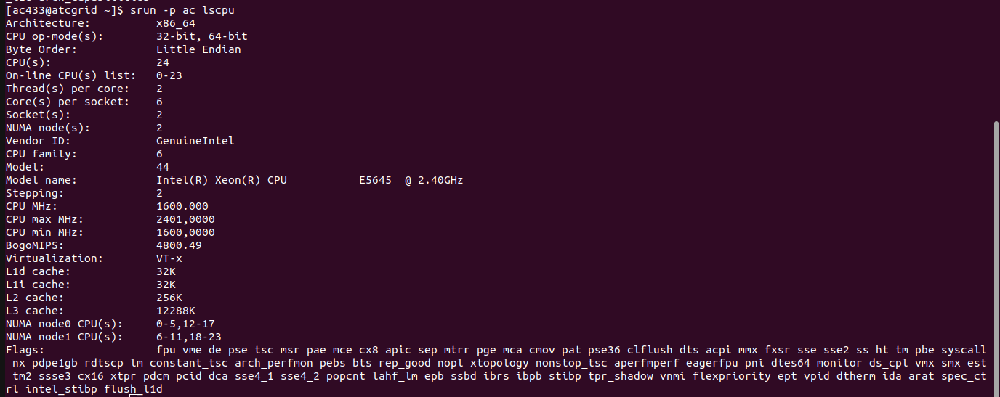
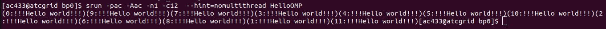
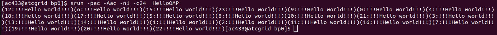
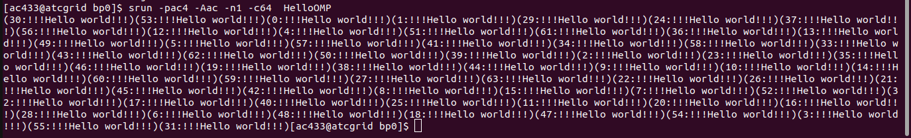
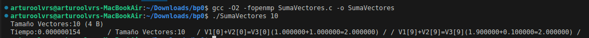
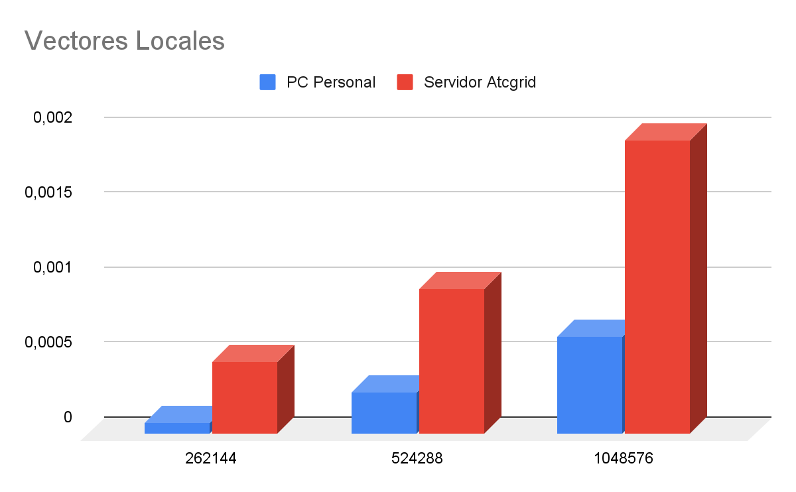
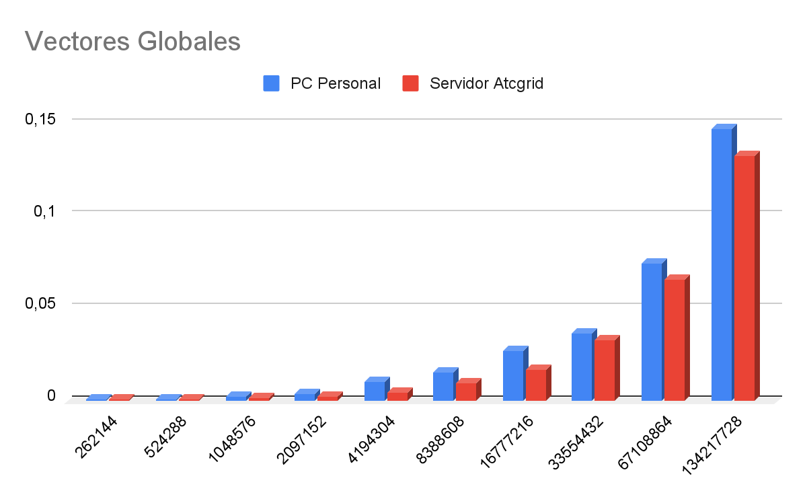
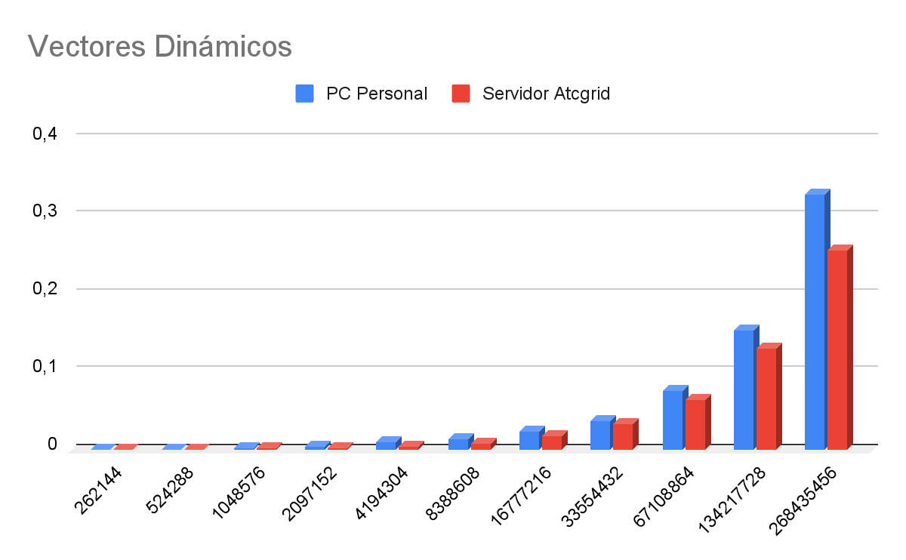
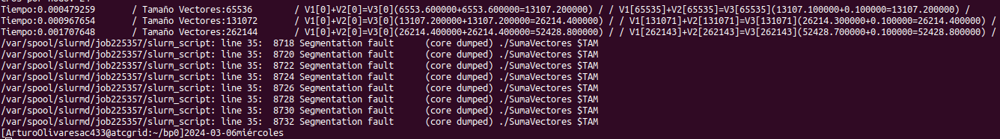

# Arquitectura de Computadores. Bloque de Prácticas 0

**Autor:** Arturo Olivares Martos
***

- **Asignatura:** Arquitectura de Computadores.
- **Curso Académico:** 2023-24.
- **Grado:** Doble Grado en Ingeniería Informática y Matemáticas.
- **Grupo:** Único.
- **Profesor:** Mancia Anguita López.
- **Descripción:** Bloque 0 de las prácticas de AC.
<!--- **Fecha:** 17 de abril de 2023. -->
<!-- - **Duración:** -->


## Parte I. Ejercicios basados en los ejemplos del seminario práctico
Crear el directorio con nombre `bp0` en `atcgrid` y en el PC (PC se refiere al ordenador del aula de prácticas o su computador personal).

*NOTA*: En las prácticas se usa `slurm` como gestor de colas. Consideraciones a tener en cuenta:
- `Slurm` está configurado para asignar recursos a los procesos (llamados `tasks` en `slurm`) a nivel de core físico. Esto significa que por defecto `slurm` asigna un core a un proceso, para asignar `x` se debe usar con `sbatch/srun` la opción  `--cpus-per-task=x (-cx)`. 
- En `slurm`, por defecto, cpu se refiere a cores lógicos (ej. en la opción `-c`), si no se quieren usar cores lógicos hay que añadir la opción `--hint=nomultithread` a `sbatch/srun`. Para que con `sbatch` se tenga en cuenta `--hint=nomultithread` se debe usar `srun` dentro del script delante del ejecutable.
- Para asegurar que solo se crea un proceso hay que incluir `--ntasks=1 (-n1)` en `sbatch/srun`. 
- Para que no se ejecute más de un proceso en un nodo de cómputo de atcgrid hay que usar `--exclusive` con `sbatch/srun` (se recomienda no utilizarlo en los `srun` dentro de un script). 
- Los `srun` dentro de un script heredan las opciones fijadas en el `sbatch` que se usa para enviar el script a la cola (partición `slurm`).
- Las opciones de `sbatch` se pueden especificar también dentro del script (usando `#SBATCH`, ver ejemplos en el script del seminario)


### Ejercicio 1. 

- **Ejecutar `lscpu`  en  el PC, en `atcgrid4` (usar en este caso `-p ac4`) y en uno de los restantes nodos de cómputo (`atcgrid1`, `atcgrid2` o `atcgrid3`, usar en este caso `-p ac`).**


    Para el caso de `atcgrid4`, tenemos:

    


    Para el resto de nodos de cómputo, tenemos:

    


    Para el caso de mi PC, tenemos:

    


- **¿Cuántos cores físicos y cuántos cores lógicos tiene `atcgrid4`?, ¿cuántos tienen  `atcgrid1`, `atcgrid2` y `atcgrid3`? y ¿cuántos tiene el PC? Razonar las respuestas**

    - En el caso de `atcgrid4`, tengo $2\cdot 16=32$ cores físicos, y $32\cdot 2=64$ cores lógicos.
    - En el caso de un nodo de cómputo, tengo $2\cdot 6=12$ cores físicos, y $12\cdot 2=24$ cores lógicos.
    - En el caso de mi PC, tengo $1\cdot 2=2$ cores físicos, y $2\cdot 2=4$ cores lógicos.

### Ejercicio 2.

**Compilar y ejecutar en el PC el código [HelloOMP.c](https://github.com/LosDelDGIIM/LosDelDGIIM.github.io/blob/main/subjects/AC/Cuadernillos%20de%20Pr%C3%A1cticas/Bloque%200/C%C3%B3digos/HelloOMP.c) del seminario.**

- **Adjuntar capturas de pantalla que muestren la compilación y ejecución en el PC.**
  
    

- **Justificar el número de  “Hello world” que se imprimen en pantalla teniendo en cuenta la salida que devuelve `lscpu` en el PC.**
  
    Como se ha indicado anteriormente, mi PC tiene 4 cores lógicos, que coincide como podemos ver con el número de “Hello World” que se imprimen. Esto se debe a la orden `#pragma omp parallel`, que permite que se ejecute en paralelo en cada uno de los cores lógicos.


### Ejercicio 3.

**Copiar el ejecutable de [HelloOMP.c](https://github.com/LosDelDGIIM/LosDelDGIIM.github.io/blob/main/subjects/AC/Cuadernillos%20de%20Pr%C3%A1cticas/Bloque%200/C%C3%B3digos/HelloOMP.c) que ha generado anteriormente front-end de `atcgrid`. Ejecutar este código en un nodo de cómputo de `atcgrid` (de 1 a 3) a través de cola `ac` del gestor de colas utilizando directamente en línea de comandos (no use ningún script) según los siguientes comandos:**

- **`srun --partition=ac --account=ac --ntasks=1 --cpus-per-task=12 --hint=nomultithread HelloOMP `**

    (Alternativa: `srun -pac -Aac -n1 -c12  --hint=nomultithread HelloOMP`)

    

- **`srun -pac -Aac -n1 -c24  HelloOMP`**

    

- **`srun -n1 HelloOMP`**

    

- **¿Qué orden `srun` usaría para que `HelloOMP` utilice todos los cores físicos de `atcgrid4` (se debe imprimir un único mensaje desde cada uno de ellos)?**

    La orden `srun` que se debería usar para que `HelloOMP` utilice todos los cores físicos de `atcgrid4` sería `srun -pac4 -Aac -n1 -c64  HelloOMP`. Veámoslo en la siguiente captura de pantalla:

    


### Ejercicio 4.

**Modificar en su PC [HelloOMP.c](https://github.com/LosDelDGIIM/LosDelDGIIM.github.io/blob/main/subjects/AC/Cuadernillos%20de%20Pr%C3%A1cticas/Bloque%200/C%C3%B3digos/HelloOMP.c) para que se imprima “world” en un `printf` distinto al usado para “Hello”. En ambos `printf` se debe imprimir el identificador del thread que escribe en pantalla. Nombrar al código resultante `HelloOMP2.c`. Compilar este nuevo código en el PC y ejecutarlo. Copiar el fichero ejecutable resultante al front-end de `atcgrid`. Ejecutar el código en un nodo de cómputo de `atcgrid` usando el script [script_helloomp.sh](https://github.com/LosDelDGIIM/LosDelDGIIM.github.io/blob/main/subjects/AC/Cuadernillos%20de%20Pr%C3%A1cticas/Bloque%200/C%C3%B3digos/script_helloomp.sh) del seminario (el nombre del ejecutable en el script debe ser `HelloOMP2`).**

- **Utilizar el comando `sbatch script_helloomp.sh`. Adjuntar capturas de pantalla que muestren el nuevo código, la compilación, el envío a la cola de la ejecución y el resultado de esta ejecución tal y como la devuelve el gestor de colas.**

    El nuevo código, disponible en el fichero [HelloOMP2.c](https://github.com/LosDelDGIIM/LosDelDGIIM.github.io/blob/main/subjects/AC/Cuadernillos%20de%20Pr%C3%A1cticas/Bloque%200/C%C3%B3digos/HelloOMP2.c), es:
    ```c++
    #include <omp.h>

    int main(void) {

    #pragma omp parallel
    { 
        printf("(%d:!!!Hello)", 
                omp_get_thread_num());

        printf("(%d:world!!!)", 
                omp_get_thread_num());
    }

    return(0);

    }
    ```

    Notemos que es necesario incluir las llaves, para que ambos `printf` se ejecuten en paralelo. La compilación y ejecución en el PC se muestra en la siguiente captura de pantalla:

    

- **¿Qué nodo de cómputo de `atcgrid` ha ejecutado el script? Explicar cómo ha obtenido esta información.**

    El nodo asignado ha sido `atcgrid1`. Esto se ha obtenido del archivo de información que ha generado el gestor de colas, y esto a su vez se ha obtenido con la variable `$SLURM_JOB_NODELIST`.

- **¿Qué órdenes para el gestor de colas slurm incluye el script? Explicar cómo ha obtenido esta información.**
    ```c++
    #Órdenes para el Gestor de carga de trabajo

    #1. Asignar al trabajo un nombre
    #SBATCH --job-name=helloOMP

    #2. Asignar el trabajo a una partición (cola)
    #SBATCH --partition=ac

    #3. Asignar el trabajo a un account
    #SBATCH --account=ac

    #4. Para que el trabajo no comparta recursos
    #SBATCH --exclusive

    #5. Para que se genere un único proceso del sistema operativo que pueda usar un máximo de 12 núcleos
    #SBATCH --ntasks 1 --cpus-per-task 12
    ```

    Esta información se ha obtenido del propio script, que incluye comentarios explicativos de las órdenes que se están dando al gestor de colas `slurm`.

- **Haga los cambios necesarios en el script para que se utilice `atcgrid4`. Comentar los cambios realizados y los motivos por los que se han hecho.**

    Los cambios realizados en el script para que se utilice `atcgrid4` han sido los siguientes:
    ```c++
    #SBATCH --partition=ac4
    ```

    El motivo por el que se han hecho estos cambios es que se ha cambiado la partición de `ac` a `ac4`, que es la partición que corresponde a `atcgrid4`.


## Parte II. Resto de ejercicios

*Nota*: Utilizar siempre con `sbatch` las opciones `-n1` y  `-c`, `--exclusive` y, para usar cores físicos y no lógicos, no olvidar incluir  `--hint=nomultithread`. Utilizar siempre con `srun`, si se usa fuera de un script, las opciones `-n1` y  `-c` y, para usar cores físicos y no lógicos, no olvidar incluir  `--hint=nomultithread`. Recordar que los `srun` dentro de un script heredan las opciones incluidas en el `sbatch` que se usa para enviar el script a la cola `slurm`. Se recomienda usar `sbatch` en lugar de `srun` para enviar trabajos a ejecutar a través `slurm` porque éste último deja bloqueada la ventana hasta que termina la ejecución, mientras que usando `sbatch` la ejecución se realiza en segundo plano.

### Ejercicio 5.

**Generar en el PC el ejecutable del código fuente C [SumaVectores.c](https://github.com/LosDelDGIIM/LosDelDGIIM.github.io/blob/main/subjects/AC/Cuadernillos%20de%20Pr%C3%A1cticas/Bloque%200/C%C3%B3digos/SumaVectores.c) para vectores locales (para ello antes de compilar debe descomentar la definición de `VECTOR_LOCAL` y comentar las definiciones de `VECTOR_GLOBAL` y `VECTOR_DYNAMIC`). El comentario inicial del código muestra la orden para compilar (siempre hay que usar `-O2`). Incorporar volcados de pantalla que demuestren la compilación y la ejecución correcta del código en el PC.**

La compilación y ejecución en el PC se muestra en la siguiente captura de pantalla:




### Ejercicio 6.

**En el código [SumaVectores.c](https://github.com/LosDelDGIIM/LosDelDGIIM.github.io/blob/main/subjects/AC/Cuadernillos%20de%20Pr%C3%A1cticas/Bloque%200/C%C3%B3digos/SumaVectores.c) se utiliza la función `clock_gettime()` para obtener el tiempo de ejecución del trozo de código que calcula la suma de vectores. El código imprime la variable `ncgt`.**

- **¿Qué contiene esta variable?**

    En el código, podemos ver las siguientes líneas:
    ```c++
    clock_gettime(CLOCK_REALTIME,&cgt1);
    //Calcular suma de vectores 
    for(i=0; i<N; i++) 
        v3[i] = v1[i] + v2[i]; 
    
    clock_gettime(CLOCK_REALTIME,&cgt2);
    ncgt = (double) (cgt2.tv_sec-cgt1.tv_sec) +
           (double) ((cgt2.tv_nsec-cgt1.tv_nsec)/(1.e+9));
    ```

    Como podemos ver, se mide el tiempo antes y después de sumar los vectores, y dicha variable contiene cuánto tiempo se ha tardado en sumar. Se contabilizan tanto los segundos como los nanosegundos, y se convierte todo a segundos.

- ¿En qué estructura de datos devuelve `clock_gettime()` la información de tiempo (indicar el tipo de estructura de datos, describir la estructura de datos, e indicar los tipos de datos que usa)?

    La estructura de datos que usa es `struct timespec`. Esta es una estructura que almacena tiempos en precisión de segundos y nanosegundos. Los segundos se almacenan en un dato de tipo `__time_t tv_sec;` (que es `long int`) y los nanosegundos se almacenan en un dato de tipo `__syscall_slong_t tv_nsec;` (que también es `long int`).

- ¿Qué información devuelve exactamente la función `clock_gettime()` en la estructura de datos descrita en el apartado anterior? ¿qué representan los valores numéricos que devuelve?

    Como se ha mencionado anteriormente, en la estructura de datos se devuelve el tiempo actual. Tal y como el manual indica, el tiempo que se almacena representa el número de segundos y nanosegundos que han pasado desde *Epoch*. *Epoch* en Unix representa el 1 de enero de 1970 a las 00:00:00 UTC.

    

    Además, la función en sí devuelve 0 siempre que no haya error, como el manual indica.

    


### Ejercicio 7.

**Rellenar una hoja de cálculo con los tiempos de ejecución del código [SumaVectores.c](https://github.com/LosDelDGIIM/LosDelDGIIM.github.io/blob/main/subjects/AC/Cuadernillos%20de%20Pr%C3%A1cticas/Bloque%200/C%C3%B3digos/SumaVectores.c) para vectores locales, globales y dinámicos (se pueden obtener errores en tiempo de ejecución o de compilación). Obtener estos resultados usando scripts (partir del script que hay en el seminario). Debe haber una tabla para un nodo de cómputo de atcgrid con procesador Intel Xeon E5645 y otra para su PC en la hoja de cálculo. En la columna “Bytes de un vector” hay que poner el total de bytes reservado para un vector.**

El script que se ha empleado para obtener los resultados es [script_vectores.sh](https://github.com/LosDelDGIIM/LosDelDGIIM.github.io/blob/main/subjects/AC/Cuadernillos%20de%20Pr%C3%A1cticas/Bloque%200/C%C3%B3digos/script_vectores.sh).

Los resultados obtenidos en mi PC personal se muestran en la siguiente tabla:

| Nº de Componentes | Bytes de un vector | Tiempo para vectores locales | Tiempo para vectores globales | Tiempo para vectores dinámicos |
|--------------------|--------------------|------------------------------|------------------------------|--------------------------------|
| 65536              | 262144             | 0,000077539                  | 0,000539969                  | 0,000392905                    |
| 131072             | 524288             | 0,000278635                  | 0,000841822                  | 0,000956871                    |
| 262144             | 1048576            | 0,000653013                  | 0,00238132                   | 0,002228125                    |
| 524288             | 2097152            | CORE DUMP                    | 0,004043844                  | 0,003322898                    |
| 1048576            | 4194304            | CORE DUMP                    | 0,010041541                  | 0,010272101                    |
| 2097152            | 8388608            | CORE DUMP                    | 0,015294816                  | 0,013618954                    |
| 4194304            | 16777216           | CORE DUMP                    | 0,027397836                  | 0,022634178                    |
| 8388608            | 33554432           | CORE DUMP                    | 0,036636352                  | 0,036222718                    |
| 16777216           | 67108864           | CORE DUMP                    | 0,074353604                  | 0,075744287                    |
| 33554432           | 134217728          | CORE DUMP                    | 0,147133821                  | 0,153496942                    |
| 67108864           | 268435456          | CORE DUMP                    | Limitada por cód.            | 0,328083575                    |

Los resultados obtenidos en el nodo de cómputo de `atcgrid` se muestran en la siguiente tabla:

| Nº de Componentes | Bytes de un vector | Tiempo para vectores locales | Tiempo para vectores globales | Tiempo para vectores dinámicos |
|--------------------|--------------------|------------------------------|------------------------------|--------------------------------|
| 65536              | 262144             | 0,000481334                  | 0,000544478                  | 0,000489506                    |
| 131072             | 524288             | 0,000970434                  | 0,000507875                  | 0,000975332                    |
| 262144             | 1048576            | 0,001954385                  | 0,00144407                   | 0,001948265                    |
| 524288             | 2097152            | CORE DUMP                    | 0,002541665                  | 0,002750583                    |
| 1048576            | 4194304            | CORE DUMP                    | 0,004761533                  | 0,005096251                    |
| 2097152            | 8388608            | CORE DUMP                    | 0,009231791                  | 0,008765994                    |
| 4194304            | 16777216           | CORE DUMP                    | 0,017174688                  | 0,017069286                    |
| 8388608            | 33554432           | CORE DUMP                    | 0,03311402                   | 0,032595834                    |
| 16777216           | 67108864           | CORE DUMP                    | 0,065974442                  | 0,064392057                    |
| 33554432           | 134217728          | CORE DUMP                    | 0,132495885                  | 0,129571989                    |
| 67108864           | 268435456          | CORE DUMP                    | Limitada por cód.            | 0,255863128                    |


### Ejercicio 8.

**Con ayuda de la hoja de cálculo representar en una misma gráfica los tiempos de ejecución obtenidos en `atcgrid` y en su PC para vectores locales, globales y dinámicos (eje y) en función del tamaño en bytes de un vector (por tanto, los valores de la segunda columna de la tabla, que están en escala logarítmica, deben estar en el eje x). ¿Hay diferencias en los tiempos de ejecución?**

En el caso de los vectores locales, tenemos que:



En el caso de los vectores globales, tenemos que:



En el caso de los vectores dinámicos, tenemos que:



Como podemos ver, tanto en el caso de los vectores globales como dinámicos, los tiempos en el servidor son ligeramente menores, ya que tiene mejores prestaciones que mi ordenador personal. No obstante, los cambios no son significativos, ya que en este programa no hemos empleado paralelismo.

El caso de los vectores locales es particular y habría que estudiarlo por separado. Tiene la peculiaridad de que en el servidor tarda más que en mi ordenador personal. Podría deberse a que, al ser tamaños pequeños, los tiempos no son realmente significativos. Otra opción podría ser que la gestión de la pila sea más eficiente en mi ordenador personal.


### Ejercicio 9.

**Contestar a las siguientes preguntas:**
- **Cuando se usan vectores locales, ¿se obtiene error para alguno de los tamaños?, ¿a qué cree que es debido lo que ocurre?**

    Sí, se produce el error de violación de segmento, como muestra la siguiente captura de pantalla:

    

    Este error de violación de segmento se debe a que, a partir de 524288 componentes, no caben estos en la pila, que es donde se almacenan por ser vectores locales. Al no caber estos, se desborda la pila y se accede a otro segmento de memoria, provocando dicho error.

- **Cuando se usan vectores globales, ¿se obtiene error para alguno de los tamaños?, ¿a qué cree que es debido lo que ocurre?**

    No, como muestra la siguiente captura de pantalla:

    

    En este caso no hay error ninguno, ya que se usa memoria global. Lo único que sería importante resaltar sería que, en el último tamaño, cuando debería ser 67108864, se repite en 33554432. Esto se debe a que el código incluye las siguientes partes:
    ```c++
    #ifdef VECTOR_GLOBAL
    #define MAX 33554432	//=2^25
    #endif
    ...
    #ifdef VECTOR_GLOBAL
    if (N>MAX) N=MAX;
    #endif
    ```

    Como podemos ver, se ha limitado mediante el código que `N` no pueda ser mayor que `MAX`. Si `N` es mayor, se establece en `MAX`, limitándose así el tamaño mediante el código.

- **Cuando se usan vectores dinámicos, ¿se obtiene error para alguno de los tamaños?, ¿a qué cree que es debido lo que ocurre?**

    No, como muestra la siguiente captura de pantalla:

    

    En este caso no hay problemas ningunos, ya que al ser vectores dinámicos, se reserva la cantidad de memoria en el Heap que sea necesaria, y luego se libera.


### Ejercicio 10.

- **¿Cuál es el máximo valor que se puede almacenar en la variable `N` teniendo en cuenta su tipo?**
  
    Tenemos `unsigned int N`; y sabemos que `sizeof(N)=sizeof(unsigned int)=4 B`, es decir, ocupa $8\cdot 4=32$ bits. Como no almacena signo por ser unsigned, tenemos que el número máximo que puede almacenar es $2^{32}-1=4294967295$.

- **Modificar el código fuente C (en el PC) para que el límite de los vectores cuando se declaran como variables globales sea igual al máximo número que se puede almacenar en la variable `N` y generar el ejecutable. ¿Qué ocurre? ¿A qué es debido?**

    En tal caso, la salida del programa es:

    

    En este caso, vemos que nos da un error, ya que ha de truncar diversos datos porque no caben en la pila. Esto se debe a que sería necesario reservar demasiado espacio para el vector, no dejando entonces espacio para otros vectores necesarios, como `v2` o `v3`.

