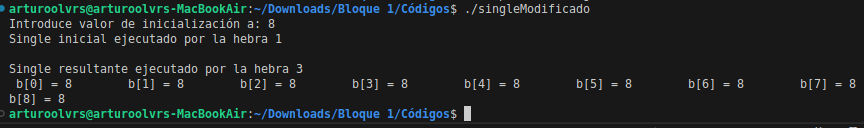
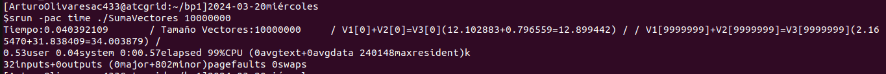
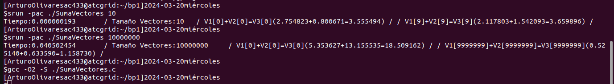
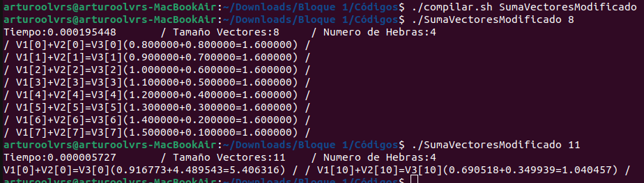
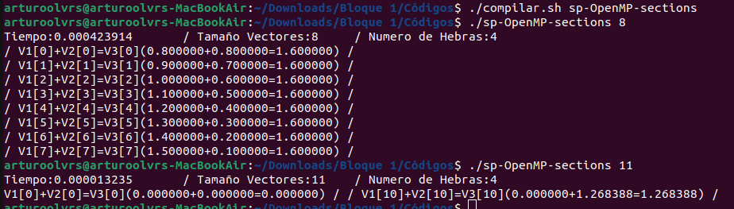
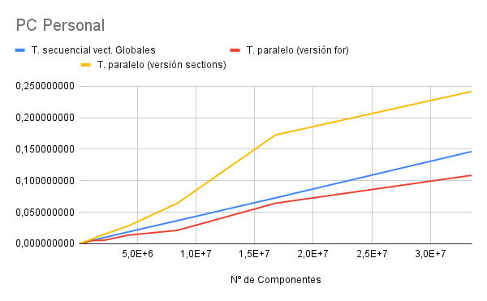
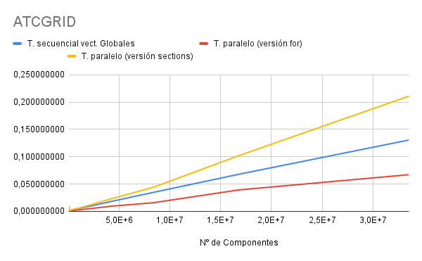
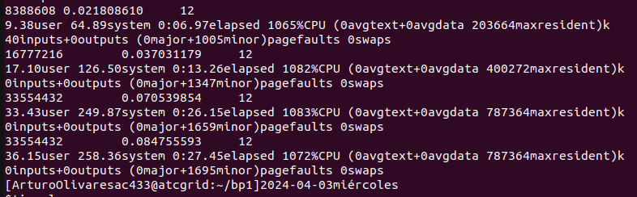

# Arquitectura de Computadores. Bloque de Prácticas 1

**Autor:** Arturo Olivares Martos
***

- **Asignatura:** Arquitectura de Computadores.
- **Curso Académico:** 2023-24.
- **Grado:** Doble Grado en Ingeniería Informática y Matemáticas.
- **Grupo:** Único.
- **Profesor:** Mancia Anguita López.
- **Descripción:** Bloque 1 de las prácticas de AC.
<!--- **Fecha:** 17 de abril de 2023. -->
<!-- - **Duración:** -->


## Parte I. Ejercicios basados en los ejemplos del seminario práctico

*Nota*: Para compilar cualquier programa, he hecho uso del simple script [compilar.sh](google), que tan solo ejecuta la siguiente línea:
```bash
gcc -O2 -o $1 $1.c -fopenmp # -D DEBUG
```
Como podemos ver, tan solo compila con la opción `-O2` y `-fopenmp`, y además se puede descomentar la opción `-D DEBUG` para que se muestren mensajes de depuración. También se puede comentar la opción `-fopenmp` para que no se compile con OpenMP, obteniendo por tanto un programa secuencial.

### Ejercicio 1. 

**Usar la directiva `parallel` combinada con directivas de trabajo compartido en los ejemplos [bucle-for.c](google) y [sections.c](google) del seminario.**

La parte modificada del programa [bucle-for.c](google) es la siguiente:
```c++
#pragma omp parallel for
    for (i=0; i<n; i++)
        printf("Hebra %d ejecuta la iteración %d del bucle\n", omp_get_thread_num(),i);
```
Se encuentra disponible en el fichero [bucle-forModificado.c](google).

La parte modificada del programa [sections.c](google) es la siguiente:
```c++
#pragma omp parallel sections
{
    #pragma omp section
        (void) funcA();

    #pragma omp section
        (void) funcB();
}
```
Se encuentra disponible en el fichero [sectionsModificado.c](google).

El objetivo de este ejercicio es simplemente darse cuenta de que se pueden juntar las directivas
`parallel` y `for` (o `sections`) en una sola, y que el resultado es el mismo, aunque queda más legible.


### Ejercicio 2.

**Imprimir los resultados del programa [single.c](google) usando una directiva `single` dentro de la construcción `parallel` en lugar de imprimirlos fuera de la región `parallel`. Añadir lo necesario, dentro de la nueva directiva `single` incorporada, para que se imprima el identificador del thread que ejecuta el bloque estructurado de la directiva `single`.**

La parte modificada del programa [single.c](google) es la siguiente:
```c++
#pragma omp parallel 
{
    #pragma omp single
    {
        printf("Introduce valor de inicialización a: ");scanf("%d",&a);
        printf("Single inicial ejecutado por la hebra %d\n\n", omp_get_thread_num());
    }

    #pragma omp for
        for (i=0; i<n; i++)
        b[i] = a;

    #pragma omp single
    {
        printf("Single resultante ejecutado por la hebra %d\n", omp_get_thread_num());
        for (i=0; i<n; i++)
        printf(" b[%d] = %d\t",i,b[i]);

        printf("\n");
    }

}
```
Se encuentra disponible en el fichero [singleModificado.c](google).

La ejecución se puede ver en la siguiente imagen:


Como podemos ver, la directiva `single` permite que la región de código determinada por dicha directiva tan solo se ejecute por una hebra, esperando el resto a que esta termine mediante un `barrier` implícito.

### Ejercicio 3.
**Imprimir los resultados del programa [single.c](google) usando una directiva `master` dentro de la construcción
`parallel` en lugar de imprimirlos fuera de la región `parallel`. Añadir lo necesario, dentro de la nueva
directiva `master` incorporada, para que se imprima el identificador del thread que ejecuta el bloque
estructurado de la directiva `master`. ¿Qué diferencia observa con respecto a los resultados de ejecución del ejercicio anterior?**

La parte modificada del programa [single.c](google) es la siguiente:
```c++
#pragma omp parallel 
{
    #pragma omp single
    {
        printf("Introduce valor de inicialización a: ");scanf("%d",&a);
        printf("Single inicial ejecutado por la hebra %d\n\n", omp_get_thread_num());
    }

    #pragma omp for
        for (i=0; i<n; i++)
        b[i] = a;

    #pragma omp master
    {
        printf("Single resultante ejecutado por la hebra %d\n", omp_get_thread_num());
        for (i=0; i<n; i++)
        printf(" b[%d] = %d\t",i,b[i]);

        printf("\n");
    }

}
```
Se encuentra disponible en el fichero [singleModificado2.c](google).

La ejecución se puede ver en la siguiente imagen:


Como podemos ver, la directiva `master` permite que la región de código determinada por dicha directiva tan solo se ejecute por una hebra (al igual que `single`), pero no en este caso dicha hebra ha de ser siempre la master, cuyo identificador es siempre 0. Por tanto, la diferencia con respecto al ejercicio anterior es que en este caso la hebra que ejecuta la región `master` es siempre la 0, mientras que en el caso de `single` es la que llega primero a la región.

Respecto de la directiva `master` es importante tener en cuenta que no tiene una barrera implícita al final de la región, por lo que si se quiere que el resto de hebras esperen a que la master termine, habría que añadir un `barrier` explícito. En este caso, como no hay código paralelo después de la región `master`, no es necesario.


### Ejercicio 4.
**¿Por qué si se elimina la directiva barrier en el ejemplo [master.c](google.com) la suma que se calcula e imprime
no siempre es correcta? Responda razonadamente.**

Si la hebra master llega el último a la directiva `master`, entonces todas las sumas parciales ya se habrán contabilizado, por lo que el resultado es correcto. No obstante, si llega antes que algún otro hilo, al no estar la barrera no esperará a que todas las hebras añadan su suma parcial, y entonces el resultado será menor que el deseado.


## Parte II. Resto de ejercicios
*Usar en atcgrid la cola `ac` a no ser que se tenga que usar atcgrid4*.

### Ejercicio 5.
**El programa secuencial C del programa [SumaVectores.c](google.com) calcula la suma de dos vectores (`v3 = v1 + v2;` $v_3(i) = v_1(i) + v_2(i),~\forall i=0,\dots,N-1$). Generar el ejecutable del programa [SumaVectores.c](google.com) para vectores globales. Usar `time` (Lección 3 / Tema 1) en la línea de comandos para obtener, en atcgrid, el tiempo de ejecución (elapsed time) y el tiempo de CPU del usuario y del sistema generado. Obtenga los tiempos para vectores con $10000000=10^7$ componentes. ¿La suma de los tiempos de CPU del usuario
y del sistema es menor, mayor o igual que el tiempo real (*elapsed*)?**

La ejecución del programa se puede ver en la siguiente imagen:


En este caso, la suma sí es igual al tiempo real. Esto se debe a que no hay entradas/salidas que ralentizan el proceso; y además al no haber paralelismo no se producen
resultados ilógicos, como veremos en el último ejercicio.


### Ejercicio 6.

**Generar el código ensamblador a partir del programa secuencial C del Programa [SumaVectores.c](google.com) para vectores globales (para generar el código ensamblador tiene que compilar usando `-S` en lugar de `-o`).
Utilice el fichero con el código fuente ensamblador generado y el fichero ejecutable generado en el [ejercicio 5](#ejercicio-5) para obtener para atcgrid los MIPS *(Millions of Instructions Per Second)* y los MFLOPS *(Millions of FLOating-point Per Second)* del código que obtiene la suma de vectores (código entre las funciones `clock_gettime()`). El cálculo se debe hacer para $10$ y $10000000=10^7$ componentes en los vectores (consulte la Lección 3/Tema1 AC). Razonar cómo se han obtenido
los valores que se necesitan para calcular los MIPS y MFLOPS.**

En la siguiente imagen se pueden ver la generación del código ensamblador y la obtención de los tiempos de ejecución:


El código ensamblador generado se encuentra en el fichero [SumaVectores.s](google), aunque la parte relevante es la siguiente:
```asm
    call	clock_gettime
	xorl	%eax, %eax
	.p2align 4,,10
	.p2align 3
.L8:
	movsd	v1(,%rax,8), %xmm0
	addsd	v2(,%rax,8), %xmm0
	movsd	%xmm0, v3(,%rax,8)
	addq	$1, %rax
	cmpl	%eax, %ebp
	ja	.L8
	leaq	16(%rsp), %rsi
	xorl	%edi, %edi
	call	clock_gettime
```

Para el cálculo de los MIPS, fuera del bucle vemos que se realizan 4 instrucciones. Además, dentro de él vemos que se realizan 6 instrucciones. Por tanto, tenemos que:
- Para $10$ iteraciones:
$$\text{MIPS} = \dfrac{6\cdot 10+4}{1,93\cdot 10^{-7}\cdot 10^{6}} \approx 331,06~\text{MIPS}$$
- Para $10^7$ iteraciones:
$$\text{MIPS} = \dfrac{6\cdot 10^7+4}{0,040502454\cdot 10^{6}} \approx 1481,39~\text{MIPS}$$

PPara el cálculo de los MFLOPS, usamos directamente el número de instrucciones en coma flotante que hay en el código, disponible en el fichero [SumaVectores.s](google). En él se puede ver el siguiente fragmento:
```c++
clock_gettime(CLOCK_REALTIME,&cgt0);
//Calcular suma de vectores 
for(i=0; i<N; i++) 
v3[i] = v1[i] + v2[i]; 

clock_gettime(CLOCK_REALTIME,&cgt2);
```
Por tanto, como por cada iteración se realiza una suma y hay $N$ iteraciones, usando el tiempo que nos da el código podemos obtener esos datos. Tenemos que:
- Para $10$ iteraciones:
$$\text{MFLOPS} = \dfrac{10\cdot 1}{1,93\cdot 10^{-7}\cdot 10^{6}} \approx 51,81~\text{MFLOPS}$$
- Para $10^7$ iteraciones:
$$\text{MFLOPS} = \dfrac{10^7\cdot 1}{0,040502454\cdot 10^{6}} \approx 246,89~\text{MFLOPS}$$

Analizamos ahora si tiene sentido que haya tanta diferencia entre los resultados en función del número de iteraciones que se ejecutan. Sí lo tiene, y se debe a posibles fallos de caché o incluso a precaptaciones de instrucciones.


### Ejercicio 7.

**Implementar un programa en C con OpenMP, a partir del código del Programa [SumaVectores.c](google), que calcule en
paralelo la suma de dos vectores (`v3 = v1 + v2;` $v_3(i) = v_1(i) + v_2(i),~\forall i=0,\dots,N-1$) usando las directivas `parallel` y `for`. Se deben paralelizar también las tareas asociadas a la inicialización de los vectores.
Como en el código del Programa [SumaVectores.c](google) se debe obtener el tiempo (`elapsed time`) que supone el cálculo de la suma. Para obtener este tiempo usar la función `omp_get_wtime()`, que proporciona el estándar
OpenMP, en lugar de `clock_gettime()`. Algunos aspectos a tener en cuenta son:**
- **El número de componentes $N$ de los vectores debe ser
un argumento de entrada al programa.**
- **Se deben inicializar los vectores antes del cálculo.**
- **Se debe asegurar que el programa calcula la suma correctamente imprimiendo todos los componentes del vector
resultante, `v3`, para varios tamaños pequeños de los vectores (por ejemplo, $N = 8$ y $N=11$).**
- **Se debe imprimir el tamaño de los vectores y el número de hilos.**
- **Se debe imprimir sea cual sea el tamaño de los vectores el tiempo de ejecución del código paralelo que suma los vectores y, al menos, el primer y último componente de `v1`, `v2` y `v3` (esto último evita que las optimizaciones del compilador eliminen el código de la suma).**

El programa implementado con OpenMP se encuentra en el fichero [sp-OpenMP-for.c](google).

Del código anterior, hemos de destacar que siempre que se usen funciones de la biblioteca OPENMP se ha incluido la directiva `#ifdef _OPENMP` (que se añade automáticamente al compilar con la opción correspondiente) para controlar que no haya errores de compilación. En los siguientes ejercicios, siempre que se busque ejecutar de forma secuencial el código bastará con compilar sin la opción `-fopenmp`. Esto se aprecia en la siguiente parte del código:
```c++
#ifdef _OPENMP
  #include <omp.h>
#else
   #define omp_get_thread_num() 0
   #define omp_get_num_threads() 1
#endif
```

La ejecución del programa se puede ver en la siguiente imagen:



### Ejercicio 8.


**Implementar un programa en C con OpenMP, a partir del código del Programa [SumaVectores.c](google), que calcule en
paralelo la suma de dos vectores (`v3 = v1 + v2;` $v_3(i) = v_1(i) + v_2(i),~\forall i=0,\dots,N-1$) usando las directivas `parallel` y `sections/section` (se debe aprovechar el paralelismo de datos usando estas directivas en lugar de la directiva `for`); es decir, hay que repartir
el trabajo (tareas) entre varios threads usando `sections/section`. Se deben paralelizar también las tareas asociadas a la inicialización de los vectores.
Como en el código del Programa [SumaVectores.c](google) se debe obtener el tiempo (`elapsed time`) que supone el cálculo de la suma. Para obtener este tiempo usar la función `omp_get_wtime()`, que proporciona el estándar
OpenMP, en lugar de `clock_gettime()`. Algunos aspectos a tener en cuenta son:**
- **El número de componentes $N$ de los vectores debe ser
un argumento de entrada al programa.**
- **Se deben inicializar los vectores antes del cálculo.**
- **Se debe asegurar que el programa calcula la suma correctamente imprimiendo todos los componentes del vector
resultante, `v3`, para varios tamaños pequeños de los vectores (por ejemplo, $N = 8$ y $N=11$).**
- **Se debe imprimir el tamaño de los vectores y el número de hilos.**
- **Se debe imprimir sea cual sea el tamaño de los vectores el tiempo de ejecución del código paralelo que suma los vectores y, al menos, el primer y último componente de `v1`, `v2` y `v3` (esto último evita que las optimizaciones del compilador eliminen el código de la suma).**

El programa implementado con OpenMP se encuentra en el fichero [sp-OpenMP-sections.c](google).

La ejecución del programa se puede ver en la siguiente imagen:


Como aspectos a resaltar, notemos que tan solo hemos creado 4 secciones ya que mi PC personal tan solo tiene 4 cores lógicos. Como podemos observar, este uso no tendría sentido, ya que tenemos que fijar nosotros inicialmente (y repitiendo código) la paralelización. Para paralelizar los bucles `for`, es mejor usar la directiva correspondiente. Además, en el caso de que queramos paralelizar usando solo cores físicos, ya tendría que cambiar el código para que sea eficiente.

Además, también es importante resaltar que la variable `i` es necesario que se declare en cada sección para que sea privada a cada hebra, ya que si no se hace así, se producirán errores en la ejecución. Otra opción sería incluir la cláusula `private(i)` en la directiva `sections`, para que así fuese privada a cada sección y evitar así que secciones distintas modifiquen el valor de `i`.


### Ejercicio 9.
**¿Cuántos threads y cuántos cores como máximo podría utilizar la versión que ha implementado en el [ejercicio 7](#ejercicio-7)? Razone su respuesta. ¿Cuántos threads y cuantos cores como máximo podría utilizar la versión que ha implementado en el [ejercicio 8](#ejercicio-8)?**

En el [ejercicio 7](#ejercicio-7), se ha empleado la directiva `#pragma omp for`, por lo que se utilizarán de forma automática tantos hilos como se consideren oportunos, no interfiriendo el programador en dicha decisión (por norma general se usarán tantos como cores lógicos tengas en el computador). No obstante, en el [ejercicio 8](#ejercicio-8), se emplearán tantos hilos como section haya, ya que cada sección la ejecutará un solo hilo. Por tanto, en el [ejercicio 7](#ejercicio-7) la decisión no es del programador, mientras que en el [ejercicio 8](#ejercicio-8) sí es él quien decide. En ambos casos, se tiene como límite superior el número de cores lógicos con los que dispone nuestro computador.


### Ejercicio 10.

**Rellenar una tabla para atcgrid y otra para su PC con los tiempos de ejecución de los programas paralelos implementados en los ejercicios [7](#ejercicio-7) y [8](#ejercicio-8) y el programa secuencial [SumaVectores.c](google). Generar los ejecutables usando `-O2`. Escribir un script para realizar las ejecuciones necesarias utilizando como base el script del BP0. En la tabla debe aparecer el tiempo de ejecución del trozo de código que realiza la suma en paralelo (este es el tiempo que deben imprimir los programas). Ponga en la tabla el número de threads/cores que usan los códigos (use el máximo número de cores físicos del computador que como máximo puede aprovechar el código, no use un número de threads superior al número de cores físicos). Represente en una gráfica los tres tiempos.**

*NOTA*: Nunca ejecute código que imprima todos los
componentes del resultado cuando este número sea elevado. Observar que el número de componentes en la tabla llega hasta $67108864$.

El script que he usado para realizar las ejecuciones se encuentra en el fichero [sp-OpenMP-script10.sh](google). Principalmente, contiene lo siguiente:
```bash
export OMP_DYNAMIC=False

# Necesario en PC personal, ya que no usamos Slurm
# export OMP_NUM_THREADS=2       # Número de cores físicos
# export OMP_PROC_BIND=spread    # Asignación de hebras a cores físicos

for (( i=16384; i<=67108864; i*=2 ))
do
   srun $1 $i       # En PC personal (no tenemos Slurm): $1 $i
done
```
Notemos que tal y como está, se puede ejecutar en atcgrid, pero en mi PC personal habría que descomentar las líneas correspondientes a las variables `OMP_NUM_THREADS` y `OMP_PROC_BIND`, además de eliminar `srun` por no disponer en mi PC de Slurm. Dichas variables especifican lo siguiente:
- `OMP_NUM_THREADS`: Número de hebras que queremos emplear. En este caso, se ha fijado a 2, ya que mi PC personal tiene 2 cores físicos.
- `OMP_PROC_BIND`: Cómo se debe realizar la asignación de hebras a cores. En este caso, se ha fijado a `spread`, que distribuye las hebras de forma equitativa entre los cores físicos, evitando así usar cores lógicos (*hyperthreading*).

Además, como se ha mencionado anteriormente, para ejecutarlo de forma secuencial simplemente es necesario eliminar la opción `-fopenmp` para que no use esta herramienta. Esto es posible gracias a las directivas `#ifdef` que se han incluído en el código.

Por último, y al igual que ocurría en el BP0, tenemos que para el caso de vectores globales el tamaño estaba limitado por código, por lo que directamente no se ha ejecutado el mayor tamaño, $67108864$.

Los tiempos obtenidos en el caso de mi PC Personal son los siguientes:
| Nº de Componentes | Tiempo Secuencial (1 thread=core) | Tiempo Paralelo (versión `for`) (2 threads=cores) | Tiempo Paralelo (versión `sections`) (2 threads=cores) |
|-------------------|-------------------|---------------------------------|---------------------------------------|
| 16384             | 0,000089523       | 0,000066532                     | 0,000120811                           |
| 32768             | 0,000184425       | 0,000088331                     | 0,000235048                           |
| 65536             | 0,000352613       | 0,000165532                     | 0,000480388                           |
| 131072            | 0,000658027       | 0,000342636                     | 0,000779895                           |
| 262144            | 0,001401229       | 0,000686599                     | 0,001758545                           |
| 524288            | 0,002464007       | 0,001455040                     | 0,003515509                           |
| 1048576           | 0,004776328       | 0,005311150                     | 0,007017892                           |
| 2097152           | 0,009572863       | 0,005334323                     | 0,014705162                           |
| 4194304           | 0,018715079       | 0,013670696                     | 0,028145504                           |
| 8388608           | 0,036615631       | 0,021239183                     | 0,064183772                           |
| 16777216          | 0,072810836       | 0,064295105                     | 0,172638039                           |
| 33554432          | 0,146466532       | 0,108672580                     | 0,241850052                           |
| 67108864          | Limitada por código | Limitada por código             | Limitada por código                   |


Los tiempos obtenidos en el caso de atcgrid son los siguientes:
| Nº de Componentes | Tiempo Secuencial (1 thread=core) | Tiempo Paralelo (versión `for`) (12 threads=cores) | Tiempo Paralelo (versión `sections`) (12 threads=cores) |
|-------------------|-------------------|---------------------------------|---------------------------------------|
| 16384             | 0,000114483       | 0,009516874                     | 0,007661105                           |
| 32768             | 0,000220509       | 0,000074059                     | 0,000441439                           |
| 65536             | 0,000443463       | 0,000092080                     | 0,000562204                           |
| 131072            | 0,000937861       | 0,000182253                     | 0,001165998                           |
| 262144            | 0,002231215       | 0,001880640                     | 0,002644555                           |
| 524288            | 0,003446854       | 0,001874870                     | 0,003911075                           |
| 1048576           | 0,005519029       | 0,002952524                     | 0,005935148                           |
| 2097152           | 0,009403557       | 0,004897633                     | 0,011580334                           |
| 4194304           | 0,018086346       | 0,009464783                     | 0,022888334                           |
| 8388608           | 0,034816405       | 0,015856811                     | 0,044252548                           |
| 16777216          | 0,067863042       | 0,039244431                     | 0,101912337                           |
| 33554432          | 0,130583714       | 0,067180278                     | 0,210944824                           |
| 67108864          | Limitada por código | Limitada por código             | Limitada por código                   |


Estos datos se encuentran representados en las siguientes gráficos:




Como podemos ver, paralelizar mediante la directiva `sections` siempre es más lenta que la directiva `for`, ya que el Sistema Operativo gestiona de forma más eficiente las hebras que nosotros, programadores. La diferencia entre la versión secuencial y la paralelizada con el `for` es menor, aunque también es notable. Esta diferencia se acentúa en el caso de atcgrid, ya que sus nodos de cómputo, al contar con más cores físicos, pueden obtener mayor ganancia del paralelismo.


### Ejercicio 11.

**Rellenar una tabla para atcgrid con el tiempo de ejecución, tiempo de CPU del usuario y tiempo CPU del sistema obtenidos con `time` para el ejecutable del [ejercicio 7](#ejercicio-7) y  para el programa secuencial del Programa [SumaVectores.c](google). Ponga en la tabla el número de threads (que debe coincidir con el número cores físicos y lógicos) que usan los códigos. Escribir un script para realizar las ejecuciones necesarias utilizando como base el script del seminario de BP0 (se deben imprimir en el script al menos las variables de entorno que ya se imprimen en el script de BP0) ¿El tiempo de CPU que se obtiene es mayor o igual que el tiempo real (`elapsed`)? Justifique la respuesta.**

El script que he usado para realizar las ejecuciones se encuentra en el fichero [sp-OpenMP-script11.sh](google). Principalmente, contiene lo siguiente:
```bash
export OMP_DYNAMIC=False

for (( i=8388608; i<=67108864; i*=2 ))
do
   srun time ./$1 $i
done
```
En este caso, al igual que en el ejercicio anterior, para ejecutarlo de forma secuencial simplemente es necesario eliminar la opción `-fopenmp `para que no use esta herramienta. Esto es posible gracias a las directivas `#ifdef` que se han incluído en el código.

Los resultados obtenidos se muestran en la siguiente tabla,
donde hemos de tener en cuenta de que en el caso de los secuenciales se han ejecutado con un 1 thread=core,
mientras que en el caso de las versiones paralelas (versión `for`) se han empleado 12 threads=cores lógicos=cores físicos (ya que en atcgrid hay 12 cores físicos por nodo de cómputo).

| Nº de Componentes | Elapsed (Secuencial) | User CPU (Secuencial) | SYS (Secuencial) ||| Elapsed (Paralelo) | User CPU (Paralelo) | SYS (Paralelo) |
|-------------------|----------------------|-----------------------|--|--|------------------|--------------------|---------------------|----------------|
| 8388608           | 0,48                 | 0,44                  | 0,03             ||| 6,97               | 9,38                | 64,89          |
| 16777216          | 0,91                 | 0,85                  | 0,05             ||| 13,26              | 17,10               | 126,50         |
| 33554432          | 1,82                 | 1,66                  | 0,15             ||| 26,15              | 33,43               | 249,87         |
| 67108864          | Limitada por código  | Limitada por código   | Limitada por código ||| Limitada por código | Limitada por código  | Limitada por código |


Notemos que la suma del tipo ejecutado en modo kernel (`SYS`) y el tiempo ejecutado en modo usuario (`User CPU`) en el caso del código secuencial es menor que el tiempo de ejecución total (`Elapsed CPU`), como es de esperar. No obstante, en el caso del código paralelo este tiempo es mucho mayor, ya que se considera el de cada hilo y se suman todos ellos, obteniendo un resultado irreal, mucho mayor. De hecho, como se puede apreciar en la siguiente imagen, se ve que usa, por ejemplo, el 1065% de la CPU, algo totalmente irreal ya que no se puede usar más del 100%. Esto, como hemos mencionado, es debido al paralelismo.




