# Arquitectura de Computadores. Bloque de Prácticas 2

**Autor:** Arturo Olivares Martos
***

- **Asignatura:** Arquitectura de Computadores.
- **Curso Académico:** 2023-24.
- **Grado:** Doble Grado en Ingeniería Informática y Matemáticas.
- **Grupo:** Único.
- **Profesor:** Mancia Anguita López.
- **Descripción:** Bloque 2 de las prácticas de AC.
<!--- **Fecha:** 17 de abril de 2023. -->
<!-- - **Duración:** -->


## Parte I. Ejercicios basados en los ejemplos del seminario práctico

*Nota*: Para compilar cualquier programa, he hecho uso del siguiente [makefile](https://github.com/LosDelDGIIM/LosDelDGIIM.github.io/blob/main/subjects/AC/Pr%C3%A1cticas/Bloque%202/C%C3%B3digos/makefile):
```makefile
CXX := g++
CXXFLAGS := -fopenmp -O2	# -D DEBUG

# Objetivo predeterminado (compilar el archivo proporcionado)
.DEFAULT_GOAL := compile

# Regla para compilar el archivo CPP especificado
compile: $(FILE)
	$(CXX) $(CXXFLAGS) -o $(basename $(FILE)) $(FILE)

# Limpieza de archivos generados.
# Se eliminan todos los archivos ejecutables que no sean scripts de bash o archivos de código fuente.
clean:
	find . -type f -executable ! -name "*.cpp" ! -name "*.sh" -exec rm {} \;
```
Como podemos ver, tan solo cuenta con dos reglas:
- `compile`: Compila el archivo que se le pase como argumento. Se llamará al poner `make FILE=nombreArchivo`.
    
    Como vemos, compila con la opción `-O2` y `-fopenmp`, y además se puede descomentar la opción `-D DEBUG` para que se muestren mensajes de depuración. También se puede comentar la opción `-fopenmp` para que no se compile con OpenMP, obteniendo por tanto un programa secuencial.

- `clean`: Elimina todos los archivos ejecutables generados, excepto los scripts de bash y los archivos de código fuente.


### Ejercicio 1.

- **Añadir la cláusula `default(none)` a la directiva `parallel` del ejemplo del seminario [`shared-clause.c`](https://github.com/LosDelDGIIM/LosDelDGIIM.github.io/blob/main/subjects/AC/Pr%C3%A1cticas/Bloque%202/C%C3%B3digos/shared-clause.c)? ¿Qué ocurre? ¿A qué se debe?**

	Tras incluir `default(none)`, da el siguiente error en tiempo de compilación:

	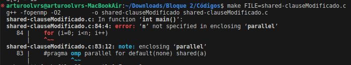

	Esto se debe a que al incluir dicha cláusula el ámbito por defecto no se especifica, por lo que hay que ponerlo explícitamente para cada variable empleada en la región correspondiente. Como no se ha especificado el ámbito de la variable `n`, da error de compilación.

- **Resolver el problema generado sin eliminar `default(none)`. Incorporar el código con la modificación al cuaderno de prácticas.**
	
	Una vez se ha añadido la variable `n` a la cláusula `shared`, el código ya se compila y funciona sin problema. El código final, disponible en el archivo [`shared-clauseModificado.c`](https://github.com/LosDelDGIIM/LosDelDGIIM.github.io/blob/main/subjects/AC/Pr%C3%A1cticas/Bloque%202/C%C3%B3digos/shared-clauseModificado.c),
	quedaría así:
	```c
	#pragma omp parallel for default(none) shared(a,n)
   for (i=0; i<n; i++)
   {
       a[i] += i;
   }
	```
	La ejecución del programa sería la siguiente:
	
	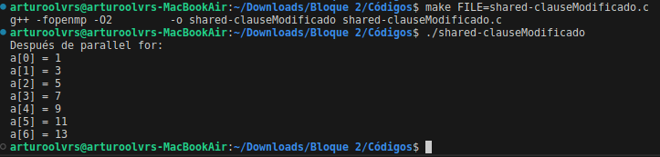


### Ejercicio 2.

- **Añadir a lo necesario a [`private-clause.c`](https://github.com/LosDelDGIIM/LosDelDGIIM.github.io/blob/main/subjects/AC/Pr%C3%A1cticas/Bloque%202/C%C3%B3digos/private-clause.c) para que imprima `suma` fuera de la región `parallel`. Inicializar `suma` dentro del parallel a un valor distinto de $0$. Ejecutar varias veces el código ¿Qué imprime el código fuera del `parallel`? Razonar respuesta.**

	Tras modificar el código para que imprima la variable `suma` fuera de la región `parallel`, el código quedaría así, como se puede ver en el archivo [`private-clauseModificado_a.c`](https://github.com/LosDelDGIIM/LosDelDGIIM.github.io/blob/main/subjects/AC/Pr%C3%A1cticas/Bloque%202/C%C3%B3digos/private-clauseModificado_a.c):
	```c
	#pragma omp parallel private(suma)
   {
      suma=10;
      #pragma omp for private(i)	
      for (i=0; i<n; i++)
      {
         suma = suma + a[i];
         printf("Hebra %d suma a[%d] / ",
               omp_get_thread_num(),i);
      } 
      printf("\n* Hebra %d suma= %d",
               omp_get_thread_num(),suma);
   }

   printf("\nSuma fuera de parallel: %d\n",suma);
   printf("\n");
	```

	La ejecución del programa sería la siguiente:

	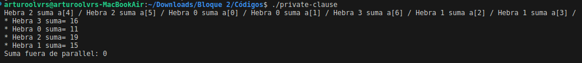

	Veamos ahora por qué ocurre esto. Fuera del `parallel`, se imprime la suma anterior, sin haberse actualizado. Esto se debe a que la directiva `private` hace que se actualicen las variables privadas, pero la compartida (que es la que se imprime al salirse del `parallel`) no se modifica. De hecho, las sumas parciales se ven incrementadas en $10$, ya que es el valor inicial que se le ha dado a la suma privada, pero esta modificación no afecta a la variable de la zona secuencial.
  
- **Modificar el código del apartado anterior para que se inicialice `suma` fuera del `parallel` en lugar de dentro ¿Qué ocurre? Comparar todo lo que imprime el código ahora con la salida en el apartado anterior. Razonar respuesta.**

	El código modificado quedaría así, como se puede ver en el archivo [`private-clauseModificado_b.c`](https://github.com/LosDelDGIIM/LosDelDGIIM.github.io/blob/main/subjects/AC/Pr%C3%A1cticas/Bloque%202/C%C3%B3digos/private-clauseModificado_b.c):
	```c
	suma=10;
   #pragma omp parallel private(suma)
   {
      #pragma omp for private(i)	
      for (i=0; i<n; i++)
      {
         suma = suma + a[i];
         printf("Hebra %d suma a[%d] / ",
               omp_get_thread_num(),i);
      } 
      printf("\n* Hebra %d suma= %d",
               omp_get_thread_num(),suma);
   }

   printf("\nSuma fuera de parallel: %d\n",suma);
   printf("\n");
	```

	La ejecución del programa sería la siguiente:

	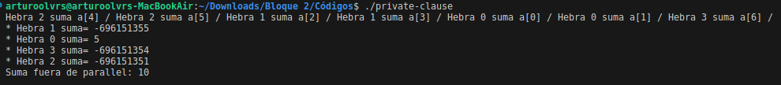

	En este caso, volvemos a estar en la misma situación anterior, la variable de la parte secuencial no se modifica en la sección paralela. No obstante, como en este caso la cláusula `private(suma)` no inicializa dicho valor, contiene basura; por lo que los resultados que imprimen son indefinidos. Esto se solucionaría usando `firstprivate` en vez de `private`.


### Ejercicio 3.

**Eliminar la cláusula  `private(suma)` en [`private-clause.c`](https://github.com/LosDelDGIIM/LosDelDGIIM.github.io/blob/main/subjects/AC/Pr%C3%A1cticas/Bloque%202/C%C3%B3digos/private-clause.c). Ejecutar el código resultante. ¿Qué ocurre? ¿A qué es debido?**

El código resultante, disponible en el archivo [`private-clauseModificado3.c`](https://github.com/LosDelDGIIM/LosDelDGIIM.github.io/blob/main/subjects/AC/Pr%C3%A1cticas/Bloque%202/C%C3%B3digos/private-clauseModificado3.c), quedaría así:
```c
#pragma omp parallel
{
   suma=0;
   #pragma omp for private(i)	
   for (i=0; i<n; i++)
   {
       suma = suma + a[i];
       printf("Hebra %d suma a[%d] / ",
             omp_get_thread_num(),i);
   } 
   printf("\n* Hebra %d suma= %d",
             omp_get_thread_num(),suma);
}
   printf("\n"); return(0);
```

La ejecución del programa sería la siguiente:

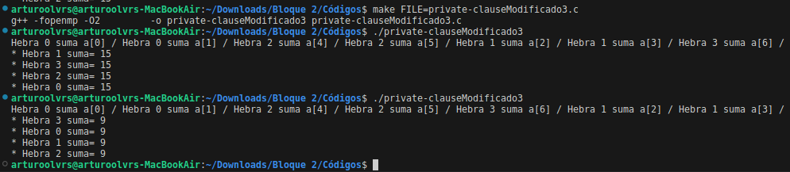

En este caso, como la variable `suma` es compartida y no lleva ninguna directiva como `critical` o `single`, no se sincronizan bien los distintos hilos y, por tanto, se calculará un valor u otro dependiendo de qué hilo llegue primero. Como vemos, en la primera ejecución sale $15$ y en la segunda sale $9$, lo que muestra que efectivamente no se calcula el resultado correctamente.

Además, como el `for` lleva una `barrier` implícita al final, tenemos que se esperan entre sí las distintas hebras y, por tanto, la variable `suma` coincide para todas las hebras, como se ve en la captura de pantalla.


### Ejercicio 4.

**En la ejecución de [`firstlastprivate-clause.c`](https://github.com/LosDelDGIIM/LosDelDGIIM.github.io/blob/main/subjects/AC/Pr%C3%A1cticas/Bloque%202/C%C3%B3digos/firstlastprivate-clause.c) se imprime un valor constante fuera de la región `parallel`.**

- **Cambiar el tamaño del vector a $10$. Razonar lo que imprime el código en su PC con esta modificación.**

  En este caso, debido al uso de `firstprivate` la variable `suma` es privada y está inicializada a $0$ en cada una de las hebras. Además, debido al uso de `lastprivate`, la variable `suma` tras la región `parallel` contendrá el valor que almacena la última hebra. En este caso, como la última hebra (3) ejecuta las iteraciones 8 y 9, `suma` valdrá $8+9=17$, como se puede observar en la siguiente captura de pantalla.

	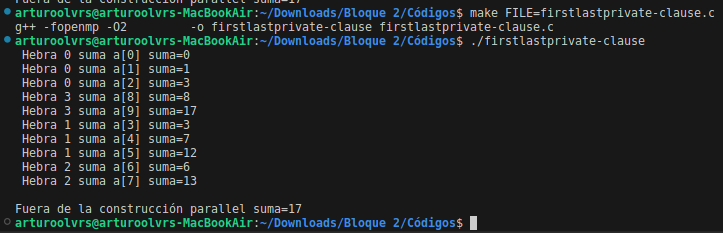

- **Sin cambiar el tamaño del vector ¿podría imprimir el código otro valor? Razonar respuesta (añadir capturas de pantalla que muestren lo que ocurre).**

	Sí, esto es posible simplemente obligando a la última hebra a que acumule un número distinto de valores, lo que se puede conseguir modificando el número de hebras. En el ejemplo mostrado en la captura, debido a la orden `export OMP_NUM_THREADS=2` tan solo se emplearán dos hebras, por lo que la última hebra acumulará las iteraciones 5, 6 7 8 y 9, por lo que suma guardará $5+6+7+8+9=35$.

	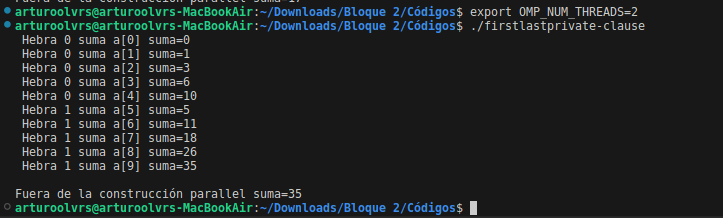


### Ejercicio 5.

**¿Qué se observa  en los resultados de ejecución de [`copyprivate-clause.c`](https://github.com/LosDelDGIIM/LosDelDGIIM.github.io/blob/main/subjects/AC/Pr%C3%A1cticas/Bloque%202/C%C3%B3digos/copyprivate-clause.c) cuando se elimina la cláusula `copyprivate(a)` en la directiva `single`? ¿A qué cree que es debido?**

Al eliminar la cláusula `copyprivate(a)` en la directiva `single`, el código queda así, como se puede ver en el archivo [`copyprivate-clauseModificado.c`](https://github.com/LosDelDGIIM/LosDelDGIIM.github.io/blob/main/subjects/AC/Pr%C3%A1cticas/Bloque%202/C%C3%B3digos/copyprivate-clauseModificado.c):
```c
#pragma omp parallel 
{  int a;
   #pragma omp single // copyprivate(a)
   {
      printf("Introduce valor de inicialización a: ");scanf("%d",&a);
      printf("Single ejecutada por la hebra %d\n",
             omp_get_thread_num());
   }

   #pragma omp for
   for (i=0; i<n; i++)
       b[i] = a;

}
```

La ejecución del programa sería la siguiente:

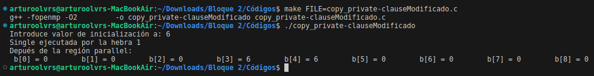

Esto se debe a que, al entrar en la región `parallel`, cada hebra declara una variable (que será privada), `int a`. Esta variable no se inicializa, por lo que contendrá basura. Al ejecutar el `single`, la hebra correspondiente (la 1 en nuestro caso) le da un valor a dicha variable, por lo que ya no contendrá basura en dicha hebra (en el resto de hebras, como se ha quitado la directiva `copyprivate`, no se modificará). Por tanto, a la hora de asignar valores al vector, tan solo se les dará el valor correcto a las componentes que ha asignado la hebra que hubiese ejecutado el `single`.

Como podemos ver, tan solo se han modificado correctamente las componentes 3 y 4, iteraciones realizadas por la hebra 1. Para el resto de componentes, pensábamos que imprimiría basura, pero se imprime el valor 0. Esto será debido a que el compilador (o la optimización que este realiza) notan que usamos una variable sin inicializar y le darán el valor por defecto, el nulo. No obstante, eso no se puede asegurar que pase en cualquier compilador. Es una mala praxis.


### Ejercicio 6.

**En el ejemplo [`reduction-clause.c`](https://github.com/LosDelDGIIM/LosDelDGIIM.github.io/blob/main/subjects/AC/Pr%C3%A1cticas/Bloque%202/C%C3%B3digos/reduction-clause.c) sustituya `suma=0` por `suma=10`. ¿Qué resultado se imprime ahora? Justifique el resultado.**

El código modificado quedaría así, como se puede ver en el archivo [`reduction-clauseModificado.c`](https://github.com/LosDelDGIIM/LosDelDGIIM.github.io/blob/main/subjects/AC/Pr%C3%A1cticas/Bloque%202/C%C3%B3digos/reduction-clauseModificado.c):
```c
int main(int argc, char **argv)
{
   int i, n=20;
   int a[n],suma=10;
   if(argc < 2)     {
      fprintf(stderr,"[ERROR]-Falta iteraciones\n");
      exit(-1);
     }
   n = atoi(argv[1]); if (n>20) {n=20; printf("n=%d",n);}

   for (i=0; i<n; i++) {
      a[i] = i; 
   }
 
   #pragma omp parallel for default(none) private(i) shared(a,n) \
                            reduction(+:suma)
   for (i=0; i<n; i++)
   {   suma += a[i];
   } 

   printf("Tras 'parallel' suma=%d\n",suma);
   return(0);
}
```

La ejecución del programa sería la siguiente:

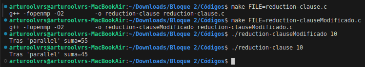

El resultado ahora no es el correcto, sino que se ha aumentado en $10$. Esto se debe a que la cláusula `reduction` suma, no solo todas las variables `suma` privadas que se han creado, sino que  también se suma el valor de la variable secuencial. Por tanto, en este caso no se sumará un $0$, sino que se sumará un $10$, modificando por tanto el resultado.


### Ejercicio 7.

**En el ejemplo [`reduction-clause.c`](https://github.com/LosDelDGIIM/LosDelDGIIM.github.io/blob/main/subjects/AC/Pr%C3%A1cticas/Bloque%202/C%C3%B3digos/reduction-clause.c), elimine `reduction()` de `#pragma omp parallel for reduction(+:suma)` y haga las modificaciones necesarias para que se siga realizando la suma de los componentes del vector a en paralelo sin añadir más directivas de trabajo compartido.**

En este caso, como no se incluye la cláusula `reduction` es necesario sincronizar los procesos para que la suma se realice de forma correcta. Esto lo haremos compartiendo la variable `suma` con la cláusula `shared`. Por último, para sincronizar los hilos usaremos la directiva `atomic`. El código modificado quedaría así, como se puede ver en el archivo [`reduction-clauseModificado7.c`](https://github.com/LosDelDGIIM/LosDelDGIIM.github.io/blob/main/subjects/AC/Pr%C3%A1cticas/Bloque%202/C%C3%B3digos/reduction-clauseModificado7.c):
```c
#pragma omp parallel for default(none) private(i) shared(a,n, suma)
for (i=0; i<n; i++)
{  
	#pragma omp atomic 
	suma += a[i];
}
```

La ejecución del programa sería la siguiente:

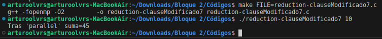

Como podemos ver, el resultado es el correcto, ya que se ha sincronizado correctamente la suma de las componentes del vector `a`.

## Parte II. Resto de ejercicios

### Ejercicio 8.

**Implementar en paralelo el producto matriz por vector con OpenMP usando la directiva `for` a partir del código secuencial disponible en [pmv-secuencial.c](https://github.com/LosDelDGIIM/LosDelDGIIM.github.io/blob/main/subjects/AC/Pr%C3%A1cticas/Bloque%202/C%C3%B3digos/pmv-secuencial.c). Debe implementar dos versiones del código:**
- **Una primera que paralelice el bucle que recorre las filas de la matriz.**
- **Una segunda que paralelice el bucle que recorre las columnas de la matriz.**

**Use las directivas que estime oportunas y las cláusulas que sean necesarias excepto la cláusula `reduction`. Se debe paralelizar también la inicialización de las matrices.**

*Notas:*
- *El número de filas/columnas $N$ de la matriz deben ser argumentos de entrada.*
- *Se debe inicializar la matriz y el vector antes del cálculo.*
- *Se debe asegurar que el programa calcula la suma correctamente imprimiendo todos los componentes del vector resultante, $v2$, para tamaños pequeños de los vectores (por ejemplo, $N=8$ y $N=11$).*
- *Se debe imprimir sea cual sea el tamaño de los vectores el tiempo de ejecución del código que calcula el producto matriz vector, el número de hilos que usa y, al menos, el primer y último componente del resultado (esto último evita que las optimizaciones del compilador eliminen el código de la suma).*

Respecto a la paralelización del bucle que recorre las filas de la matriz, el código quedaría así, como se puede ver en el archivo [`pmv-OpenMP_a.c`](https://github.com/LosDelDGIIM/LosDelDGIIM.github.io/blob/main/subjects/AC/Pr%C3%A1cticas/Bloque%202/C%C3%B3digos/pmv-OpenMP_a.c):
```c
// Inicialización de la matriz y los vectores
#pragma omp parallel for
for (int i = 0; i < N; i++){
	v1[i] = 0.1*i;
	v2[i] = 0;
	
	for (int j = 0; j < N; j++)
		m[i][j] = i*N+j;
}
//...

// Producto matriz por vector
#pragma omp parallel
{
	#pragma omp single  // Para determinar el número de hilos
	n_threads = omp_get_num_threads();

	#pragma omp for
	for(int i = 0; i < N; i++)
		for (int j = 0; j < N; j++)
			v2[i] += m[i][j] * v1[j];

}
```

La paralelización por filas no supone problemas, ya que se realiza de forma intuitiva. Además, cada componente del vector solución es calculada por solo uno de los hilos creados, por lo que no supone problemas de comunicación entre los hilos.

Respecto a la paralelización del bucle que recorre las columnas de la matriz, el código quedaría así, como se puede ver en el archivo [`pmv-OpenMP_b.c`](https://github.com/LosDelDGIIM/LosDelDGIIM.github.io/blob/main/subjects/AC/Pr%C3%A1cticas/Bloque%202/C%C3%B3digos/pmv-OpenMP_b.c):
```c
// Inicializar vectores
#pragma omp parallel for
for (int i = 0; i < N; i++){
	v1[i] = 0.1*i;
	v2[i] = 0;
}

// Inicializar matriz    
#pragma omp parallel // Para que solo cree y destruya los hilos una vez
for (int i = 0; i < N; i++){
	
	#pragma omp for    // Paraleliza recorrido por columnas
	for (int j = 0; j < N; j++)
		m[i][j] = i*N+j;
}

//...

// Producto matriz por vector
#pragma omp parallel // Para que solo crea y destruya los hilos una vez
for(int i = 0; i < N; i++){
	double suma_local = 0;

	#pragma omp for    // Paraleliza recorrido por columnas
	for (int j = 0; j < N; j++)
		suma_local += m[i][j] * v1[j];
	
	#pragma omp atomic
	v2[i] += suma_local;
}
```

La paralelización por columnas es, en cierto modo, más compleja. En primer lugar cabe destacar que no es buena praxis programar un `for` y dentro de él un `parallel for`, ya que en dicho caso en cada iteración del bucle externo estaríamos creando desde 0 todos los hilos. Asimismo, en el caso del cálculo en sí, notemos que no es conveniente usar el `atomic` dentro del bucle paralelizado, ya que esto provocaría que se ejecutase de forma secuencial. Por ello, se ha optado por emplear la variable privada `suma_local` para poder calcularla de forma paralela y, posteriormente, unir los resultados con el uso de la directiva `atomic`.

La ejecución de ambos códigos sería la siguiente:


### Ejercicio 9.

**A partir de la segunda versión de código paralelo desarrollado en el ejercicio anterior, implementar una versión paralela del producto matriz por vector con OpenMP que use para comunicación/sincronización la cláusula `reduction`.**

El código fuente de la implementación sería el siguiente, como se puede ver en el archivo [`pmv-OpenMP_reduction.c`](https://github.com/LosDelDGIIM/LosDelDGIIM.github.io/blob/main/subjects/AC/Pr%C3%A1cticas/Bloque%202/C%C3%B3digos/pmv-OpenMP_reduction.c):
```c
#pragma omp parallel // Para que solo crea y destruya los hilos una vez
for(int i = 0; i < N; i++){

	#pragma omp for reduction(+:v2[i])    // Paraleliza recorrido por columnas
	for (int j = 0; j < N; j++)
		v2[i] += m[i][j] * v1[j];
}
```

La ejecución del programa sería la siguiente:

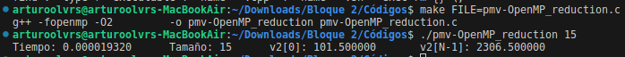

Como podemos ver, en este caso no es necesario emplear la variable privada `suma_local` ni la directiva `atomic`, ya que precisamente esto es lo que hace la cláusula `reduction`. Notemos que no hay problema ninguno con usar dicha cláusula con la componente de un vector.


### Ejercicio 10.

**Realizar una tabla y una gráfica que permitan comparar la escalabilidad (ganancia en velocidad en función del número de cores) en atcgrid4, en uno de los nodos de la cola ac y en su PC del mejor código paralelo de los tres implementados en los ejercicios anteriores para dos tamaños (N) distintos. Usar `-O2` al compilar. Justificar por qué el código escogido es el mejor.**


Ejecutemos en primer lugar los códigos en atcgrid4 para obtener una primera aproximación a cuál es el mejor código. Para ello, ejecutaremos los códigos con $N=2000$ usando los 32 cores disponibles en atcgrid4. Los resultados obtenidos son los siguientes:

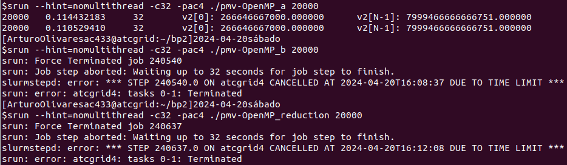

Como se ha visto en la Lección correspondiente en Teoría, y como se ha observado en la programación, al paralelizar el acceso a las filas no es necesaria comunicación alguna entre los distintos hilos, por lo que la escalabilidad será mucho mayor.

Por el otro lado, al paralelizar el acceso por columnas (las otras dos opciones) es necesaria la comunicación entre los distintos hilos mediante una reducción. Por tanto, esta comunicación ralentiza en cierta medida la ejecución, llegando incluso a provocar que el gestor de colas Slurm aborte los programas por alcanzar el límite de tiempo, como ha ocurrido en este caso. Por tanto, optamos que la mejor opción es la paralelización por filas, disponible en el archivo [`pmv-OpenMP_a.c`](https://github.com/LosDelDGIIM/LosDelDGIIM.github.io/blob/main/subjects/AC/Pr%C3%A1cticas/Bloque%202/C%C3%B3digos/pmv-OpenMP_a.c).

Para enviar los códigos a las colas, he hecho uso del siguiente script de bash, disponible en el archivo [`pmv-OpenMP_script.sh`](https://github.com/LosDelDGIIM/LosDelDGIIM.github.io/blob/main/subjects/AC/Pr%C3%A1cticas/Bloque%202/C%C3%B3digos/pmv-OpenMP_script.sh):
```bash
# Necesario en PC personal, ya que no usamos Slurm
export OMP_PROC_BIND=spread    # Asignación de hebras a cores físicos

# El primer parámetro es el programa que queremos ejecutar
# El segundo parámetro es el tamaño del problema
programa=$1
size=$2

# El tercer parámetro es el número máximo de procesadores a usar
maxProc=$3

for (( i=1; i<=$maxProc; i++ ))
do
   # En Atcgrid: contamos con Slurm
   # srun -c $i $programa $size
   
   # En PC personal (no tenemos Slurm):
   export OMP_NUM_THREADS=$i       # Número de cores físicos
   $programa $size
done
```

Notemos que, al igual que ocurría en el BP1, dependiendo si el archivo se ejecutará desde mi PC o desde los nodos de cómputo de Atcgrid, deberemos comentar o descomentar las líneas correspondientes.

Para el caso de las veriosnes paralelizadas, la compilación y envío a los nodos de cómputo de Atcgrid se ha realizado como sigue:

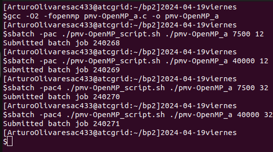

Para el caso de las versiones secuenciales, la compilación y envío a los nodos de cómputo de Atcgrid se ha realizado como sigue:

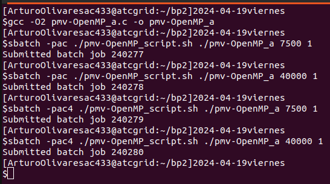


Los resultados obtenidos se pueden ver en la siguiente tabla, donde en las primeras columnas salen los resultados obtenidos en un nodo normal de atcgrid, en las segundas columnas los obtenidos en atcgrid y en las últimas columnas los obtenidos en mi PC personal. En la tabla se ha incluido la ganancia de velocidad, $S(p)$, que se ha calculado como:
$$S(p)=\frac{T_{secuencial}}{T(p)}$$

La tabla es la siguiente:
||$N=7500$||$N=40000$||||$N=7500$||$N=40000$||||$N=7500$||$N=40000$||
|---|---|---|---|---|---|---|---|---|---|---|---|---|---|---|---|---|
Nº cores $(p)$ | $T(p)$ | $S(p)$ | $T(p)$ | $S(p)$ |||  $T(p)$ | $S(p)$ | $T(p)$ | $S(p)$ ||| $T(p)$ | $S(p)$ | $T(p)$ | $S(p)$ |
Secuencial | $0,0804$ | ---- | $2,9498$ | ---- ||| $0,1114$ | ---- | $2,8803$ | ---- ||| $0,0619$ | ---- | $0,6974$ | ---- |
1 | $0,0850$ | $0,9459$ | $3,0181$ | $0,9774$ ||| $0,1189$ | $0,9366$ | $2,8154$ | $1,0231$ ||| $0,0606$ | $1,0221$ | $0,7232$ | $0,9642$ |
2 | $0,0467$ | $1,7236$ | $1,9720$ | $1,4958$ ||| $0,0593$ | $1,8775$ | $1,9008$ | $1,5154$ ||| $0,0403$ | $1,5341$ | $0,3760$ | $1,8548$ |
3 | $0,0366$ | $2,2008$ | $1,5625$ | $1,8879$ ||| $0,0393$ | $2,8372$ | $1,2955$ | $2,2233$ ||| | | | |
4 | $0,0352$ | $2,2882$ | $1,3346$ | $2,2102$ ||| $0,0311$ | $3,5865$ | $0,9646$ | $2,9861$ ||| | | | |
5 | $0,0311$ | $2,5898$ | $1,1254$ | $2,6212$ ||| $0,0280$ | $3,9790$ | $0,7690$ | $3,7454$ ||| | | | |
6 | $0,0297$ | $2,7068$ | $1,0543$ | $2,7979$ ||| $0,0281$ | $3,9703$ | $0,6497$ | $4,4331$ ||| | | | |
7 | $0,0258$ | $3,1137$ | $0,9119$ | $3,2349$ ||| $0,0273$ | $4,0866$ | $0,5367$ | $5,3666$ ||| | | | |
8 | $0,0232$ | $3,4701$ | $0,7273$ | $4,0557$ ||| $0,0269$ | $4,1449$ | $0,4766$ | $6,0430$ ||| | | | |
9 | $0,0211$ | $3,8037$ | $0,6566$ | $4,4928$ ||| $0,0272$ | $4,0887$ | $0,3990$ | $7,2180$ ||| | | | |
10 | $0,0191$ | $4,2029$ | $0,6272$ | $4,7030$ ||| $0,0271$ | $4,1086$ | $0,3427$ | $8,4039$ ||| | | | |
11 | $0,0179$ | $4,5047$ | $0,5946$ | $4,9606$ ||| $0,0272$ | $4,1024$ | $0,3367$ | $8,5550$ ||| | | | |
12 | $0,0168$ | $4,7872$ | $0,6171$ | $4,7801$ ||| $0,0269$ | $4,1477$ | $0,2984$ | $9,6528$ ||| | | | |
32 | Cores | Cores | Cores | Cores ||| $0,0210$ | $5,3066$ | $0,1641$ | $17,549$ ||| | | | |


Las gráficas obtenidas son las siguientes:

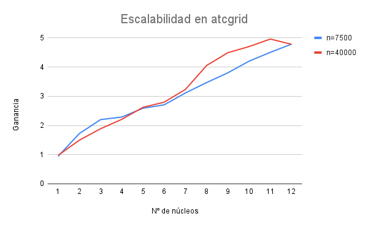
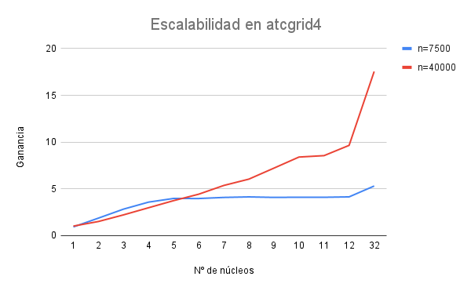
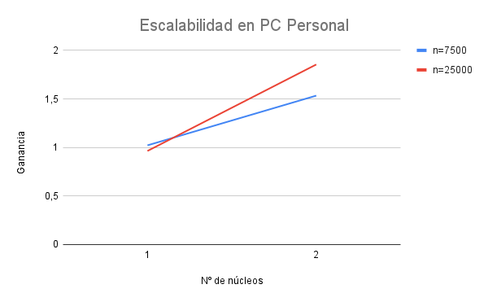

Se repite el mismo patrón en las tres gráficas anteriores, por lo que las conclusiones que saquemos a priori serán fiables.

En primer lugar, y aunque en las gráficas puede ser que no se aprecie, hemos de notar que para $p=1$ en algunos casos se da una ganancia menor que 1, lo que implica que el código secuencial es más rápido que el paralelizado con un único procesador. Esto se debe a que, aunque en ningún momento sea necesario crear nuevos hilos, la herramienta OpenMP incluye cierto overhead que supone que sea más rápido el secuencial.

En segundo lugar, podemos ver que para un número bajo de procesadores la ganancia es mayor en el caso del tamaño del problema menor, mientras que conforme el número de procesadores crece vemos que la ganancia para el mayor tamaño del problema sobrepasa a la otra, algo que se ve claramente en el caso de $p=32$ en el nodo de cómputo actgrid4.

Por último, vemos que para un número de procesadores muy grande, la ganancia para el tamaño menor no se ve incrementada de igual forma, sino que parece que se estabiliza. Esto se debe a que las prestaciones que supone la paralelización se ven equilibradas por el gran overhead que supone la creación de tantos hilos, por lo que la ganancia no se mejora en igual proporción.
