# Arquitectura de Computadores. Bloque de Prácticas 3

**Autor:** Arturo Olivares Martos
***

- **Asignatura:** Arquitectura de Computadores.
- **Curso Académico:** 2023-24.
- **Grado:** Doble Grado en Ingeniería Informática y Matemáticas.
- **Grupo:** Único.
- **Profesor:** Mancia Anguita López.
- **Descripción:** Bloque 3 de las prácticas de AC.
<!--- **Fecha:** 17 de abril de 2023. -->
<!-- - **Duración:** -->


## Parte I. Ejercicios basados en los ejemplos del seminario práctico

*Nota*: Para compilar cualquier programa, he hecho uso del siguiente [makefile](https://github.com/LosDelDGIIM/LosDelDGIIM.github.io/blob/main/subjects/AC/Pr%C3%A1cticas/Bloque%203/C%C3%B3digos/makefile):
```makefile
CXX := g++
CXXFLAGS := -fopenmp -O2	# -D DEBUG

# Objetivo predeterminado (compilar el archivo proporcionado)
.DEFAULT_GOAL := compile

# Regla para compilar el archivo CPP especificado
compile: $(FILE)
	$(CXX) $(CXXFLAGS) -o $(basename $(FILE)) $(FILE)

# Limpieza de archivos generados.
# Se eliminan todos los archivos ejecutables que no sean scripts de bash o archivos de código fuente.
clean:
	find . -type f -executable ! -name "*.cpp" ! -name "*.sh" -exec rm {} \;
```
Como podemos ver, tan solo cuenta con dos reglas:
- `compile`: Compila el archivo que se le pase como argumento. Se llamará al poner `make FILE=nombreArchivo`.
    
    Como vemos, compila con la opción `-O2` y `-fopenmp`, y además se puede descomentar la opción `-D DEBUG` para que se muestren mensajes de depuración. También se puede comentar la opción `-fopenmp` para que no se compile con OpenMP, obteniendo por tanto un programa secuencial.

- `clean`: Elimina todos los archivos ejecutables generados, excepto los scripts de bash y los archivos de código fuente.


### Ejercicio 1.

**Usar la cláusula `num_threads(x)` en el ejemplo del seminario [`if_clause.c`](https://github.com/LosDelDGIIM/LosDelDGIIM.github.io/blob/main/subjects/AC/Pr%C3%A1cticas/Bloque%203/C%C3%B3digos/if-clause.c), y añadir un parámetro de entrada al programa que fije el valor `x` que se va a usar en la cláusula.**

El código modificado, que se encuentra en el archivo [`if-clauseModificado.c`](https://github.com/LosDelDGIIM/LosDelDGIIM.github.io/blob/main/subjects/AC/Pr%C3%A1cticas/Bloque%203/C%C3%B3digos/if-clauseModificado.c),
tiene modificadas las clásulas de la siguiente directiva:
```c
#pragma omp parallel if(n>4) default(none) \
                private(sumalocal,tid) shared(a,suma,n) \
                num_threads(n_threads)
```

En este caso, si el número de iteraciones es mayor que 4, entonces se emplearán el número de hebras que el usuario asigne mediante el segundo parámetro. En el caso de que el número de iteraciones sea menor o igual que 4, entonces el código se ejecutará de forma secuencial.
Este programa sirve como ejemplo para analizar el orden de precedencia para fijar el número de hebras que se emplearán en una región paralela, donde vemos que aunque la cláusula `num_threads` sirve para fijar este valor, la cláusula `if` tiene mayor precedencia.

El resultado de la ejecución se muestra en la siguiente imagen:

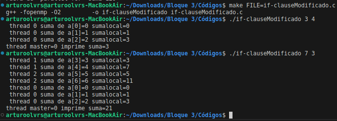


### Ejercicio 2.

**Rellenar la siguiente tabla usando el programa [`scheduled-clause.c`](https://github.com/LosDelDGIIM/LosDelDGIIM.github.io/blob/main/subjects/AC/Pr%C3%A1cticas/Bloque%203/C%C3%B3digos/scheduled-clause.c) con tres threads (0,1,2) y un número de iteraciones de 16 (0 a 15 en la tabla). Con este ejercicio se pretende comparar distintas alternativas de planificación de bucles. Se van a usar distintos tipos (`static`, `dynamic`, `guided`), modificadores (`monotonic` y p ) y tamaños de chunk (x = 1 y 2). Destacar las diferencias entre las 4 alternativas de planificación de la tabla, en particular, las que hay entre `static`, `dynamic` y `guided` y las diferencias entre usar `monotonic` y `nonmonotonic`.**

La tabla generada es:

Iteración | `monotonic:static,1` | `monotonic:static,2` | `nonmonotonic:static,1` | `nonmonotonic:static,2` | `monotonic:dynamic,1` | `monotonic:dynamic,2` | `monotonic:guided,1` | `monotonic:guided,2`
--- | --- | --- | --- | --- | --- | --- | --- | ---
0 | 0 | 0 | 0 | 0 | 0 | 1 | 1 | 0
1 | 1 | 0 | 1 | 0 | 1 | 1 | 1 | 0
2 | 2 | 1 | 2 | 1 | 2 | 0 | 1 | 0
3 | 0 | 1 | 0 | 1 | 2 | 0 | 1 | 0
4 | 1 | 2 | 1 | 2 | 2 | 2 | 1 | 0
5 | 2 | 2 | 2 | 2 | 2 | 2 | 1 | 0
6 | 0 | 0 | 0 | 0 | 2 | 1 | 0 | 1
7 | 1 | 0 | 1 | 0 | 2 | 1 | 0 | 1
8 | 2 | 1 | 2 | 1 | 2 | 1 | 0 | 1
9 | 0 | 1 | 0 | 1 | 2 | 1 | 0 | 1
10 | 1 | 2 | 1 | 2 | 2 | 1 | 2 | 1
11 | 2 | 2 | 2 | 2 | 1 | 1 | 2 | 2
12 | 0 | 0 | 0 | 0 | 1 | 0 | 1 | 2
13 | 1 | 0 | 1 | 0 | 1 | 0 | 1 | 1
14 | 2 | 1 | 2 | 1 | 1 | 2 | 0 | 1
15 | 0 | 1 | 0 | 1 | 1 | 2 | 0 | 1


La más directa de diferenciar es la asignación `static`, ya que vemos claramente la asignación *Round-Robin* de los chunks y que dicha asignación se ha realizado en tiempo de compilación (por estar claramente en orden).

Respecto de las otras dos formas de asignación (`dynamic` y `guided`), vemos que la asignación no se realiza en el tiempo de compilación, ya que esta no está en orden, diferenciándose por tanto de la estática. Entre ellas la diferencia es más sutil y no es fácil apreciarlo en la tabla, ya que no se ve el tamaño del chunk, aunque en la guiada se puede intuir que algunas asignaciones se han realizado con un chunk mayor, y este ha ido decreciendo.

Por último, y respecto a la diferencia entre `monotonic` y `nonmonotonic`, aquí no se puede ver debido a que no se sabe en qué orden ha ejecutado cada hilo las iteraciones. No obstante, y viendo las salidas del programa, ha coincidido que las salidas con `nonmonotonic` seguían cumpliendo la restricción. Esto se debe a que, aunque no se obligue a que cumpla la restricción, puede darse el caso.


### Ejercicio 3.
**¿Qué valor por defecto usa OpenMP para `chunk` y `modifier` con `static`, `dynamic` y `guided`? Explicar qué ha hecho para contestar a esta pregunta.**

Como hemos indicado en la pregunta anterior, ver si por defecto es `monotonic` o no es complicado, ya que puede darse la casualidad de que aun así las iteraciones se asignen en orden creciente aun sin tener esa restricción. Por tanto, y recurriendo a la documentación oficial de la directiva `schedule` disponible [aquí](https://www.openmp.org/spec-html/5.0/openmpse49.html), vemos que en el caso de la asignación `static` es `monotonic`, y en cualquier otro tipo de asignación es `nonmonotonic`.

Respecto del tamaño de chunk por defecto, también hemos usado la documentación oficial, en concreto la Tabla 2.5 de [esta web](https://www.openmp.org/spec-html/5.0/openmpsu41.html#x64-1290002.9.2). Además, hemos empleado el programa [`scheduled-clauseDefault.c`](https://github.com/LosDelDGIIM/LosDelDGIIM.github.io/blob/main/subjects/AC/Pr%C3%A1cticas/Bloque%203/C%C3%B3digos/scheduled-clauseDefault.c), que como vemos usa el chuck por defecto, y analizaremos la salida para sacar conclusiones:
```c
#pragma omp parallel for reduction(+:suma)\
                schedule(guided)
for (i=0; i<n; i++)
{
    suma += a[i];
    printf(" thread %d suma a[%d]=%d suma=%d \n",
            omp_get_thread_num(),i,a[i],suma);
}
```

En primer lugar, analizamos el caso de asignación `static`. La salida es la de la siguiente imagen:


Aquí podemos observar que a cada hilo tan solo se le asigna un bloque de iteraciones, todos ellos del mismo chunk aproximadamente. Por tanto, el chunk es el necesario para que a cada hilo tan solo se le asigne un chunk.

En segundo lugar, analizamos el caso de la asignación `dynamic`. La salida es la de la siguiente imagen:

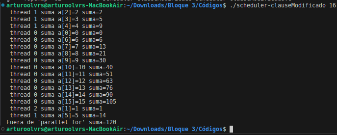

Es directo concluir que el tamaño del chunk por defecto es 1 en este tipo de asignación.

Por último, analizamos el caso de la asignación `guided`. La salida es la de la siguiente imagen:

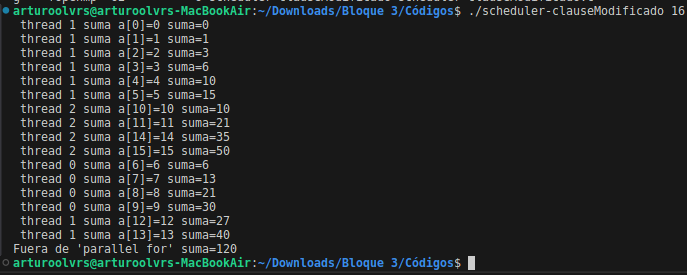

De igual forma, es directo concluir que el tamaño del chunk por defecto es 1 en este tipo de asignación.


### Ejercicio 4.
**Añadir al programa [`scheduled-clause.c`](https://github.com/LosDelDGIIM/LosDelDGIIM.github.io/blob/main/subjects/AC/Pr%C3%A1cticas/Bloque%203/C%C3%B3digos/scheduled-clause.c) lo necesario para que imprima el valor de las variables de control `dyn-var`, `nthreads-var`, `thread-limit-var` y `run-sched-va`r dentro (debe imprimir sólo un thread) y fuera de la región paralela. Realizar varias ejecuciones usando variables de entorno para modificar estas variables de control antes de la ejecución. ¿Se imprimen valores distintos dentro y fuera de la región paralela?**

El código modificado, que se encuentra en el archivo [`scheduled-clauseModificado.c`](https://github.com/LosDelDGIIM/LosDelDGIIM.github.io/blob/main/subjects/AC/Pr%C3%A1cticas/Bloque%203/C%C3%B3digos/scheduled-clauseModificado.c), contiene la siguiente función para consultar el valor de las variables de control:
```c
void print_var_control(){
    printf("- Ajuste dinámico de nº de hilos (0=false, 1=true): %d\n", omp_get_dynamic());
    printf("- Nº de threads: %d\n", omp_get_max_threads());
    printf("- Limite de threads: %d\n", omp_get_thread_limit());

    #ifdef _OPENMP
        omp_sched_t kind;
        int chunk;
    #else
        int kind=-1, chunk=-1;
    #endif
    
    omp_get_schedule(&kind, &chunk);
    printf("- Kind para la planificacion con runtime: %x\n", kind);
    printf("- Chunk para la planificacion con runtime: %d\n", chunk);
}
```

Además, se ha añadido la llamada a esta función tanto dentro como fuera de la región paralela, como se muestra a continuación:
```c
printf("Fuera de la region paralela:\n");
print_var_control();
printf("\n\n");

#pragma omp parallel
{
    #pragma omp master
    {
        printf("Dentro de la region paralela:\n");
        print_var_control();
        printf("\n\n"); 
    }

    #pragma omp barrier

    #pragma omp for reduction(+:suma) schedule(static,chunk)
    for (i=0; i<n; i++)
    {
        suma = suma + a[i];
        printf(" thread %d suma a[%d]=%d suma=%d \n",
            omp_get_thread_num(),i,a[i],suma);
    }
}
```


La salida del programa, ejecutado con diferentes valores de las variables de entorno, es la siguiente:

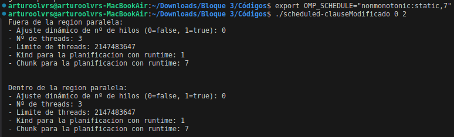

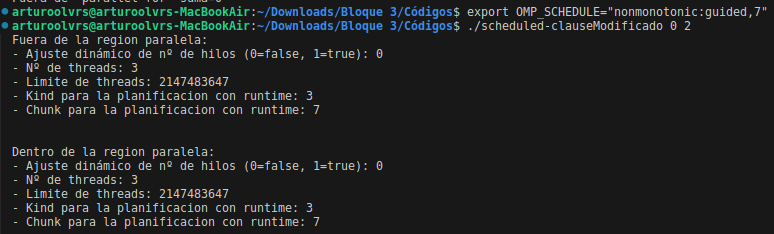
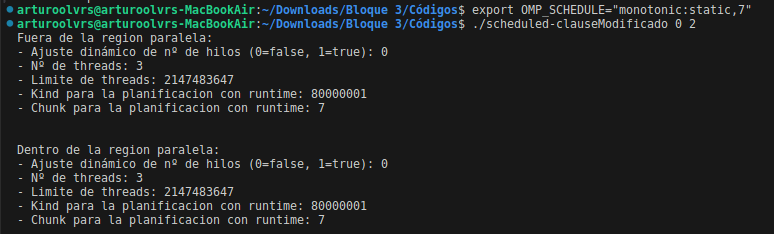

Como vemos, no se imprimen valores distintos dentro y fuera de la región paralela, sino que se imprimen los mismos valores. Esto se debe a que las tareas (tareas) creadas por el `parallel` heredan el entorno de datos (también variables de control), obteniendo por tanto los mismos resultados.


### Ejercicio 5.

**Usar en el ejemplo anterior las funciones `omp_get_num_threads()`, `omp_get_num_procs()` y `omp_in_parallel()` dentro y fuera de la región paralela. Imprimir los valores que obtienen estas funciones dentro (lo debe imprimir sólo uno de los threads) y fuera de la región paralela. Indicar en qué funciones se obtienen valores distintos dentro y fuera de la región paralela.**

El código modificado, que se encuentra en el archivo [`scheduled-clauseModificado2.c`](https://github.com/LosDelDGIIM/LosDelDGIIM.github.io/blob/main/subjects/AC/Pr%C3%A1cticas/Bloque%203/C%C3%B3digos/scheduled-clauseModificado2.c), contiene la misma función que en el apartado anterior, aunque modificada:
```c
void print_var_control(){
    printf("- Ajuste dinámico de nº de hilos (0=false, 1=true): %d\n", omp_get_dynamic());
    printf("- Nº de threads en sig. parallel: %d\n", omp_get_max_threads());
    printf("- Limite de threads: %d\n", omp_get_thread_limit());

    #ifdef _OPENMP
        omp_sched_t kind;
        int chunk;
    #else
        int kind=-1, chunk=-1;
    #endif
    
    omp_get_schedule(&kind, &chunk);
    printf("- Kind para la planificacion con runtime: %x\n", kind);
    printf("- Chunk para la planificacion con runtime: %d\n", chunk);

    printf("- Nº de threads en ejecución: %d\n", omp_get_num_threads());
    printf("- Nº de procesadores: %d\n", omp_get_num_procs());
    printf("- En region paralela (0=false, 1=true): %d\n", omp_in_parallel());
}
```

La ejecución del programa es la siguiente:

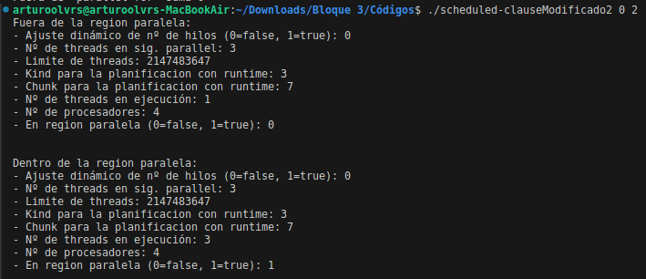

En este caso, tenemos que los datos introducidos en este ejercicio sí varían en función de si se está dentro de una región paralela o no. Esto se debe a que no son variables de entorno, sino que informan sobre el momento de la ejecución en el programa. No obstante, el número de procesadores disponibles, evidentemente, no cambia.


### Ejercicio 6.

**Añadir al programa `scheduled-clause.c` lo necesario para, usando funciones, modificar las variables de control `dyn-var`, `nthreads-var` y `run-sched-var` dentro de la región paralela y fuera de la región paralela. En la modificación de `run-sched-var` se debe usar un valor de `kind` distinto al utilizado en la cláusula `schedule()`. Añadir lo necesario para imprimir el contenido de estas variables antes y después de cada una de las dos modificaciones.**

El código modificado (con una modificación de las variables antes y después de la región paralela, y otra dentro de ella), que se encuentra en el archivo [`scheduled-clauseModificado3.c`](https://github.com/LosDelDGIIM/LosDelDGIIM.github.io/blob/main/subjects/AC/Pr%C3%A1cticas/Bloque%203/C%C3%B3digos/scheduled-clauseModificado3.c), es el siguiente:
```c
printf("Antes de la 1ª modificación fuera del parallel:\n");
print_var_control();
printf("\n\n");
omp_set_dynamic(1);
omp_set_num_threads(4);
omp_set_schedule((omp_sched_t)(omp_sched_guided | omp_sched_monotonic), 7);
printf("Después de la 1ª modificación fuera del parallel:\n");
print_var_control();
printf("------------------------------------\n\n");
printf("\n\n");


#pragma omp parallel
{
    #pragma omp master
    {
        printf("Antes de la modificación dentro del parallel:\n");
        print_var_control();
        printf("\n\n");
        omp_set_dynamic(0);
        omp_set_num_threads(5);
        omp_set_schedule(omp_sched_dynamic, 4);
        printf("Después de la modificación dentro del parallel:\n");
        print_var_control();
        printf("------------------------------------\n\n");
        printf("\n\n"); 
    }

    #pragma omp barrier

    #pragma omp for reduction(+:suma) schedule(static,chunk)
    for (i=0; i<n; i++)
    {
        suma = suma + a[i];
        printf(" thread %d suma a[%d]=%d suma=%d \n",
            omp_get_thread_num(),i,a[i],suma);
    }
}

printf("Antes de la 2ª modificación fuera del parallel:\n");
print_var_control();
printf("\n\n");
omp_set_dynamic(0);
omp_set_num_threads(5);
omp_set_schedule(omp_sched_dynamic, 4);
printf("Después de la 2ª modificación fuera del parallel:\n");
print_var_control();
printf("------------------------------------\n\n");
printf("\n\n");
```

Como aspecto a resaltar, para poder usar el modificador `monotonic`, como no se realiza un `casting` de `unsigned` a `omp_sched_t`, es necesario forzar el `casting`.
La ejecución del programa es la siguiente:

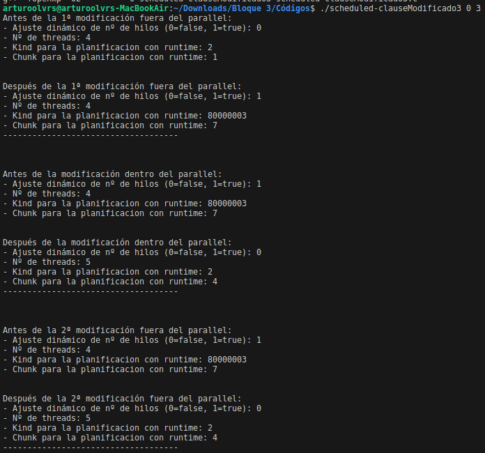

En primer lugar, este ejercicio sirve como ejemplo del diagrama de flujo visto en el seminario, ya que aunque la variable de control `run-sched-var` no contenga la asignación estática, como se ha usado la cláusula `schedule` con dicha asignación, entonces esta cláusula tiene mayor prioridad.

Respecto a las modificaciones, vemos que en cada caso ocurre algo que a priori parece diferente, por lo que expliquemos cada una.
- En la primera modificación, se modifican las variables de control sin problema, y esta modificación pertenece al ámbito de datos de la tarea principal.
- Cuando el hilo principal se encuentra la región `parallel`, todas las variables de control se heredan (como hemos visto en el ejercicio anterior), por lo que al consultarlas antes de modificarlas efectivamente vemos que la modificación se ha realizado. Además, tras consultarlas vemos que se han modificado en la región paralela.
- Al salir de la región paralela ocurre algo que a priori parece extraño, las modificaciones que se han realizado dentro del `parallel` no han surgido efecto, y se ha vuelto a los valores anteriores a la región paralela. Esto se debe a que estas modificaciones de las variables de control tan solo tienen efecto en la tarea que las modificó, que ya ha terminado por ser esta una de las asociadas a los hilos del `parallel`. 

*Este último caso es complejo, y en clase no se vió con detalle al no haber tratado el concepto de “tarea”*.


## Parte II. Resto de ejercicios

### Ejercicio 7.
**Implementar en paralelo la multiplicación de una matriz triangular superior por un vector a partir del código secuencial [`pmtv-secuencial.c`](https://github.com/LosDelDGIIM/LosDelDGIIM.github.io/blob/main/subjects/AC/Pr%C3%A1cticas/Bloque%203/C%C3%B3digos/pmtv-secuencial.c). El código debe repartir entre los threads las iteraciones del bucle que recorre las filas. La inicialización de los datos la debe hacer el thread 0. Añadir lo necesario para que el usuario pueda fijar la planificación de tareas usando la variable de entorno `OMP_SCHEDULE`.**

El código modificado, que se encuentra en el archivo [`pmtv-OpenMP.c`](https://github.com/LosDelDGIIM/LosDelDGIIM.github.io/blob/main/subjects/AC/Pr%C3%A1cticas/Bloque%203/C%C3%B3digos/pmtv-OpenMP.c), es el siguiente:
```c
// Calcular v2 = m * v1
#pragma omp parallel for schedule(runtime)
for(int i = 0; i < N; i++){
    for (int j = i; j < N; j++)
        v2[i] += m[i][j] * v1[j];
    
    // Imprime qué hilo ha realizado cada fila
    // Eliminar si N es muy grande
    printf("Fila: %d\t Hilo: %d\n", i, omp_get_thread_num());
}
```
Como aspecto a destacar del código, hemos usado la cláusula `schedule` con la opción `runtime`, de forma que se usará la asignación especificada en la variable de control `run-sched-var`.
Además, el `printf` del bucle tiene como único objetivo ver el funcionamiento de las distintas formas de planificación posibles. Para valores de `N` grandes dicha orden evidentemente se eliminará.

Respecto a la descomposición de dominio, en el presente código tenemos que se hace por filas, ya que distintas filas pueden asignarse a distintos hilos. De hecho, en el código se ha puesto una instrucción `printf` para saber qué hilo procesa cada fila de la matriz, por lo que así podremos saber dicha información.


La salida para distintos tipos de planificación es la siguiente:

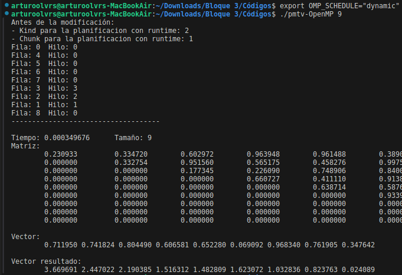
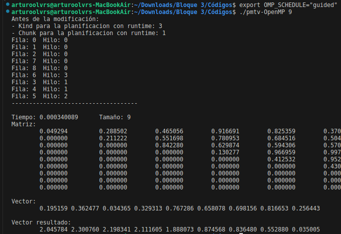

### Ejercicio 8.
**Contestar a las siguientes preguntas sobre el código del ejercicio anterior:**
- **¿Qué número de operaciones de multiplicación y qué número de operaciones de suma realizan cada uno de los threads en la asignación `static` con `monotonic` y un `chunk` de 1?**
- 
    Supongamos que $M\in \mathcal{M}_N(\mathbb{R})$ es una matriz de dimensión $N$, y notemos por $M[i]$ a la fila $i-$ésima de $M$, donde la primera fila será la $0$, y la última la $N-1$. Tenemos que la fila $M[i]$ requerirá $N-i$ multiplicaciones y $N-i-1$ sumas.

    Determinar cuántas operaciones se realizan en cada thread para un número cualquiera de hilos y cualquiera de filas no es fácil. Para $4$ hilos (que es el número de cores lógicos de mi PC) y $9$ filas, tenemos que:
    - Hilo $0$ procesa las filas $0$,$4$,$8$. Son $9+5+1=15$ multiplicaciones y $12$ sumas.
    - Hilo $1$ procesa las filas $1$,$5$. Son $8+4=12$ multiplicaciones y $10$ sumas.
    - Hilo $2$ procesa las filas $2$,$6$. Son $7+3=10$ multiplicaciones y $8$ sumas.
    - Hilo $3$ procesa las filas $3$,$7$. Son $6+2=8$ multiplicaciones y $2$ sumas.
    
    Como vemos, la carga de trabajo no está balanceada.


- **Con la asignación `dynamic` y `guided`, ¿qué cree que debe ocurrir con el número de operaciones de multiplicación y suma que realizan cada uno de los threads?** 

    Este número estaría mucho más equilibrado, puesto que los hilos que procesen las filas más costosas procesarán menos filas que los que procesen filas más sencillas. Esta asignación se hace en tiempo de ejecución, por lo que se evita que haya hilos sin carga de trabajo, ociosos.

- **¿Qué alternativa cree que debería ofrecer mejores prestaciones? Razonar la respuesta.**

    Sin duda alguna, ya hemos visto que la asignación estática queda descartada. Respecto de las otras dos, aunque no es directo ver cuál sería mejor, debido a la diferencia de sobrecarga que hay con la dinámica, pensamos que la guiada será una opción mejor. Además, como las cargas de trabajo se reducen conforme aumenta el índice de la fila a procesar, pensamos que efectivamente esta será la mejor elección. No obstante, la diferencia sería sutil.


### Ejercicio 9.
**Obtener en atcgrid los tiempos de ejecución del código paralelo que multiplica una matriz triangular por un vector con las alternativas de planificación `static`, `dynamic` y `guided` para chunk de $1$, $64$ y el chunk por defecto para la alternativa (con `monotonic` en todos los casos). Usar un tamaño de vector $N$ múltiplo del número de cores y de $64$ que esté entre $11520$ y $23040$. El número de threads en las ejecuciones debe coincidir con el número de núcleos del computador. Rellenar la siguiente Tabla dos veces con los tiempos obtenidos, para obtener la media. Representar el tiempo para `static`, `dynamic` y `guided` en función del tamaño del `chunk` en una gráfica.**

El script completo empleado se encuentra en el archivo [`pmtv-OpenMP_script.sh`](https://github.com/LosDelDGIIM/LosDelDGIIM.github.io/blob/main/subjects/AC/Pr%C3%A1cticas/Bloque%203/C%C3%B3digos/pmtv-OpenMP_script.sh.c), aunque la parte relevante es la siguiente:
```bash
size=$2
programa=$1
export OMP_SCHEDULE=$3
srun $programa $size
```

Como vemos, el script recibe tres parámetros, el programa a ejecutar, el tamaño de la matriz y el tipo de planificación a usar, y ejecuta el programa como se ha indicado. Aquí tenemos un ejemplo de ejecución:

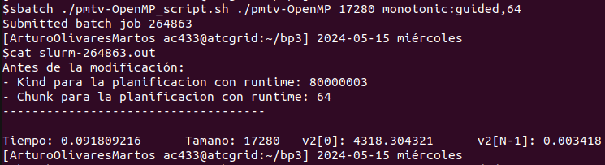

Los tiempos de ejecución se han tomado para versión paralela del producto de una matriz triangular por un vector para enteros de tamaño $N=17280$. Primera toma de datos es:

|Chunk|Static|Dynamic|Guided|
|---|---|---|---|
|Por defecto|0,15059949|0,09370489|0,08882015|
|1|0,08971142|0,10360794|0,09307385|
|64|0,09571345|0,07706109|0,09180922|

La segunda toma de datos es:

|Chunk|Static|Dynamic|Guided|
|---|---|---|---|
|Por defecto|0,10561835|0,09612910|0,09416724|
|1|0,08153436|0,10840744|0,08628290|
|64|0,09537868|0,07722288|0,08367610|

La media aritmética de los tiempos de ejecución por tanto, es:

|Chunk|Static|Dynamic|Guided|
|---|---|---|---|
|Por defecto|0,12810892|0,09491700|0,09149369|
|1|0,08562289|0,10600769|0,08967838|
|64|0,09554607|0,07714199|0,08774266|


Dichos datos, representados en una gráfica, son los siguientes:

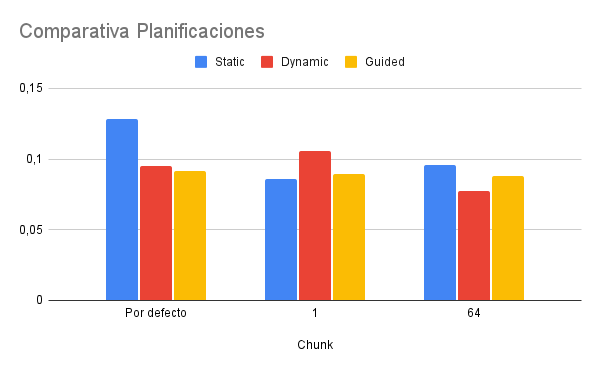

Ante la gráfica expuesta, podemos sacar gran cantidad de conclusiones. En primer lugar, vemos que el chuck por defecto para la planificación estática debe quedar descartada, ya que en este caso se asignan filas consecutivas a un mismo hilo, lo que provoca que el hilo que procesa las primeras filas tarde mucho más que el resto. Por otro lado, para un chunk de 1, el tiempo de ejecución con planificación dinámica es mucho mayor debido a la gran sobrecarga que la planificación en tiempo de ejecución supone; algo que vemos que se ve compensado con la planificación guiada. Para un tamaño de chunk mayor (como es 64) vemos que la dinámica si se comporta mejor que el resto de las planificaciones.