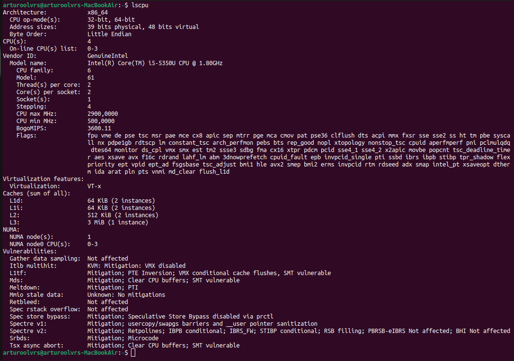
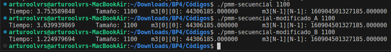
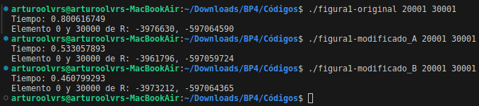
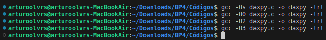
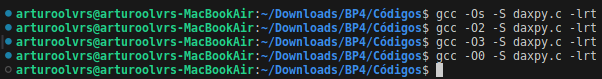
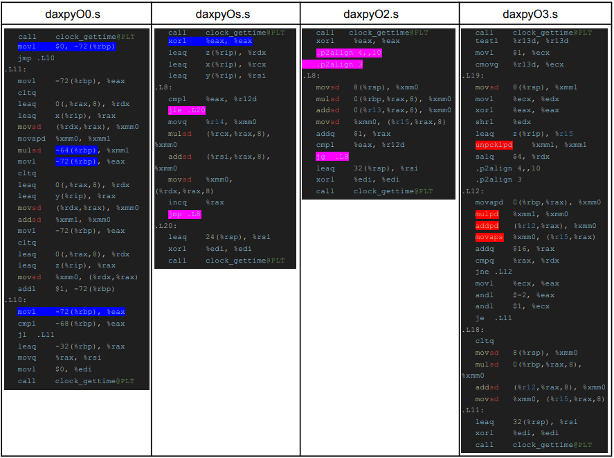

# Arquitectura de Computadores. Bloque de Prácticas 4

**Autor:** Arturo Olivares Martos
***

- **Asignatura:** Arquitectura de Computadores.
- **Curso Académico:** 2023-24.
- **Grado:** Doble Grado en Ingeniería Informática y Matemáticas.
- **Grupo:** Único.
- **Profesor:** Mancia Anguita López.
- **Descripción:** Bloque 4 de las prácticas de AC.
<!--- **Fecha:** 17 de abril de 2023. -->
<!-- - **Duración:** -->


*Nota*: Para compilar cualquier programa, he hecho uso del siguiente [makefile](https://github.com/LosDelDGIIM/LosDelDGIIM.github.io/blob/main/subjects/AC/Pr%C3%A1cticas/Bloque%204/C%C3%B3digos/makefile):
```makefile
CXX := gcc
CXXFLAGS := -fopenmp -O2	# -D DEBUG

# Objetivo predeterminado (compilar el archivo proporcionado)
.DEFAULT_GOAL := compile

# Regla para compilar el archivo CPP especificado
compile: $(FILE)
	$(CXX) $(CXXFLAGS) -o $(basename $(FILE)) $(FILE)

# Limpieza de archivos generados.
# Se eliminan todos los archivos ejecutables que no sean scripts de bash o archivos de código fuente.
clean:
	find . -type f -executable ! -name "*.cpp" ! -name "*.sh" -exec rm {} \;
```
Como podemos ver, tan solo cuenta con dos reglas:
- `compile`: Compila el archivo que se le pase como argumento. Se llamará al poner `make FILE=nombreArchivo`.
    
    Como vemos, compila con la opción `-O2` y `-fopenmp`, y además se puede descomentar la opción `-D DEBUG` para que se muestren mensajes de depuración. También se puede comentar la opción `-fopenmp` para que no se compile con OpenMP, obteniendo por tanto un programa secuencial.

- `clean`: Elimina todos los archivos ejecutables generados, excepto los scripts de bash y los archivos de código fuente.


Además, antes de iniciar el seminario, se nos piden diversos datos sobre nuestro ordenador:
- Denominación de marca del chip de procesamiento o procesador (se encuentra en `/proc/cpuinfo` y se
lista con `lscpu`): *Intel(R) Core(TM) i5-5350U CPU @ 1.80GHz*
- Sistema operativo utilizado: *Ubuntu 22.04.4 LTS*
- Versión de gcc utilizada: *gcc (Ubuntu 11.4.0-1ubuntu1~22.04) 11.4.0*
- Volcado de pantalla que muestre lo que devuelve *lscpu* en la máquina en la que ha tomado las
medidas:
    


### Ejercicio 1.

**Modificar el código secuencial para la multiplicación de matrices disponible en archivo [pmm-secuencial.c](https://github.com/LosDelDGIIM/LosDelDGIIM.github.io/blob/main/subjects/AC/Pr%C3%A1cticas/Bloque%204/C%C3%B3digos/pmm-secuencial.c) (solo el trozo que calcula la multiplicación) para reducir el tiempo de ejecución. Justificar los tiempos
obtenidos (usando siempre `-O2`) a partir de la modificación realizada.**

Se han realizado dos modificaciones:
- **Modificación A**: Se encuentra en el archivo [pmm-secuencial-modificado_A.c](https://github.com/LosDelDGIIM/LosDelDGIIM.github.io/blob/main/subjects/AC/Pr%C3%A1cticas/Bloque%204/C%C3%B3digos/pmm-secuencial-modificado_A.c).
  
  En esta modificación, se ha empleado el desenrollado del bucle, calculando en cada iteración 4 multiplicaciones y acumulándose sobre 4 variables distintas, para así reducir las latencias provocadas por los errores RAW.

  El código modificado es el siguiente:
    ```c
    double aux[4];
    aux[0] = 0; aux[1] = 0; aux[2] = 0; aux[3] = 0;

    clock_gettime(CLOCK_REALTIME,&cgt1);
    for(i = 0; i < N; i++){
        for (j = 0; j < N; j++){

            // Inicializo las variables de acumulación
            aux[0] = 0; aux[1] = 0; aux[2] = 0; aux[3] = 0;

            // Desenrollado de bucle, asegurando que k+3 no se sale del rango
            for (k = 0; k < N-3; k+=4){
                aux[0] += m1[i][k] * m2[k][j];
                aux[1] += m1[i][k+1] * m2[k+1][j];
                aux[2] += m1[i][k+2] * m2[k+2][j];
                aux[3] += m1[i][k+3] * m2[k+3][j];
            }

            // Acumulo los resultados
            m3[i][j] = aux[0] + aux[1] + aux[2] + aux[3];

            // Acumulo el resto de la multiplicación, los restos de la división por 4
            while (k < N) {
                m3[i][j] += m1[i][k] * m2[k][j];
                k++;
            }
        }
    }
    clock_gettime(CLOCK_REALTIME,&cgt2);
    ```

- **Modificación B**: Se encuentra en el archivo [pmm-secuencial-modificado_B.c](https://github.com/LosDelDGIIM/LosDelDGIIM.github.io/blob/main/subjects/AC/Pr%C3%A1cticas/Bloque%204/C%C3%B3digos/pmm-secuencial-modificado_B.c)
  
  En este caso, se han intercambiado los índices de los bucles más internos, es decir, se ha intercambiado la `k` por la `j`. De esta forma, ambas matrices `m1` y `m2` se recorren por filas, mientras que antes la segunda matriz se estaba recorriendo por columnas. Esto mejora en tiempos debido al uso de la localidad espacial.

    El código modificado es el siguiente:
    ```c
    clock_gettime(CLOCK_REALTIME,&cgt1);
    for(i = 0; i < N; i++){
        for (k = 0; k < N; k++)
            for (j = 0; j < N; j++)
                m3[i][j] += m1[i][k] * m2[k][j];
    }
    clock_gettime(CLOCK_REALTIME,&cgt2);
    ```

La ejecución de las tres versiones se aprecia en la siguiente imagen:



Los tiempos se resumen en la siguiente tabla:

Modificación | Breve descripción de las modificaciones | Tiempo de ejecución (-O2)
--- | --- | ---
Sin modificar |  | 3.7535 s
Modificación A) | Desenrollado del bucle | 3.6399 s
Modificación B) | Intercambio de índices `k` y `j` para usar localidad espacial | 1.2249 s

En este caso, como podemos ver ambas mejoras reducen los tiempos de ejecución. Sí es cierto que
el desenrollado del bucle reduce en menor proporción, pero el intercambio de índices da muy buenos
resultados. Esto se debe a que se usa el principio de localidad espacial, ya que en este caso ambas
matrices se recorren por filas, provocando así que haya menos errores de caché por cómo están
almacenadas las matrices en C.


### Ejercicio 2.
**Usar en este ejercicio el programa secuencial disponible del archivo [figura1-original.c](https://github.com/LosDelDGIIM/LosDelDGIIM.github.io/blob/main/subjects/AC/Pr%C3%A1cticas/Bloque%204/C%C3%B3digos/figura1-original.c). Modificar en el programa el bucle `for` de cálculos para reducir el tiempo de ejecución. Justificar los tiempos obtenidos (usando siempre `-O2`) a partir de la modificación realizada. En las ejecuciones de evaluación usar valores de `N` y `M` mayores que $1000$.**


Se han realizado dos modificaciones:
- **Modificación A**: Se encuentra en el archivo [figura1-modificado_A.c](https://github.com/LosDelDGIIM/LosDelDGIIM.github.io/blob/main/subjects/AC/Pr%C3%A1cticas/Bloque%204/C%C3%B3digos/figura1-modificado_A.c).
  
    En primer lugar, hemos empleado que ambos bucles internos se pueden unir en uno solo. Además, las componentes del struct están contiguas en memoria, por lo que se usa la localidad espacial.
    El código modificado es el siguiente:
    ```c
    clock_gettime(CLOCK_REALTIME,&cgt1);
	for (ii=0; ii<M;ii++){
		X1=0; X2=0;

		// Se unen ambos bucles en uno solo
		for(i=0; i<N;i++){
			X1 += 2*s[i].a + ii;
			X2 += 3*s[i].b - ii;
		}

		if (X1<X2) {R[ii]=X1;} else {R[ii]=X2;}
	}
    clock_gettime(CLOCK_REALTIME,&cgt2);
    ```

- **Modificación B**: Se encuentra en el archivo [figura1-modificado_B.c](https://github.com/LosDelDGIIM/LosDelDGIIM.github.io/blob/main/subjects/AC/Pr%C3%A1cticas/Bloque%204/C%C3%B3digos/figura1-modificado_B.c)

    En este caso, además de la mejora anterior, se ha usado el desenrollado del bucle, usando para ello cuatro variables auxiliares.
    El código modificado es el siguiente:
    ```c
    int aux[4];
    clock_gettime(CLOCK_REALTIME,&cgt1);
	for (ii=0; ii<M;ii++){
		X1=0; X2=0;

		aux[0]=0; aux[1]=0; aux[2]=0; aux[3]=0;

		// Se unen ambos bucles en uno solo
		for(i=0; i<N-1;i+=2){
			aux[0] += 2*s[i].a + ii;
			aux[1] += 3*s[i].b - ii;

			aux[2] += 2*s[i+1].a + ii;
			aux[3] += 3*s[i+1].b - ii;
		}

		// Se suman los resultados de los bucles
		X1 = aux[0] + aux[2];
		X2 = aux[1] + aux[3];

		// Se añade el caso en el que N es impar
		if (N%2 != 0){
			X1 += 2*s[N-1].a + ii;
			X2 += 3*s[N-1].b - ii;
		}

		if (X1<X2) {R[ii]=X1;} else {R[ii]=X2;}
	}
    clock_gettime(CLOCK_REALTIME,&cgt2);
    ```

La ejecución de las tres versiones se aprecia en la siguiente imagen:



Los tiempos se resumen en la siguiente tabla:

Modificación | Breve descripción de las modificaciones | Tiempo de ejecución (-O2)
--- | --- | ---
Sin modificar |  | 0.8006 s
Modificación A) | Unión de ambos bucles en uno solo | 0.5330 s
Modificación B) | Modificación A + Desenrollado del bucle | 0.4607 s

Como podemos ver, la modificación A) ya reduce en gran medida el tiempo de ejecución, debido a que se realizan muchas menos iteraciones al unirse ambos bucles. Además, en esta unión también se hace uso de la localidad espacial, como se ha comentado anteriormente. Respecto de la modificación B), también tenemos que mejora debido al desenrollado del bucle, al reducir así las latencias provocadas por los errores RAW.


### Ejercicio 3.

El benchmark *Linpack* ha sido uno de los programas más ampliamente utilizados para evaluar las
prestaciones de los computadores. De hecho, se utiliza como base en la lista de los 500
computadores más rápidos del mundo (el *Top500 Report*). El núcleo de este programa es una
rutina que opera con flotantes de doble precisión denominada *DAXPY* (*Double precision- real
Alpha X Plus Y*) que multiplica un vector por una constante y los suma a otro vector:
```c
void daxpy(int n, double a, double *x, double *y){
    for (int i=0;i<n;i++) y[i]= a*x[i] + y[i];
}
```
A partir del programa DAXPY disponible en el archivo [daxpy.c](https://github.com/LosDelDGIIM/LosDelDGIIM.github.io/blob/main/subjects/AC/Pr%C3%A1cticas/Bloque%204/C%C3%B3digos/daxpy.c), generar los programas en ensamblador para cada una de las siguientes opciones de optimización del compilador: `-O0`, `-Os`, `-O2`, `-O3`. Explique las diferencias que se observan en el código justificando al mismo tiempo las mejoras en velocidad que acarrean. Incorporar los códigos al cuaderno de prácticas y destacar las diferencias entre ellos. Sólo se debe evaluar el tiempo del núcleo DAXPY. `N` debe ser parámetro de entrada al programa.


La compilación para obetener el ejecutable ha sido la siguiente:



La ejecución de los cuatro códigos se aprecia en la siguiente imagen:


Los tiempos obtenidos, para un vector de $N=33554432$ componentes, se resumen en la siguiente tabla:

Opción de optimización | Tiempo de ejecución
--- | ---
-O0 | 0.21718 s
-Os | 0.15086 s
-O2 | 0.14850 s
-O3 | 0.14483 s

Como podemos ver, a mayor nivel de optimización, menor tiempo de ejecución. Esto se debe a que el compilador realiza diversas optimizaciones; veámos cuáles son. En primer lugar, tuvimos que generar el código ensamblador, tal y como se aprecia en la siguiente imagen:



Los códigos de ensamblador para cada una de las optimizaciones son los siguientes:
- `-O0`: [daxpyO0.s](https://github.com/LosDelDGIIM/LosDelDGIIM.github.io/blob/main/subjects/AC/Pr%C3%A1cticas/Bloque%204/C%C3%B3digos/daxpyO0.s)
- `-Os`: [daxpyO0.s](https://github.com/LosDelDGIIM/LosDelDGIIM.github.io/blob/main/subjects/AC/Pr%C3%A1cticas/Bloque%204/C%C3%B3digos/daxpyOs.s)
- `-O2`: [daxpyO0.s](https://github.com/LosDelDGIIM/LosDelDGIIM.github.io/blob/main/subjects/AC/Pr%C3%A1cticas/Bloque%204/C%C3%B3digos/daxpyO2.s)
- `-O3`: [daxpyO0.s](https://github.com/LosDelDGIIM/LosDelDGIIM.github.io/blob/main/subjects/AC/Pr%C3%A1cticas/Bloque%204/C%C3%B3digos/daxpyO3.s)

Las diferencias las hemos resaltado con distintos colores en la siguiente imagen:



Como podemos apreciar en los tiempos de ejecución, las mejoras más significativas se obtienen al pasar
de `-O0` a `-Os`, puesto que se elimina gran parte de código innecesario (como mover `$0` a memoria para
luego extraerlo en el registro `%eax` en vez de modificar dicho registro). Además, vemos que se accede
muchas veces a la memoria, ralentizando el proceso.
Usando la optimización `-Os` arreglamos este problema, y como vemos el código se ve reducido en gran medida. No obstante, se producen dos saltos, algo que se puede solventar usando tan solo un salto como se muestra en la optimización `-O2`. Esta mejora no es extremadamente significativa, y se muestra en que el tiempo de ejecución no se reduce en gran medida. Por último, y respecto del cambio a -O3, vemos que se dejan de usar instrucciones simples para un solo dato, para pasar a usar instrucciones vectoriales (denotadas con la letra `p`). Esto mejora la eficiencia también.