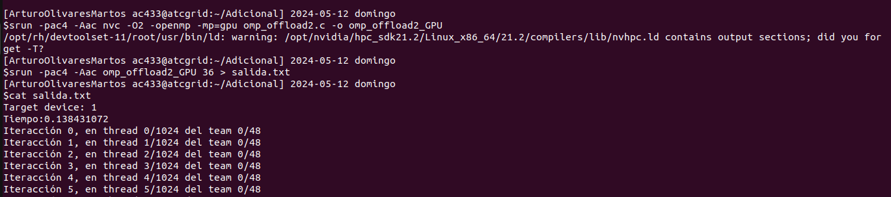
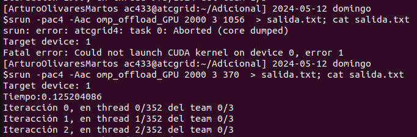
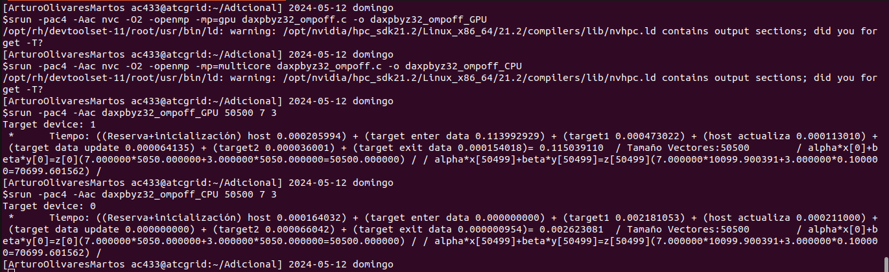
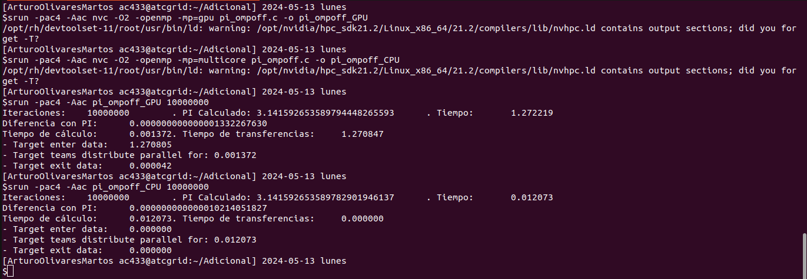

# Arquitectura de Computadores. Bloque de Prácticas 3

**Autor:** Arturo Olivares Martos
***

- **Asignatura:** Arquitectura de Computadores.
- **Curso Académico:** 2023-24.
- **Grado:** Doble Grado en Ingeniería Informática y Matemáticas.
- **Grupo:** Único.
- **Profesor:** Mancia Anguita López.
- **Descripción:** Seminario adicional de la asignatura Arquitectura de Computadores.

El objetivo es habituarse a la organización de la GPU y al compilador, y entender la
sobrecarga que introduce el uso del coprocesador (GPU, en este caso).
<!--- **Fecha:** 17 de abril de 2023. -->
<!-- - **Duración:** -->

*Nota*: Se usará el compilador `nvc` de Nvidia, en particular, se utilizará la versión *21.2* que está instalado en el
nodo atcgrid4 (se debe tener en cuenta que distintas versiones de `nvc` podrían generar distinto código
ejecutable).


## Ejercicios basados en los ejemplos del seminario


### Ejercicio 1.

- **Compilar el ejemplo [omp_offload.c](https://github.com/LosDelDGIIM/LosDelDGIIM.github.io/blob/main/subjects/AC/Pr%C3%A1cticas/Seminario%20Adicional/C%C3%B3digos/omp_offload.c) del seminario en el nodo atcgrid4. Para ello, ejecute el siguiente código:**
    ```bash
    srun –pac4 –Aac nvc -O2 -openmp -mp=gpu omp_offload.c -o omp_offload_GPU
    ```
    **(`-openmp` para que tenga en cuenta las directivas OpenMP y `-mp=gpu` para que el código delimitado con `target` se genere para un dispositivo gpu). Ejecutar omp_offload_GPU usando:**
    ```bash
    srun –pac4 –Aac omp_offload_GPU 36 3 32 > salida.txt
    ```

    El contenido del fichero `salida.txt` generado es:
    ```txt
    Target device: 1
    Tiempo:0.153923035
    Iteracción 0, en thread 0/32 del team 0/3
    Iteracción 1, en thread 1/32 del team 0/3
    Iteracción 2, en thread 2/32 del team 0/3
    Iteracción 3, en thread 3/32 del team 0/3
    Iteracción 4, en thread 4/32 del team 0/3
    Iteracción 5, en thread 5/32 del team 0/3
    Iteracción 6, en thread 6/32 del team 0/3
    Iteracción 7, en thread 7/32 del team 0/3
    Iteracción 8, en thread 8/32 del team 0/3
    Iteracción 9, en thread 9/32 del team 0/3
    Iteracción 10, en thread 10/32 del team 0/3
    Iteracción 11, en thread 11/32 del team 0/3
    Iteracción 12, en thread 12/32 del team 0/3
    Iteracción 13, en thread 13/32 del team 0/3
    Iteracción 14, en thread 14/32 del team 0/3
    Iteracción 15, en thread 15/32 del team 0/3
    Iteracción 16, en thread 16/32 del team 0/3
    Iteracción 17, en thread 17/32 del team 0/3
    Iteracción 18, en thread 18/32 del team 0/3
    Iteracción 19, en thread 19/32 del team 0/3
    Iteracción 20, en thread 20/32 del team 0/3
    Iteracción 21, en thread 21/32 del team 0/3
    Iteracción 22, en thread 22/32 del team 0/3
    Iteracción 23, en thread 23/32 del team 0/3
    Iteracción 24, en thread 24/32 del team 0/3
    Iteracción 25, en thread 25/32 del team 0/3
    Iteracción 26, en thread 26/32 del team 0/3
    Iteracción 27, en thread 27/32 del team 0/3
    Iteracción 28, en thread 28/32 del team 0/3
    Iteracción 29, en thread 29/32 del team 0/3
    Iteracción 30, en thread 30/32 del team 0/3
    Iteracción 31, en thread 31/32 del team 0/3
    Iteracción 32, en thread 0/32 del team 1/3
    Iteracción 33, en thread 1/32 del team 1/3
    Iteracción 34, en thread 2/32 del team 1/3
    Iteracción 35, en thread 3/32 del team 1/3
    ```

- **Contestar las siguientes preguntas justificando la respuesta usando el contenido del fichero *salida.txt*:**
    - ¿Cuántos equipos (*teams*) se han creado y cuántos se han usado realmente en la ejecución?
  
        Se han creado 3 equipos, y se han usado tan solo 2 (numerados como 0, 1).

    - ¿Cuántos hilos (*theads*) se han creado en cada equipo y cuántos de esos hilos se han usado en la ejecución?

        Se han creado 32 hilos por equipo. En el primero se han empleado todos, pero en el segundo equipo tan solo se han empleado 4 hebras.

    - ¿Qué número de iteraciones se ha asignado a cada hilo?

        En cada hilo tan solo se ha ejecutado una iteración.

    - ¿Qué número de iteraciones se ha asignado a cada equipo?

        A cada equipo se le han asignado:
        $$\text{Número de iteraciones por hilo} \cdot \text{Número de hilos por equipo} = 1 \cdot 32 = 32$$
        
        Por tanto, deducimos que a cada equipo se le han asignado 32 iteraciones (aunque en el segundo equipo tan solo se han ejecutado 4, porque no hubiese más).

### Ejercicio 2.

**Eliminar en [omp_offload.c](https://github.com/LosDelDGIIM/LosDelDGIIM.github.io/blob/main/subjects/AC/Pr%C3%A1cticas/Seminario%20Adicional/C%C3%B3digos/omp_offload.c) las cláusulas `num_teams(nteams)` y `thread_limit(mthreads)` y la entrada como parámetros de `nteams` y `mthreads`. Llamar al código resultante [omp_offload2.c](https://github.com/LosDelDGIIM/LosDelDGIIM.github.io/blob/main/subjects/AC/Pr%C3%A1cticas/Seminario%20Adicional/C%C3%B3digos/omp_offload2.c). Compilar y ejecutar el código
para poder contestar a las siguientes preguntas:**

- **¿Qué número de equipos y de hilos por equipo se usan por defecto?**

    Por defecto, se usan 48 equipos y 1024 hilos por equipo, como se puede ver en la siguiente imagen:

    


- **¿Es posible relacionar estos números con alguno de los parámetros, comentados en el seminario, que caracterizan al coprocesador que estamos usando? ¿Con cuáles?**

    Sí, son el número máximo de equipos (48) y de hilos por equipo (1024) con los que cuenta Nvidia Quadro RTX 5000, el coprocesador que estamos empleando.

- **¿De qué forma se asignan por defecto las iteraciones del bucle a los equipos y a los hilos dentro de un equipo? Contestar además las siguientes preguntas: ¿a qué equipo y a qué hilo de ese equipo se asigna la iteración 2? Y ¿a qué equipo y a qué hilo de ese equipo se asigna la iteración 1026, si la hubiera?**

    Por defecto, se le asigna una iteración a cada hebra. Además, se completan todos los hilos de cada equipo antes de pasar al siguiente. De esta forma, al empezar a contar desde 0, en este caso la iteración 2 se asigna al hilo 2 del equipo 0. Si hubiera 1026 iteraciones, como cada equipo tiene 1024 hilos, la iteración 1025 (contamos desde 0) se asignaría en el equipo 1, en la hebra 1.


### Ejercicio 3.
**Ejecutar la versión original, [omp_offload.c](https://github.com/LosDelDGIIM/LosDelDGIIM.github.io/blob/main/subjects/AC/Pr%C3%A1cticas/Seminario%20Adicional/C%C3%B3digos/omp_offload.c), con varios valores de entrada hasta que se pueda contestar a las siguientes cuestiones:**

- **¿Se crean cualquier número de hilos (*threads*) por equipo que se ponga en la entrada al programa? (probar también con algún valor mayor que 3000) En caso negativo, ¿qué número de hilos por equipo son posibles?**

    No, tiene determinadas limitaciones. El número de hilos que se creen siempre será un múltiplo de 32, ya que es el número de hilos que tiene un *warp* (que es la unidad de procesamiento que se envía al
    coprocesador). Por tanto, hay distintas casuísticas:
    - Si se indican menos de 32 hilos, siempre se crearán 32 hilos.
    - Si se indica un número entre 32 y 1024, siempre se creará el múltiplo de 32 más cercano al indicado por abajo; es decir, se redondeará por abajo.
    - Si se indica un número entre 1024 y 1055$=1024+31$, se crearán siempre 1024 hilos. Este es un caso particular del anterior. Además, es el caso límite, porque el máximo de hilos por SM es de 1024.
    - Si se indican más de 1056, al ajustarse como se ha indicado anteriormente resultaría en más de 1024 hilos por SM, algo que no es posible.

    Estos resultados se muestran en la siguiente imagen:

    


- **¿Es posible relacionar el número de hilos por equipo posibles con alguno o algunos de los parámetros, comentados en el seminario, que caracterizan al coprocesador que se está usando? Indicar cuáles e indicar la relación.**

    Sí, tanto con el número máximo de hilos en un SM (1024) como con el tamaño del *warp* (32), como se ha mencionado anteriormente.


### Ejercicio 4.

**Eliminar las directivas `teams` y `distribute` en [omp_offload2.c](https://github.com/LosDelDGIIM/LosDelDGIIM.github.io/blob/main/subjects/AC/Pr%C3%A1cticas/Seminario%20Adicional/C%C3%B3digos/omp_offload2.c), llamar al código resultante [omp_offload3.c](https://github.com/LosDelDGIIM/LosDelDGIIM.github.io/blob/main/subjects/AC/Pr%C3%A1cticas/Seminario%20Adicional/C%C3%B3digos/omp_offload3.c). Compilar y ejecutar este código para poder contestar a las siguientes preguntas:**

- **¿Qué número de equipos y de hilos por equipo se usan por defecto?**

    Se usa tan solo un equipo, ya que la directiva `teams` se encarga de crear los equipos y la directiva `distribute` distribuye el trabajo entre los distintos equipos. Si no incluimos la primera, no se creará ningún equipo adicional, por lo que tan solo hay un equipo. El número de hilos, al igual que en el caso anterior, es de 1024.


- **¿Qué tanto por ciento del número de SM se están utilizando? Justificar la respuesta.**

    El coprocesador cuenta con 48 SM, y en este caso tan solo estaríamos usando uno, por lo que se usa un:
    $$\frac{1}{48} \cdot 100\% \approx 2.08\%$$


### Ejercicio 5.

**En el código [daxpbyz32_ompoff.c](https://github.com/LosDelDGIIM/LosDelDGIIM.github.io/blob/main/subjects/AC/Pr%C3%A1cticas/Seminario%20Adicional/C%C3%B3digos/daxpbyz32_ompoff.c) se calcula (`a` y `b` son escalares, `x`, `y` y `z` son vectores):**
$$z=a \cdot x + b \cdot y$$
**Se han introducido funciones `omp_get_wtime()` para obtener el tiempo de ejecución de las diferentes construcciones/directivas `target` utilizadas en el código.**

1) `t2-t1` es el tiempo de `target enter data`, que reserva espacio en el dispositivo coprocesador para `x`, `y`, `z`, `N` y `p`, y transfiere del host al coprocesador aquellas que se mapean con `to` (`x`, `N` y `p`).
2) `t3-t2` es el tiempo del primer `target teams distribute parallel for` del código, que se ejecuta en paralelo en el coprocesador del bucle:
    ```c
    for (int i = 0; i < N; i++) z[i] = p * x[i];
    ```
3) `t4-t3` es el tiempo de `target update`, que transfiere del host al coprocesador `p` e `y`.
4) `t5-t4` es el tiempo del segundo `target teams distribute parallel for` del código, que ejecuta en paralelo en el coprocesador del bucle:
    ```c
    for (int i = 0; i < N; i++) z[i] = z[i] + p * y[i];
    ```
5) `t6-t7` es el tiempo que supone `target exit data`, que transfiere los resultados de las variables con `from` y libera el espacio ocupado en la memoria del coprocesador.


**Compilar [daxpbyz32_ompoff.c](https://github.com/LosDelDGIIM/LosDelDGIIM.github.io/blob/main/subjects/AC/Pr%C3%A1cticas/Seminario%20Adicional/C%C3%B3digos/daxpbyz32_ompoff.c) para la GPU y para las CPUs de atctrid4 usando:**
```bash
srun –pac4 –Aac nvc -O2 -openmp -mp=gpu daxpbyz32_ompoff.c -o daxpbyz32_ompoff_GPU
srun –pac4 –Aac nvc -O2 -openmp -mp=multicore daxpbyz32_ompoff.c -o daxpbyz32_ompoff_CPU
```
**En `daxpbyz32_off_GPU` el coprocesador será la GPU del nodo y, en `daxpbyz32_off_CPU`, será el propio
host. En ambos casos la ejecución aprovecha el paralelismo a nivel de flujo de instrucciones del
coprocesador. Ejecutar ambos para varios valores de entrada usando un número de componentes `N` para los
vectores entre $1000$ y $100000$ y contestar a las siguientes preguntas.**


En primer lugar, mostramos la compilación y la ejecución de lo pedido:



- **¿Qué construcción o directiva `target` supone más tiempo en la GPU? ¿A qué se debe?**
  
    La directiva que más tarda en la GPU es `target enter data`, debido a que esta requiere gran cantidad de comunicación entre la GPU y mucha gestión de memoria (reservar memoria para las variables en la memoria de la GPU, etc.). Aunque otras directivas también incluyen sincronización, posiblemente las variables en otros casos ya estén declaradas y por tanto ya tengan el espacio reservado; tan solo siendo necesario actualizar sus valores.


- **¿Qué construcciones o directivas target suponen más tiempo en la GPU que en la CPU? ¿A qué se debe?**

    Tardan más las directivas `target enter data`, `target data update`, y `target exit data`. Estas son las directivas que suponen gran coste de comunicación entre el host y el coprocesador, ya que en el caso de que se ejecuten en la CPU el host y el coprocesador son el mismo, por lo que la memoria no difiere y estas operaciones tienen un coste nulo (tan solo la directiva `target exit data` tiene un tiempo no nulo en la CPU, asociado al coste de liberación de memoria).

    En el resto de directivas, la mayoría asociada al cálculo de las operaciones, se tarda menos en la GPU por contar esta con un mayor número de núcleos.


## Resto de ejercicios

**A partir del código secuencial que calcula $\pi$ disponible en el archivo [pi.c](https://github.com/LosDelDGIIM/LosDelDGIIM.github.io/blob/main/subjects/AC/Pr%C3%A1cticas/Seminario%20Adicional/C%C3%B3digos/pi.c), obtener un código paralelo basado en las construcciones/directivas OpenMP para ejecutar código en coprocesadores. El código debe usar como entrada el número de intervalos de integración y debe imprimir el valor de $\pi$ calculado, el error cometido y los tiempos (1) del cálculo de $\pi$ y (2) de la transferencia hacia y desde el coprocesador. Generar dos ejecutables, uno que use como coprocesador la CPU y otro que use la GPU. Comparar la precisión del resultado y los tiempos de ejecución total, cálculo y comunicación obtenidos en atcgrid4 con la CPU y la GPU, indicar qué arquitectura es mejor y razonar los motivos.**


El código paralelo obtenido a partir del código secuencial, disponible en [pi_ompoff.c](https://github.com/LosDelDGIIM/LosDelDGIIM.github.io/blob/main/subjects/AC/Pr%C3%A1cticas/Seminario%20Adicional/C%C3%B3digos/pi_ompoff.c), es el siguiente:
```c
double t0 = omp_get_wtime();

// Entrada de datos al coprocesador
#pragma omp target enter data map(to: intervals, width, sum)

double t1 = omp_get_wtime();


// Cálculo de PI en el coprocesador
#pragma omp target
{
    #pragma omp teams distribute parallel for reduction(+:sum)
    for (int i = 0; i < intervals; i++) {
        register double x = (i + 0.5) * width;
        sum += 4.0 / (1.0 + x * x);
    }
    
    sum *= width;
}

double t2 = omp_get_wtime();

// Salida de datos del coprocesador
#pragma omp target exit data map(delete: intervals, width) map(from: sum)

double t3 = omp_get_wtime();

double diferencia = fabs(sum - M_PI);
double tiempo_calculo = t2 - t1;
double tiempo_transferencias = t3 - t2 + t1 - t0;
```

La compilación y ejecución del código para $10^7$ intervalos se muestra en la siguiente imagen:




En primer lugar, hemos de enviar los datos al coprocesador con la directiva `target enter data`. Posteriormente, realizamos los cálculos con la `directiva target teams distribute parallel for`.
Por último, tomamos los datos del coprocesador con la directiva `target exit data`.

Respecto a la precisión, vemos que ambos coprocesadores nos dan una excelente precisión, aunque es cierto que GNU es ligeramente mejor que la CPU, obteniendo una precisión de un decimal más.

Respecto a los tiempos, ocurre lo previsto; las comunicaciones ralentizan en gran medida la ejecución del programa en la GPU. Sí es cierto que en la GPU el tiempo de cálculo es menor, pero el tiempo de cómputo es mucho mayor, lo que provoca que el tiempo total también sea mucho mayor.