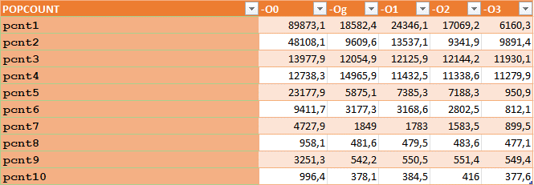
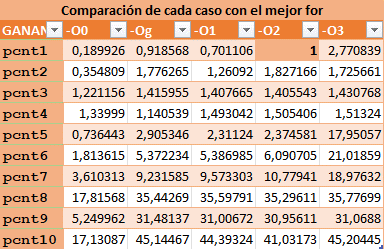
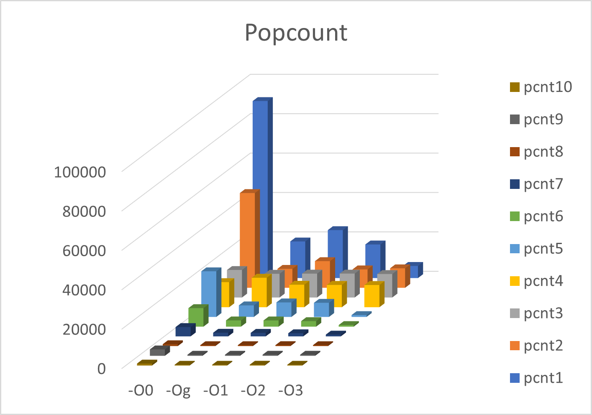
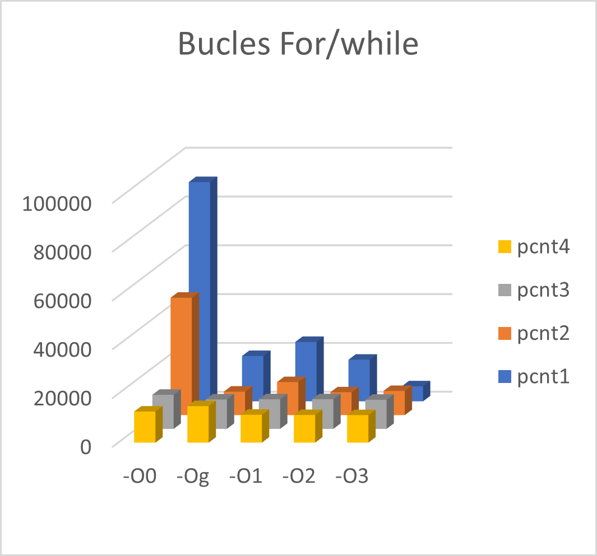
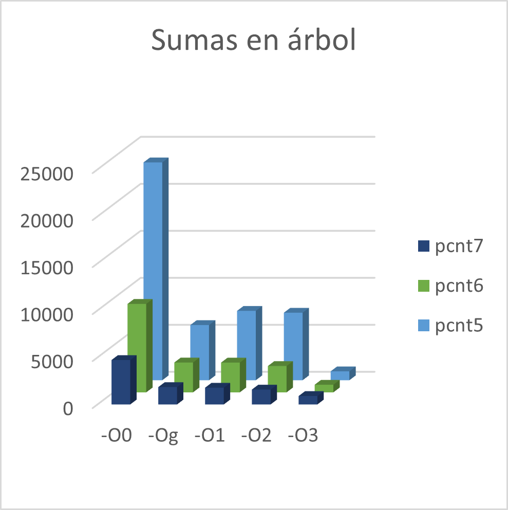
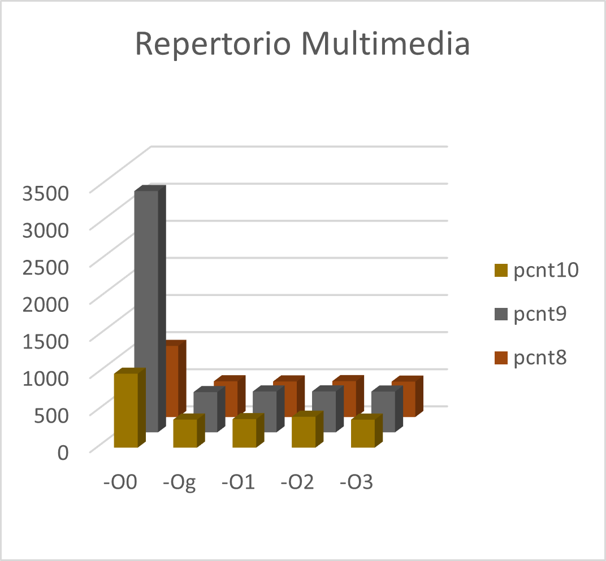

# Estructura de Computadores. Práctica 03.

**Autor:** Arturo Olivares Martos
***

- **Asignatura:** Estructura de Computadores.
- **Curso Académico:** 2023-24.
- **Grado:** Doble Grado en Ingeniería Informática y Matemáticas.
- **Grupo:** Único.
- **Profesor:** Ignacio Rojas Ruiz.
- **Descripción:** Práctica 3 de EC.
<!--- **Fecha:** 17 de abril de 2023. -->
<!-- - **Duración:** -->


Esta práctica consiste en medir la eficiencia de distintas implementaciones del `popcount`, que consiste en sumar el número de bits activados (en 1) de un número. Para ello, en realidad calcularemos la suma de los popcount de un vector.

Para ello, usamos la siguiente función `crono`, que dado un array y su longitud calcula el pocount acumulado:
```c
void crono(int (*func)(), char* msg){
    struct timeval tv1,tv2;     // gettimeofday() secs-usecs
    long tv_usecs;              // y sus cuentas
    
    gettimeofday(&tv1,NULL);
    resultado = func(lista, SIZE);
    gettimeofday(&tv2,NULL);

    
    tv_usecs=(tv2.tv_sec -tv1.tv_sec )*1e6+ (tv2.tv_usec-tv1.tv_usec);

    #if TEST==0
    printf("%ld; \n", tv_usecs);
    
    #else
        printf("resultado = %10d\t", resultado);
        printf("%s:%9ld us\n", msg, tv_usecs);
    #endif
}
```

Veamos cada versión del `popcount`.

### 1. Lenguaje C - `for`

El primer algoritmo que intuitivamente se nos ocurre es ir elemento por elemento del vector.

En cada uno, obtenemos el último bit aplicándole la máscara `&1` y desplazamos a la derecha, descartando el bit ya obtenido. Este bucle lo realizaos tantas veces como bits tenga el número.
```c
# define NUM_BITS 8*sizeof(unsigned)    // Multiplico por 8, ya que 1 byte tiene 8 bits.
int popcount1(unsigned* array, size_t len){

    int res=0;
    unsigned x;
    for (size_t i=0; i<len; ++i){
        
        x = array[i];

        for (int j=0; j<NUM_BITS; ++j){
            res += x & 1;   // Obtengo el LS bit cada vez
            x >>= 1;
        }
    }

    return res;
}
```


### 2. Lenguaje C - `while`
```c

En este caso, el algoritmo es idéntico a excepción de que, cuando el número ya es 0, no iteramos sobre el resto de bytes. Esto permite que, por ejemplo en el `1=0b0...01`, solo itere sobre el LSB.

int popcount2(unsigned* array, size_t len){

    int res=0;
    unsigned x;
    for (size_t i=0; i<len; ++i){
        
        x = array[i];

        // Al ser un while, cuando ya solo quedan 0 no sigo iterando
        while(x){
            res += x & 1;       // Obtengo el LS bit cada vez.
            x >>= 1;
        }
    }

    return res;
}
```


### 3. Lenguaje ASM. While de 4 instrucciones

Implementa el bucle `while` anterior, pero en ensamblador. Hago uso de que `shr` modifica las flags de estado. En concreto, en `CF` se almacena el bit desplazado ("perdido").
```asm
int popcount3(unsigned* array, size_t len){

    int res=0;
    unsigned x;
    for (size_t i=0; i<len; ++i){
        
        x = array[i];

        asm("\n"
    "ini3:                  \n\t"
    "   shr %[x]            \n\t"
    "   adc $0, %[r]        \n\t"
    "   test %[x], %[x]     \n\t"
    "   jne ini3            \n\t"
        : [r]"+r" (res)
        : [x] "r" (x)
        : "cc"
        );
    }

    return res;
}
```


### 4. Lenguaje ASM. While de 3 instrucciones

Implementa el bucle `while` anterior en ensamblador, pero reduce el cuerpo del bucle. Hago uso de que `shr` modifica las flags de estado. En concreto, en `CF` se almacena el bit desplazado ("perdido"), y `ZF` se pone a 1 si el número resultado es el 0.
```asm
int popcount4(unsigned* array, size_t len){

    int res=0;
    unsigned x;
    for (size_t i=0; i<len; ++i){
        
        x = array[i];

        asm("\n"
    "   clc                 \n\t"       // Set CF a 0 
    "ini4:                  \n\t"
    "   adc $0, %[r]        \n\t"
    "   shr %[x]            \n\t"
    "   jnz ini4            \n\t"
    "                       \n\t"
    "   adc $0, %[r]        \n\t"       // Cuando se quite el último bit 1, se saldrá del bucle. Pero ese 1 hay que sumarlo
        : [r]"+r" (res)
        : [x] "r" (x)
        : "cc"
        );
    }

    return res;
}
```


### 5. Suma por bytes. Lectura de 1 número.

En este caso, leemos cada número y calculamos su `popcount`. En primer lugar se calcula el popcount de cada byte mediante máscaras y desplazamientos a la derecha.

El algoritmo está explicado en los comentarios del código.
```c
int popcount5(unsigned* array, size_t len){

    int res=0;
    unsigned x;
    for (size_t i=0; i<len; ++i){
        
        x = array[i];

        int val = 0;
        for (size_t i = 0; i < 8; i++) {
            /*
                En cada iteración, aplico esta máscara 0x01010101 para obtener los LSB de cada byte.
                Como desplazo un bit cada vez, itero sobre todo el byte.
                De esta forma, obtengo el popcount cada byte en su LSB. 
            */
            val += x & 0x01010101;
            x >>= 1;
        }

        /**
            Como son de 32 bits, tienen 4 bytes.
            Con el >>16, el popcount del 4º ( y 3º) LSB se lo sumo al del 2º ( y 1º) LSB.
                    De esta forma, En el 2º LSB tengo la suma del popcount del 2º y 4º
                                   En el 1º LSB tengo la suma del popcount del 1º y 3º

            Con el >>8, el valor del 2º LSB se lo sumo al del 1º LSB.
                    De esta forma, En el 1º LSB tengo la suma del popcount del
                    1º y 3º (ya los tenía) y del 2º y 4º (los acabo de añadir).
                
            De esta forma, en el LSB tengo el popcount total del número.
            Esta suma se dice en árbol, ya que vamos "uniendo las ramas".
        */
        val += (val >> 16);
        val += (val >> 8);
        
        // Aplico la máscara para obtener el LSB, y lo sumo al acumulado del array.
        res += val & 0xFF;
    }

    return res;
}
```


### 6. Suma en árbol. Lectura de 1 número.
En este caso, leemos cada número y calculamos su `popcount`. Este se calcula mediante máscaras y desplazamientos a la derecha, de forma que realizamos una suma en árbol.

Tiene como ventaja frente al anterior que no se usa un bucle, sino que se usan las siguientes máscaras:
```c
const unsigned long m1  = 0x5555555555555555; //binary: 0101...
const unsigned long m2  = 0x3333333333333333; //binary: 00110011..
const unsigned long m4  = 0x0f0f0f0f0f0f0f0f; //binary: 4 zeros, 4 ones ...
const unsigned long m8  = 0x00ff00ff00ff00ff; //binary: 8 zeros, 8 ones ...
const unsigned long m16 = 0x0000ffff0000ffff; //binary: 16 zeros, 16 ones ...
const unsigned long m32 = 0x00000000ffffffff; //binary: 32 zeros, 32 ones ...
```

El algoritmo está explicado en los comentarios del código.

```c
int popcount6(unsigned* array, size_t len){

    int res=0;
    unsigned x;
    for (size_t i=0; i<len; ++i){
        
        x = array[i];

        x = (x & m1 ) + ((x >> 1 ) & m1 ); //put count of each 2  bits into LSB of those 2
        x = (x & m2 ) + ((x >> 2 ) & m2 ); //put count of each 4  bits into LSB of those 4
        x = (x & m4 ) + ((x >> 4 ) & m4 ); //put count of each 8  bits into LSB of those 8
        x = (x & m8 ) + ((x >> 8 ) & m8 ); //put count of each 16 bits into LSB of those 16
        x = (x & m16) + ((x >> 16) & m16); //put count of each 32 bits into LSB of those 32 (POPCOUNT)
        
        res += x;
    }

    return res;
}
```


### 7. Suma en árbol. Lectura de 4 números.
En este caso, leemos bloques de 4 números y calculamos su `popcount`.

Esto tiene como ventaja frente al anterior que se realiza un cuarto de las iteraciones (lecturas).

```c
int popcount7(unsigned* array, size_t len){

    int res=0;
    unsigned long x1, x2;

    // Si len no es múltiplo de 4, quedarán números sin leerse.
    if (len & 0x3) printf("leyendo bloques de 128b (4 unsigned) pero len no múltiplo de 4\n");

    for (size_t i=0; i<len; i+=4){
        
        // Hay unsigned (32 bits) pero quiero leer dos unsigned long (2*64).
        // Obtengo la dirección, la convierto en puntero a unsigned long, y ya obtengo el unsigned long.
        x1 = *(unsigned long *) &array[i];
        x2 = *(unsigned long *) &array[i+2];

        x1 = (x1 & m1 ) + ((x1 >> 1 ) & m1 ); //put count of each 2  bits into LSB of those 2
        x1 = (x1 & m2 ) + ((x1 >> 2 ) & m2 ); //put count of each 4  bits into LSB of those 4
        x1 = (x1 & m4 ) + ((x1 >> 4 ) & m4 ); //put count of each 8  bits into LSB of those 8
        x1 = (x1 & m8 ) + ((x1 >> 8 ) & m8 ); //put count of each 16 bits into LSB of those 16
        x1 = (x1 & m16) + ((x1 >> 16) & m16); //put count of each 32 bits into LSB of those 32
        x1 = (x1 & m32) + ((x1 >> 32) & m32); //put count of each 64 bits into LSB of those 64 (POPCOUNT)

        x2 = (x2 & m1 ) + ((x2 >> 1 ) & m1 );
        x2 = (x2 & m2 ) + ((x2 >> 2 ) & m2 );
        x2 = (x2 & m4 ) + ((x2 >> 4 ) & m4 );
        x2 = (x2 & m8 ) + ((x2 >> 8 ) & m8 );
        x2 = (x2 & m16) + ((x2 >> 16) & m16);
        x2 = (x2 & m32) + ((x2 >> 32) & m32);
        
        res += x1 + x2;
    }

    return res;
}
```


### 8. Versión SSSE3 ([pshufb](http:/wm.ite.pl/articles/sse-popcount.html)).

En este caso, el algoritmo cambia completamente. Se hace uso de la orden `pshufb` de ensamblador, que peretenece a la extensión `SSSE3` de la arquitectura `x86-64`.
```c
int popcount8(unsigned* array, size_t len){
    size_t i;
    int val, result=0;
    int SSE_mask[] = {0x0f0f0f0f, 0x0f0f0f0f, 0x0f0f0f0f, 0x0f0f0f0f};
    int SSE_LUTb[] = {0x02010100, 0x03020201, 0x03020201, 0x04030302}; // Entradas en little-endian. Byte por entrada.
            // Índices   3 2 1 0     7 6 5 4    1110 9 8    15141312

    if (len & 0x3) printf("leyendo 128b pero len no múltiplo de 4\n");
    for (i=0; i<len; i+=4){
        asm("movdqu %[x], %%xmm0    \n\t" // Obtiene el valor de x. Mov double quad (2*64=128b) unaligned (por si los arrays no están alineados).
            "movdqa %%xmm0, %%xmm1  \n\t" // x: two copies xmm0-1
            "movdqu %[m], %%xmm6    \n\t" // mask: xmm6
            "psrlw $4 , %%xmm1      \n\t" // Cada nibble de cada byte de cada palabra queda desplazado 4 bits a la derecha (en el siguiente nibble).
            "pand %%xmm6, %%xmm0    \n\t" //; xmm0 – lower nibbles
            "pand %%xmm6, %%xmm1    \n\t" //; xmm1 – higher nibbles

            "movdqu %[l], %%xmm2    \n\t" //; since instruction pshufb modifies LUT
            "movdqa %%xmm2, %%xmm3  \n\t" //; we need 2 copies
            "pshufb %%xmm0, %%xmm2  \n\t" //; xmm2 = vector of popcount lower nibbles
            "pshufb  %%xmm1, %%xmm3 \n\t" //; xmm3 = vector of popcount upper nibbles
    
            "paddb %%xmm2, %%xmm3   \n\t" //; xmm3 – vector of popcount for bytes // Suma byte por byte. En cada nibble tengo el popcount de ese byte
            "pxor %%xmm0, %%xmm0    \n\t" //; xmm0 = 0,0,0,0
            "psadbw %%xmm0, %%xmm3  \n\t" //; xmm3 = [pcnt bytes0..7 | pcnt bytes8..15]
            "movhlps %%xmm3, %%xmm0 \n\t" //; xmm0 = [   0           | pcnt bytes0..7 ]
            "paddd %%xmm3, %%xmm0   \n\t" //; xmm0 = [ not needed    | pcnt bytes0..15]
            "movd %%xmm0, %[val]"         //; Mueve los 32 bits inferiores (el popcount) a val. 
        :   [val]"=r" (val)
        :   [x] "m" (array[i]),
            [m] "m" (SSE_mask[0]),
            [l] "m" (SSE_LUTb[0])
        );
        
        result += val;
        
    }

    return result;
}
```


### 9. Versión SSE4.2 (`popcount`).

Se hace uso de la orden `popcnt` de ensamblador, que peretenece a la extensión `SSE4.2` de la arquitectura `x86-64`.
```c
int popcount9(unsigned* array, size_t len){ 
    size_t i;
    unsigned x;
    int val, result=0;

    for (i=0; i<len; i++){
        x = array[i];

        asm("popcnt %[x], %[val]"
            : [val] "=r" (val)
            : [x] "r" (x)
        );

        result += val;
    }

    return result;
}
```


### 10. Versión SSE4.2 (`popcount`). Lectura de 4 números.

En este caso, leemos bloques de 4 números y calculamos su `popcount`.

Esto tiene como ventaja frente al anterior que se realiza un cuarto de las iteraciones (lecturas).
```c
int popcount10(unsigned* array, size_t len){
    size_t i;
    unsigned long x1,x2;
    long val; int result=0;

    if (len & 0x3) printf("leyendo 128b pero len no múltiplo de 4\n");

    for (i=0; i<len; i+=4) {

        x1 = *(unsigned long*) &array[i];
        x2 = *(unsigned long*) &array[i+2];
        
        asm("popcnt %[x1], %[val] \n\t"
            "popcnt %[x2], %[x1] \n\t"
            "add %[x1], %[val]"
            : [val]"=&r" (val)
            : [x1] "r" (x1),
              [x2] "r" (x2)
        );
        
        result += val;
    }

    return result;
}
```


### Tests
Para ver si las funciones son correctas, se usan los siguientes tests:
```c
/* -------------------------------------------------------------------- */
#if TEST==1
/* -------------------------------------------------------------------- */
#define SIZE 4
unsigned lista[SIZE]={0x80000000, 0x00400000, 0x00000200, 0x00000001};
#define RESULT 4

/* -------------------------------------------------------------------- */
#elif TEST==2
/* -------------------------------------------------------------------- */
#define SIZE 8
unsigned lista[SIZE]={  0x7fffffff, 0xffbfffff, 0xfffffdff, 0xfffffffe,
                        0x01000023, 0x00456700, 0x8900ab00, 0x00cd00ef};
#define RESULT 156

/* -------------------------------------------------------------------- */
#elif TEST==3
/* -------------------------------------------------------------------- */
#define SIZE 8
unsigned lista[SIZE]={  0x0,        0x01020408, 0x35906a0c, 0x70b0d0e0,
                        0xffffffff, 0x12345678, 0x9abcdef0, 0xdeadbeef};
#define RESULT 116

/* -------------------------------------------------------------------- */
#elif TEST==4 || TEST==0
/* -------------------------------------------------------------------- */
#define NBITS 20
#define SIZE (1<<NBITS)     // tamaño suficiente para tiempo apreciable
unsigned lista[SIZE];       // unsigned para desplazamiento derecha lógico
#define RESULT ( NBITS * ( 1 << (NBITS-1) ) )
/*
Hay NBITS Columas, y cada columna tiene SIZE/2 1s.

Si NBITS es 3, tenems que SIZE=2^3=8 (es decir, hay 8 números). Estos son:

000
001
010
011
100
101
110
111

Vemos que hay 3 columnas, y en cada columa la mitad son 0s y la mitad son 1s.
Es decir, hay NBITS Columnas (3) y SIZE/2 (4) 1s en cada columna.

SIZE/2 es lo mismo que SIZE << 1, y por la definición de SIZE
    se tiene que es (1<<NBITS)<<1= 1 << (NBITS -1)

*/
/* -------------------------------------------------------------------- */
#else
#error "Definir TEST entre 0..4"
#endif
/* -------------------------------------------------------------------- */
```

Vemos que los 3 primeros test son triviales, y el 4º test es más complejo. En el 4º test, el vector se rellenará con todos los números desde 0 hasta SIZE$-1$.

### Función main

Por tanto, queda la siguiente función `main`:
```c
int main(){
    #if TEST==0 || TEST==4 // inicializar array en los casos necesarios
        size_t i;
        for (i=0; i<SIZE; i++)
        lista[i]=i;
    #endif

    // Medimos cuánto tarda para cada versión    
    crono(popcount1 , "popcount1 (lenguaje C -for)       ");
    crono(popcount2 , "popcount2 (lenguaje C -while)     ");
    crono(popcount3 , "popcount3 (leng.ASM-body while 4i)");
    crono(popcount4 , "popcount4 (leng.ASM-body while 3i)");
    crono(popcount5 , "popcount5 (CS:APP2e 3.49-group 8b)");
    crono(popcount6 , "popcount6 (Wikipedia- naive - 32b)");
    crono(popcount7 , "popcount7 (Wikipedia- naive -128b)");
    crono(popcount8 , "popcount8 (asm SSE3 - pshufb 128b)");
    crono(popcount9 , "popcount9 (asm SSE4- popcount 32b)");
    crono(popcount10, "popcount10(asm SSE4- popcount128b)");

    #if TEST != 0
    printf("\ncalculado = %10d\n\n\n", RESULT);
    #endif

    exit(0);
}
```

Vemos que, si el test es el 4º o el 1º se inicializa el vector. Posteriormente, se calcula el tiempo que tarda en ejecutarse cada una de las versiones de `popcount`.


## Comprobar corrección de las funciones

Para comprobar si las funciones son correctas para los 4 test y para todos los niveles de optimización, ejecutamos el siguiente script:
```bash
#!/bin/bash

# Verifica que se proporcionen 0 argumentos
if [ $# -ne 0 ]; then
  echo "Uso: $0"
  exit 1
fi

# Bucle para ejecutar todos los test en todos los niveles de optimización
for i in 0 g 1 2 3; do
  printf "__OPTIM%1c__%70s\n" $i "" | tr " " "="
  for j in $(seq 1 4); do
    printf "__TEST%02d__%70s\n" $j "" | tr " " "-"

    gcc -D TEST=$j -no-pie -g -O$i popcount.c -o popcount
    ./popcount
    rm ./popcount
  done
done
```

Vemos que se itera sobre cada nivel de organización y sobre cada test. Los resultados hemos de comprobar manualmente que coinciden y que son correctos.


# Estudio de la eficiencia

Estudiamos la eficiencia de cada versión de `popcount`. Para ello, usamos el 4º test con la salida reducida (test 0). Además, para obtener medidas más fiables vamos a ejecutar el programa 10 veces y posteriormente calcularemos la media.

Para obtener los tiempos de ejecución para cada orden de optimización, aplico el siguiente script:
```bash
#!/bin/bash

# Verifica que se proporcionen 0 argumentos
if [ $# -ne 0 ]; then
  echo "Uso: $0"
  exit 1
fi

# Bucle para ejecutar todos los test en todos los niveles de optimización
for i in 0 g 1 2 3; do
  printf "__OPTIM%1c__%70s\n" $i "" | tr " " "="

  gcc -D TEST=0 -no-pie -g -O$i popcount.c -o popcount
  
  for j in $(seq 0 10); do
    echo "Ej $j;" ; ./popcount
  done | pr -11 -l 22 -w 80

  rm ./popcount
done
```

Además, usamos `pr -11 -l 22 -w 80` para que la salida salga en formato de tabla, permitiendo así copiar y pegarla en una hoja de cálculo.

Tenemos por tanto las siguientes tablas, para cada optimización:


En resumen, tenemos la siguiente gráfica, que incluye los tiempos medios de todas las optimizaciones y todas las versiones de `popcount`. Para los tiempos medios se descarta la primera medida, ya que siempre es peor.



La siguiente tabla muestra las ganancias respecto a la mejor optimización de la versión 1 del `popcount`. Vemos que las ganancias son muy significativas, llegando incluso a ser prácticamente 44 veces más rápido.




Tenemos por tanto las siguientes gráficas. En primer lugar, tenemos la gráfica que compara todas las versiones de `popcount` y todas las optimizaciones:



En segundo lugar, tenemos la gráfica que compara las versiones de `popcount` 1-4. Estas son las versiones que están hechas mediante bucles `for` o `while`:



En tercer lugar, tenemos la gráfica que compara las versiones de `popcount` 5-7. Estas son las versiones que están hechas mediante sumas en árbol:



Por último, tenemos la gráfica que compara las versiones de `popcount` 8-10. Estas son las versiones que están hechas mediante el repertorio multimedia:

