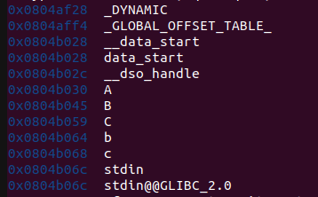

# Estructura de Computadores. Práctica 04.

**Autor:** Arturo Olivares Martos
***

- **Asignatura:** Estructura de Computadores.
- **Curso Académico:** 2023-24.
- **Grado:** Doble Grado en Ingeniería Informática y Matemáticas.
- **Grupo:** Único.
- **Profesor:** Ignacio Rojas Ruiz.
- **Descripción:** Práctica 4 de EC.

El objetivo del presente documento es explicar la resolución de una bomba dada por el profesor, disponible pinchando [aquí](https://www.google.com).

Su contraseña es `Oh, castitas lilium`, y el passcode es `1030`.

En primer lugar, ejecutamos la bomba con `gdb`:
```console
gdb -tui ./NBA_2015
```

Una vez dentro de `gdb`, mostramos el lenguaje ensamblador:
```console
(gdb) layout asm
```

No obstante, no vemos que en ningún momento se use ninguna variable, como podría ser `<password>` o del estilo. Para obtener alguna pista, vemos las variables del programa:
```console
(gdb) info variables
```

En la salida, vemos las siguientes variables, que nos llaman la atención por tener un nombre distinto, que no parece ser como el resto:


Por tanto, las variables que nos hacen sospechar son:
```console
0x0804b030 A
0x0804b045 B
0x0804b059 C
0x0804b064 b
0x0804b068 c
```

Intentamos mostrar todas ellas como cadenas:
```console
(gdb) x/s 0x0804b030
0x0804b030 <A>: "Oh, castitas lilium\n"
(gdb) x/s 0x0804b045
0x0804b045 <B>: "Esta es la clave!!\n"
(gdb) x/s 0x0804b059
0x0804b059 <C>: "Miauuu\n"
(gdb) x/s 0x0804b064
0x0804b064 <b>: "\006\004"
(gdb) x/s 0x0804b068
0x0804b068 <c>: "D\026"
```

Por tanto, tenemos que las variables `A,B,C` son candidatas a contraseñas. No obstante, `b,c` no parecen ser cadenas.Veamos si son números:
```console
(gdb) x/d 0x0804b064
0x0804b064 <b>: 1030
(gdb) x/d 0x0804b068
0x0804b068 <c>: 5700
```

Por tanto, ya tenemos los dos candidatos a código. Como hay 3 candidatos a contraseñas y dos candidatos a código, en total tenemos 6 combinaciones candidatas.

Probando, tenemos que las correctas son `A` y `b`.
```console
Introduce la contraseña: 
Oh, castitas lilium
Introduce el código: 1030
.........................
... bomba desactivada ...
.........................
```

El código en ensamblador es más complejo de entender, ya que los saltos son difíciles de seguir aun sabiendo ya la contraseña. Esto suponemos que es porque se ha usando optimización avanzada.

Una vez que sabemos que la posición de memoria de la contraseña es `0x0804b030`, vemos que en `*main+383` y `*main+424` compara con las dos contraseñas falsas. No obstante, en ambos casos llama a `f1_ew`, que de la salida del código suponemos que tan solo imprime por pantalla `miau`. Por tanto, la comparación real es la tercera que se hace, en `*main+468`, que compara con la contraseña verdadera.

Respecto al código, sabemos que que se compara en `*main + 582` con el número dado.