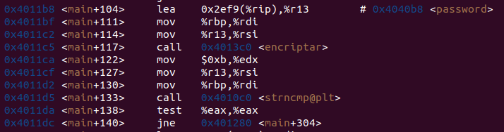
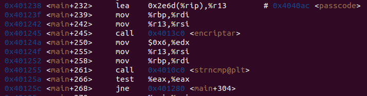

# Estructura de Computadores. Práctica 04.

**Autor:** Arturo Olivares Martos
***

- **Asignatura:** Estructura de Computadores.
- **Curso Académico:** 2023-24.
- **Grado:** Doble Grado en Ingeniería Informática y Matemáticas.
- **Grupo:** Único.
- **Profesor:** Ignacio Rojas Ruiz.
- **Descripción:** Práctica 4 de EC.

El objetivo del presente documento es documentar cómo desactivar mi bomba, cuyo código en `C` está disponible pinchando [aquí](https://github.com/LosDelDGIIM/LosDelDGIIM.github.io/blob/main/subjects/EC/Pr%C3%A1cticas/Pr%C3%A1ctica04/2023_AOM/bomba.c) y el ejecutable se encuentra [aquí](https://github.com/LosDelDGIIM/LosDelDGIIM.github.io/blob/main/subjects/EC/Pr%C3%A1cticas/Pr%C3%A1ctica04/2023_AOM/bomba).

En primer lugar, es necesario ejecutar la bomba con `gdb`:
```console
gdb -tui ./bomba
```

Una vez dentro de `gdb`, se debe mostrar el lenguaje ensamblador, por lo que pondremos:
```console
layout asm
```

Dentro del código, vemos lo siguiente:


Por tanto, vemos que se encripta la contraseña con la función `encriptar`. Para ver cómo se encripta, ponemos un `breakpoint` justo antes de la llamada a la función, y miraremos los valores antes y después de la llamada.
```console
(gdb) layout asm
(gdb) br *main +117
Breakpoint 1 at 0x4011c5
(gdb) run
```

Notemos que, antes de llegar a la función `encriptar`, el programa pide al usuario la contraseña. Introducimos `abcdefghij`, ya que el máximo de caracteres es 10. Además, usamos una variable con el máximo número de letras distintas, ya que si usase un cifrado común como puede ser el del César o desordenar las letras, o que a cada letra le corresponda otra; obtendremos más información. Por tanto, ponemos `abcdefghij` para que no haya letras repetidas.
```console
Introduce la contraseña: abcdefghij

Breakpoint 1, 0x00000000004011c5 in main ()
(gdb) x/s $rdi
0x7fffffffdd10: "abcdefghij\n"
(gdb) x/s $rsi
0x4040b8 <password>: "hcufvyt\n!?"
```

Por tanto, ya tenemos los valores antes de la llamada a la función. Ahora, ponemos `nexti` para que se ejecute la función `encriptar` y vemos los valores después de la llamada. Sabiendo las direcciones de memoria, podemos verlo de forma directa:
```console
(gdb) nexti
0x00000000004011ca in main ()
(gdb) x/s 0x4040b8
0x4040b8 <password>: "hcufvyt\n!?"
(gdb) x/s 0x7fffffffdd10
0x7fffffffdd10: "cebadgfjih\n"
```

Por tanto, vemos que la función `encriptar` encripta la contraseña de la siguiente forma:

| | 0 | 1 | 2 | 3 | 4 | 5 | 6 | 7 | 8 | 9 | 10 
--- |--- | --- | --- | --- | --- | --- | --- | --- | --- | --- | ---
Antes | a | b | c | d | e | f | g | h | i | j | \n
Después | c | e | b | a | d | g | f | j | i | h | \n

Es decir, la función `encriptar` intercambia las posiciones de las letras de la contraseña de la siguiente forma:

Posición | 0 | 1 | 2 | 3 | 4 | 5 | 6 | 7 | 8 | 9 | 10
--- |--- | --- | --- | --- | --- | --- | --- | --- | --- | --- | ---
Antes | 0 | 1 | 2 | 3 | 4 | 5 | 6 | 7 | 8 | 9 | 10
Después | 2 | 4 | 1 | 0 | 3 | 6 | 5 | 9 | 8 | 7 | 10


Es decir, es fácil deducir que se encripta poniendo en la posición `0` la letra que estaba en la posición `2`, en la posición `1` la letra que estaba en la posición `4`, etc. Es decir, se encripta de la siguiente forma:
```c
strcpy(cp, a_encriptar);

for (int i=0; i<strlen(encriptado); i++)
	a_encriptar[i] = cp[shuffle[i]];
```

Aunque es posible que con tan solo un ejemplo no se piense de forma directa, con varios ejemplos es fácil ver que la fila de _Después_ se mantiene constante, por lo que se baraja según esos índices.

Continuando con el programa, en la imagen anterior vemos que se llama a la función `strncmp@plt`, que sabemos que compara dos strings. Por tanto, ponemos un `breakpoint` en esa función para ver qué compara:
```console
(gdb) br *main + 133
Breakpoint 2 at 0x4011d5
(gdb) continue
Continuing.

Breakpoint 2, 0x00000000004011d5 in main ()
(gdb) x/s $rsi
0x4040b8 <password>: "hcufvyt\n!?"
(gdb) x/s $rdi
0x7fffffffdd10: "cebadgfjih\n"
```

Además, viendo la imagen, debido a la instrucción `jne` vemos que si dichas cadenas no son iguales salta a `<main+304>`, y en dicha posición vemos que se encuentra la llamada a `<boom>` (notemos que la llamada a `boom` no se encuentra inmediatamente tras comparar las cadenas debido a que se ha compilado con optimización `-O2`).


Por tanto, vemos que compara la contraseña que el usuario introduce, pero encrptada; con otra cadena, que deducimos que es la contraseña para desactivar la bomba pero encriptada. Usando el algoritmo de encriptación pero en sentido contrario, buscamos desencriptar la contraseña `"hcufvyt\n!?"`:
| | 0 | 1 | 2 | 3 | 4 | 5 | 6 | 7 | 8 | 9 | 10
--- |--- | --- | --- | --- | --- | --- | --- | --- | --- | --- | ---
Pos_Encriptadas | 2 | 4 | 1 | 0 | 3 | 6 | 5 | 9 | 8 | 7 | 10
Después | h | c | u | f | v | y | t | \n | ! | ?
Antes | f | u | h | v | c | t | y | ? | ! | \n

Por tanto, tenemos que la contraseña para desactivar la bomba es `fuhvcty?!`. Efectivamente, si volvemos a ejecutar el programa introduciendo esa contraseña no explota, sino que nos pide el pin; muestra de que la contraseña es correcta.

Busquemos ahora cuál es el pin correcto. Volvemos a abrir el programa con `gdb`, y tras introducir `layout asm`, vemos la siguiente parte del código:


Como podemos ver, se sigue un proceso análogo al de encriptar la contraseña, pero en este caso se encripta el pin. Por tanto, ponemos un `breakpoint` en la llamada a la función `encriptar` y vemos los valores antes y después de la llamada:
```console
(gdb) layout asm
(gdb) br *main + 245
Breakpoint 1 at 0x401245
(gdb) run

Introduce la contraseña: fuhvcty?!

Introduce el pin: 123456

Breakpoint 1, 0x0000000000401245 in main ()

(gdb) x/s $rdi
0x7fffffffdd80: "123456\n"
(gdb) x/s $rsi
0x4040ac <passcode>: "7\n250"
```
Notemos que hemos tenido que introducir la contraseña correcta para que no explote, y que hemos introducido dicho pin siguiendo el mismo razonamiento que en la contraseña, el máximo número de digitos y todos ellos distintos.

Por tanto, vemos que el pin encriptado es `7\n250`. Desecriptémoslo usando el mismo algoritmo:
| | 0 | 1 | 2 | 3 | 4 | 5 | 6 | 7 | 8 | 9 | 10
--- |--- | --- | --- | --- | --- | --- | --- | --- | --- | --- | ---
Pos_Encriptadas | 2 | 4 | 1 | 0 | 3 | 6 | 5 | 9 | 8 | 7 | 10
Después | 7 | \n | 2 | 5 | 0 |  |  |  |  | 
Antes | 5 | 2 | 7 | 0 | \n |  |  |  |  | 

Por tanto, podríamos pensar que el pin es `5270`. Si ejecutamos el programa con la contraseña desencriptada y el pin desencriptado, vemos que se desactiva:
```console
$ ./bomba 

Introduce la contraseña: fuhvcty?!

Introduce el pin: 5270

·························
··· bomba desactivada ···
·························
```

Por tanto, hemos desactivado la bomba. Veamos ahora cómo cambiar las contraseñas. Buscamos ponerle `abcdefghi` como contraseña, y `1234` como pin. Encriptémoslas:

| | 0 | 1 | 2 | 3 | 4 | 5 | 6 | 7 | 8 | 9 | 10
--- |--- | --- | --- | --- | --- | --- | --- | --- | --- | --- | ---
Pos_Encriptadas | 2 | 4 | 1 | 0 | 3 | 6 | 5 | 9 | 8 | 7 | 10
Password sin encriptar | a | b | c |d  | e | f | g |h  | i | \n
Password encriptada | c | e | b | a | d | g | f | \n | i |h 
Passcode sin encriptar | 1 | 2 | 3 | 4 | \n |  |  |  |  | 
Passcode encriptado | 3 | \n | 2 | 1 | 4 |  |  |  |  | 


Por tanto, ya podemos abrir el ejecutable con permisos de escritura con `gdb` y modificar las posiciones de memoria correspondientes:
```console
(gdb) set write on
(gdb) file bomba

(gdb) set {char[11]}0x4040b8="cebadgf\nih"
(gdb) set {char[6]}0x4040ac="3\n214"
(gdb) x/s 0x4040b8
0x4040b8 <password>: "cebadgf\nih"
(gdb) x/s 0x4040ac
0x4040ac <passcode>: "3\n214"
```

Comprobemos que efectivamente han sido modificadas:
```console
$ ./bomba 

Introduce la contraseña: abcdefghi    

Introduce el pin: 1234

·························
··· bomba desactivada ···
·························
```

Como vemos, se ha desactivado la bomba con éxito con las nuevas contraseñas.