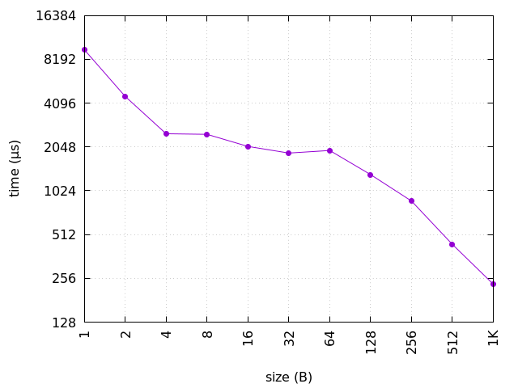
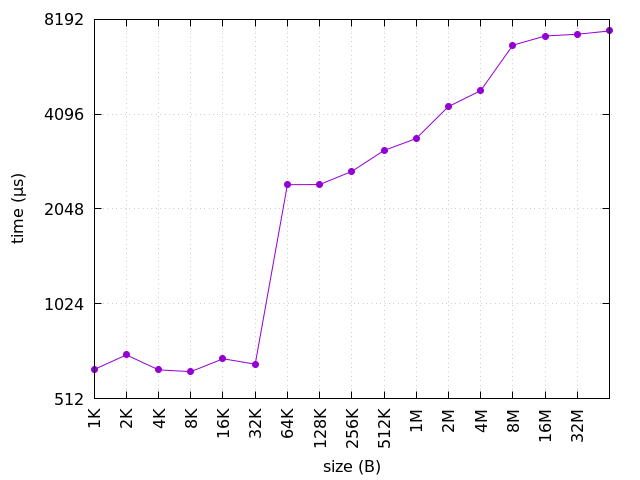

# Estructura de Computadores. Práctica 06.

**Autor:** Arturo Olivares Martos
***

- **Asignatura:** Estructura de Computadores.
- **Curso Académico:** 2023-24.
- **Grado:** Doble Grado en Ingeniería Informática y Matemáticas.
- **Grupo:** Único.
- **Profesor:** Ignacio Rojas Ruiz.
- **Descripción:** Práctica 6 de EC.


Veamos en primer lugar la información de mi CPU:
```console
$ lscpu
...
Caches (sum of all):     
  L1d:                   64 KiB (2 instances)
  L1i:                   64 KiB (2 instances)
  L2:                    512 KiB (2 instances)
  L3:                    3 MiB (1 instance)
...
```

Como hay dos núcleos, por cada procesador, tenemos que en cada núcleo tiene 32 KiB de caché L1d (datos) y 32 KiB de caché L1i (instrucciones). Además, tenemos 256 KiB de caché L2 y 3 MiB de caché L3 (esta es compartida por todos los núcleos de cada procesador).

Veamos que coincide con la información del `make` de la práctica:
```console
$ make info
line size = 64B
cache size = 32K/32K/256K/3072K/
cache level = 1/1/2/3/
cache type = Data/Instruction/Unified/Unified/
```

Vemos que efectivamente coincide. Además, vemos que el tamaño de línea de caché es de 64 bytes. Veamos ahora enconces cada programa.

## Tamaño de Línea de Caché

La parte clave del programa es:
```c
for (unsigned i = 0; i < bytes.size(); i += line)
	bytes[i] ^= 1;
```

Es decir, una vez creado el vector (del mismo tamaño para todas las ejecuciones), se itera sobre dicho vector en saltos de `line`, que es lo que varía en potencias de 2 (1, 2, 4, 8, etc.). Además, queremos acceder a dicha posición, por lo que se accede y se modifica con una instrucción simple (`xor` en este caso).
 
La gráfica generada es:


Es directo ver que para saltos bajos tarda mucho más que para saltos grandes. Esto se debe a que obviamente se tarda mucho más en saltos de 1 que en saltos de 1K, ya que en el segundo caso se hacen muchísimas menos iteraciones.

No obstante, vemos que en saltos de 64 se produce una especie de punto de inflexión. Esto se debe a que el tamaño de línea, como se ha visto con `make info` es de 64B. Por tanto, con saltos manores de 64B se han de traer todos los bloques de memoria principal a la caché. No obstante, para saltos mayores (por ejemplo, 128B), no se treaerán todos los bloques a caché, tan solo algunos (Para saltos de 128B, se traerán la mitad de los bloques). Por tanto, además de tardar menos por ser menos iteraciones, también tarda mucho menos por acceder menos veces a memoria principal.


## Tamaño del Vector sobre el que se itera

La parte clave del programa es:
```c
for (unsigned i = 0; i < STEPS; ++i)
	bytes[(i*64)&(size-1)]++;
```

Es decir, en primer lugar creamos el vector del correspondiente tamaño, que varía en potencias de 2 (1, 2, 4, 8, etc.). Para cada tamaño, queremos acceder a todos los bloques, por lo que será necesario traerlos a caché.

Para acceder a todas las líneas, basta con acceder al primero de la línea, que ocupa `64B`.
 
La gráfica generada es:



Vemos que si el tamaño del vector es menor o igual que 32K, como cabe entero en la caché L1, tarda mucho menos. Para valores mayores de 32K, no cabe en L1, por lo que se produce un gran salto.

Conforme se aumenta el tamaño, vemos que el tiempo aumenta, notando pequeños saltos en 256K y 3M, que son el tamaño de la L2 y la L3. Para valores mayores que 3M, vemos que el tamaño vuelve a aumentar de forma considerable, ya que no cabe en memoria caché y será necesario traerlo de memoria principal.