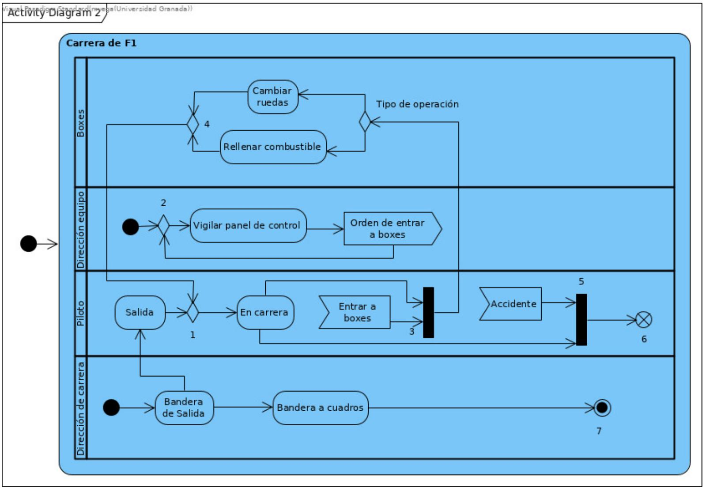
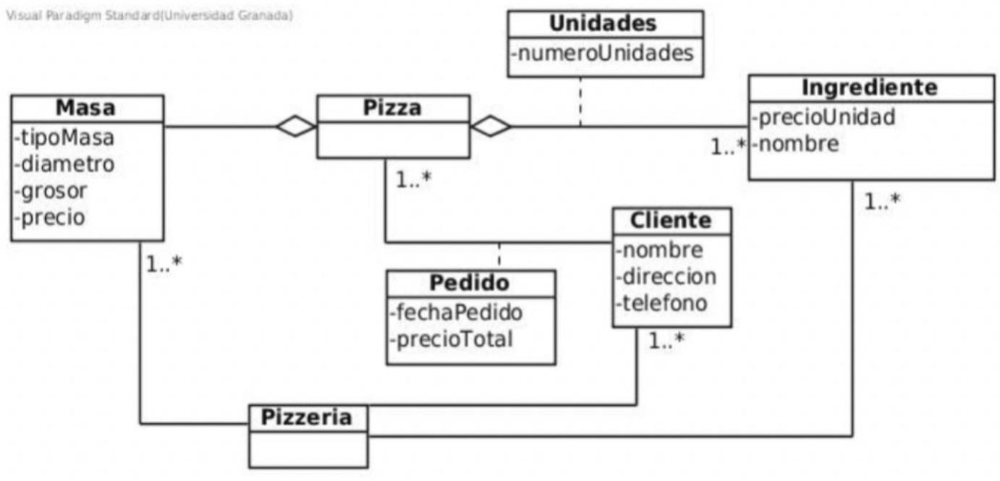
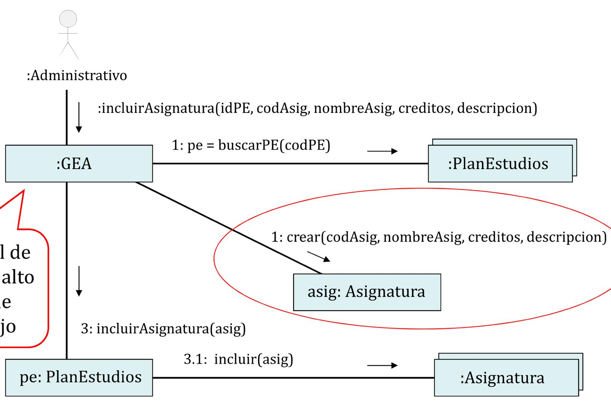
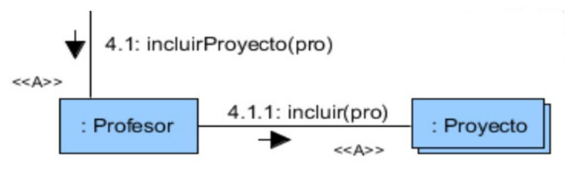

 

# Fundamentos de Ingeniería del Software

- **Autor:** Arturo Olivares Martos
- **Autor:** Lucas Hidalgo Herrera
- **Autor:** Laura Mandow Fuentes
- **Autor:** José Juan Urrutia Milán
- **Descripción:** Recopilación de preguntas Tipo Test de la asignatura de FIS. Se han obtenido de fuentes diversas, por lo que si faltasen, sobrasen o estuviesen mal formuladas, por favor, se ruega nos lo hagan saber para corregirlo.

---

1. Todos los sustantivos que se identifiquen en los casos de uso se representan como conceptos en el diagrama conceptual.
    - ( ) Verdadero
    - (x) Falso

2. El diagrama de componentes especifica el hardware físico sobre el que se ejecutará el sistema software.
    - ( ) Verdadero
    - (x) Falso

3. Uno de los objetivos de la fase de inicio del proceso unificado es el estudio de viabilidad del sistema a desarrollar.
    - (x) Verdadero
    - ( ) Falso

4. Durante la etapa de definición hay que conseguir encontrar la solución software al sistema analizado.
    - ( ) Verdadero
    - (x) Falso

5. Las clases del diagrama de clases del diseño toman sus atributos de los diagramas de comunicación.
    - ( ) Verdadero
    - (x) Falso

6. Todos los enlaces estereotipados con `<<L>>`, `<
>` o `<<G>>` estarán en el diagrama de clases del diseño como una asociación.
    - ( ) Verdadero
    - (x) Falso

7. El usuario es una pieza importante en el proceso de validación de las especificaciones del software.
    - (x) Verdadero
    - ( ) Falso

8. El uso de mecanismos de abstracción en el diseño permiten obtener la modularidad adecuada de un sistema software.
    - ( ) Verdadero
    - (x) Falso

9. Uno de los problemas más importantes en el proceso de desarrollo del software es el incumplimiento de la planificación.
    - (x) Verdadero
    - ( ) Falso

10. El modelo de prototipos es un buen método para validar los requisitos de los usuarios en cualquier proyecto de desarrollo de software.
    - ( ) Verdadero
    - (x) Falso

11. En la arquitectura multicapa las capas deben estar lo más acopladas posible.
    - ( ) Verdadero
    - (x) Falso

12. Los requisitos no funcionales definen los criterios de calidad del sistema software.
    - (x) Verdadero
    - ( ) Falso

13. Las asociaciones de navegación se obtienen a partir de las asociaciones del modelo conceptual.
    - ( ) Verdadero
    - (x) Falso

14. Los requisitos no funcionales no tienen ninguna relación con los funcionales.
    - ( ) Verdadero
    - (x) Falso

15. En el diagrama de clases del diseño pueden aparecer clases que no estaban en el diagrama de conceptos construido en el modelo de análisis.
    - (x) Verdadero
    - ( ) Falso

1. Una de las funciones de la relación de inclusión en los casos de uso es descomponer un caso de uso complejo y largo en varios, para facilitar su comprensión.
    - (x) Verdadero
    - ( ) Falso

2. Las bases principales para obtener los diagramas de comunicación son los contratos y el modelo conceptual.
    - (x) Verdadero
    - ( ) Falso

3. Un caso de uso sólo puede tener un actor principal que coincide con el que inicia el caso de uso.
    - ( ) Verdadero
    - (x) Falso

4. El uso de métodos de desarrollo ágiles rompen con la filosofía de equipos de trabajo organizados de forma jerárquica.
    - (x) Verdadero
    - ( ) Falso

5. Una de las ventajas al incluir las relaciones entre los casos de uso es que se reduce el texto generado en la descripción de los casos de uso.
    - (x) Verdadero
    - ( ) Falso

6. Uno de los pasos a realizar en la elaboración del modelo de interacción de objetos es la incorporación de las asociaciones entre las clases de objetos.
    - ( ) Verdadero
    - (x) Falso

7. Los diagramas de actividad se usan como complemento a la descripción de un caso de uso complejo.
    - (x) Verdadero
    - ( ) Falso

8. El uso del patrón controlador en la elaboración del modelo de diseño se hace para reducir el nivel de acoplamiento entre los elementos de la interfaz de usuario y los que modelan la solución.
    - (x) Verdadero
    - ( ) Falso

9.  Los proyectos software reales raramente se adaptan a un modelo de ciclo de vida clásico o en cascada.
    - (x) Verdadero
    - ( ) Falso

10. El análisis de requisitos permite descubrir los conflictos existentes entre los requisitos.
    - (x) Verdadero
    - ( ) Falso

11. Durante el análisis no se estudia la solución que se va a proponer al problema planteado, eso se deja a la fase de diseño.
    - ( ) Verdadero
    - (x) Falso

12. Con el análisis orientado a objetos sólo se modelan las propiedades estáticas del ámbito del problema.
    - ( ) Verdadero
    - (x) Falso

13. Los casos de uso “esenciales” son los procedimientos comunes más importantes del sistema.
    - ( ) Verdadero
    - (x) Falso

14. No se deben usar atributos de un concepto como clave de acceso desde otro concepto.
    - (x) Verdadero
    - ( ) Falso

15. El modelo conceptual se representa usando un diagrama de clases que contiene las clases con sus atributos, métodos y asociaciones.
    - ( ) Verdadero
    - (x) Falso

16. En un diagrama de secuencia del sistema pueden aparecer tantos objetos como se necesiten para modelar la interacción entre ellos.
    - ( ) Verdadero
    - (x) Falso

17. Un caso de uso puede generar más de una operación en el diagrama de secuencia del sistema.
    - (x) Verdadero
    - ( ) Falso

18. Los patrones de diseño para la asignación de responsabilidades a objetos ayudan a obtener el diagrama de clases del diseño.
    - ( ) Verdadero
    - (x) Falso

19. Una asociación es una conexión significativa y relevante entre conceptos.
    - (x) Verdadero
    - ( ) Falso

1. El modelo estructural del análisis está representado por el/los diagramas de secuencia del sistema.
    - ( ) Verdadero
    - (x) Falso

2. Antes de definir una subclase en un modelo conceptual se debe comprobar que cumple las reglas del 100% y del “es-un”.
    - (x) Verdadero
    - ( ) Falso

3. El diseño es una tarea clave para la calidad del producto software.
    - (x) Verdadero
    - ( ) Falso

4. Un cambio de estado que se describe en las poscondiciones de un contrato es la creación de un atributo.
    - ( ) Verdadero
    - (x) Falso

5. Cuando se construye un modelo conceptual es mejor añadir el mayor número posible de asociaciones entre conceptos.
    - ( ) Verdadero
    - (x) Falso

6. Un participante en un diagrama de secuencia puede ser un objeto individual o un multiobjeto.
    - ( ) Verdadero
    - (x) Falso

7. La diferencia entre una precondición y una excepción es que la precondición no tiene que comprobarse en la operación que se está definiendo.
    - (x) Verdadero
    - ( ) Falso

8. En el diagrama de clases del diseño, la multiplicidad se obtiene de la existencia o no de multiobjetos en los diagramas de comunicación.
    - (x) Verdadero
    - ( ) Falso

9. La etnografía es una técnica de obtención de requisitos que consiste en preguntar a los trabajadores de un negocio sobre la forma en que realizan sus tareas.
    - ( ) Verdadero
    - (x) Falso

10. El incumplimiento de la planificación lleva de forma inmediata al aumento de personal en el equipo de desarrollo.
    - ( ) Verdadero
    - (x) Falso

11. Una característica de los métodos ágiles es las entregas frecuentes.
    - (x) Verdadero
    - ( ) Falso

12. Un diagrama de secuencia del sistema es un diagrama de secuencia de UML en el que se muestran los eventos generados por los actores.
    - (x) Verdadero
    - ( ) Falso

13. Los requisitos de un proyecto software pueden cambiar continuamente, pero esto no es un problema ya que los sistemas software son flexibles (se adaptan a los cambios).
    - ( ) Verdadero
    - (x) Falso

14. Para obtener un buen diseño, cada módulo debe presentar un bajo nivel de cohesión.
    - ( ) Verdadero
    - (x) Falso

15. La arquitectura de un sistema software facilita la comprensión de la estructura global del sistema.
    - (x) Verdadero
    - ( ) Falso

1. Los modelos del análisis pueden contener tantas inconsistencias como consideremos oportunas, puesto que no son la solución del problema.
    - ( ) Verdadero
    - (x) Falso

2. Uno de los objetivos del análisis es conseguir los requisitos del software a partir de los requisitos de usuario mediante un proceso de refinamiento.
    - (x) Verdadero
    - ( ) Falso

3. Un Diagrama de Secuencia del Sistema se puede corresponder con un caso de uso, con un diagrama de casos de uso o con todo el sistema.
    - (x) Verdadero
    - ( ) Falso

4. El nombre que le demos al sistema en el DSS se va a corresponder con el nombre de una clase que va a formar parte de nuestra solución.
    - (x) Verdadero
    - ( ) Falso

5. El Contrato de una operación debe indicar qué hace una operación sin decir cómo lo hace.
    - (x) Verdadero
    - ( ) Falso

6. Los modelos de AER son: Modelo conceptual, diagramas de casos de uso y los contratos de las operaciones principales.
    - ( ) Verdadero
    - (x) Falso

7. El modelo conceptual debe representar cualquier tipo de relación que se dé entre los conceptos que forman parte de él.
    - ( ) Verdadero
    - (x) Falso

8. Un concepto debe incluir los atributos que indiquen las asociaciones que tienen otros conceptos.
    - ( ) Verdadero
    - (x) Falso

9. En un contrato si está relleno el apartado de las excepciones, el apartado de las precondiciones debe estar vacío.
    - ( ) Verdadero
    - (x) Falso

10. Lo siguiente es una poscondición correcta: "se creó una lista en la que se incluye el nombre del cliente, dirección y teléfono, que se proporciona como salida de la operación".
    - ( ) Verdadero
    - (x) Falso

11. A la hora de elaborar el diagrama de comunicación de una operación son esenciales los siguientes apartados del contrato correspondiente: excepciones, precondiciones y poscondiciones.
    - ( ) Verdadero
    - (x) Falso

12. Con la abstracción de datos se abstraen sobre el funcionamiento para conseguir una estructura modular basada en procedimientos.
    - ( ) Verdadero
    - (x) Falso

13. El análisis de la productividad permite realizar una buena gestión de proyectos.
    - (x) Verdadero
    - ( ) Falso

14. El diagrama de clases de diseño se deduce de los diagramas de comunicación. Se elaboran los diagramas de comunicación y después el diagrama de clases del diseño.
    - (x) Verdadero
    - ( ) Falso

15. EL diseño es el proceso de refinamiento, en el que partiendo de modelos del análisis vamos añadiendo información hasta completar el diseño.
    - (x) Verdadero
    - ( ) Falso

16. El mayor esfuerzo durante el proceso de producción del software se realiza en la etapa de desarrollo.
    - ( ) Verdadero
    - (x) Falso

17. El mayor esfuerzo realizado durante el mantenimiento de un software es para adaptar el software a nuevos requisitos.
    - ( ) Verdadero
    - (x) Falso

18. El modelado de casos de uso solo puede ser usado en la etapa de detección de requisitos.
    - ( ) Verdadero
    - (x) Falso

19. El modelo conceptual no debe incluir los nombres de rol de las asociaciones.
    - ( ) Verdadero
    - (x) Falso

20. El modelo conceptual no puede contener las navegabilidades de las asociaciones.
    - (x) Verdadero
    - ( ) Falso

21. El modelo conceptual o modelo de dominio es básico para especifiar las postcondiciones de un contrato.
    - (x) Verdadero
    - ( ) Falso

22. El modelo de casos de uso permite determinar con facilidad los requisitos no funcionales del sistema.
    - ( ) Verdadero
    - (x) Falso

23. El modelo de casos de uso se usa exclusivamente para la obtención de requisitos.
    - ( ) Verdadero
    - (x) Falso

24. El número de módulos de un sistema software debe ser cuantos más mejor, pues así garantizamos la independencia modular de cada uno de ellos.
    - ( ) Verdadero
    - (x) Falso

25. El número de operaciones principales de un sistema es el mismo que el número de casos de usos que tengamos.
    - ( ) Verdadero
    - (x) Falso

26. El proceso unificado es un modelo de proceso dirigido por casos de uso.
    - (x) Verdadero
    - ( ) Falso

27. El resultado del diseño de la arquitectura del software es un conjunto de subsistemas y las relaciones entre ellos.
    - (x) Verdadero
    - ( ) Falso

28. En el modelo conceptual hay que definir los atributos y los métodos de todas las clases.
    - ( ) Verdadero
    - (x) Falso

29. En los diagramas de clases de diseño no se deben representar las relaciones de dependencia entre clases, solo se deben representar las de asociación y de generalización.
    - ( ) Verdadero
    - (x) Falso

30. En los diagramas de clases de diseño pueden aparecer relaciones de dependencia.
    - (x) Verdadero
    - ( ) Falso

31. Es posible que en un caso de uso no tenga que intervenir el sistema software a modelar.
    - ( ) Verdadero
    - (x) Falso

32. La arquitectura cliente-servidor favorece la escalabilidad de los sistemas software, porque permite la reconfiguración añadiendo clientes y servidores extra.
    - (x) Verdadero
    - ( ) Falso

33. La forma más directa de identificar casos de uso es identificando los objetivos y necesidades de los actores del sistema.
    - (x) Verdadero
    - ( ) Falso

34. La navegabilidad de las asociaciones en el diagrama de clases del diseño se obtiene teniendo en cuenta la dirección en los envíos de mensaje en los diagramas de comunicación.
    - (x) Verdadero
    - ( ) Falso

35. La primera tarea del diseño es encontrar el diseño de la arquitectura del sistema.
    - (x) Verdadero
    - ( ) Falso

36. Las relaciones entre actores y casos de uso son la asociación y la dependencia.
    - ( ) Verdadero
    - (x) Falso

37. Las relaciones entre los casos de uso pueden ser asociación, generalización y dependencia.
    - ( ) Verdadero
    - (x) Falso

38. Las relaciones que se dan entre casos de uso es la dependencia y la generalización.
    - (x) Verdadero
    - ( ) Falso

39. Las tareas principales de la ingeniería de requisitos son detección, análisis, especificación, revisión y reacción de requisitos.
    - ( ) Verdadero
    - (x) Falso

40. Las vías de comunicación o enlaces entre objetos en un diagrama de colaboración son bidireccionales.
    - ( ) Verdadero
    - (x) Falso

41. Lo siguiente es un requisito funcional "las reservas de préstamos de libros caducan a los 10 días a partir del momento que el libro esté a disposición del usuario".
    - (x) Verdadero
    - ( ) Falso

42. Lo siguiente es un requisito NO funcional de facilidad de uso "el entorno debe avisar al usuario mediante email tres días antes de que finalice el plazo del préstamo".
    - ( ) Verdadero
    - (x) Falso

43. Los actores representan roles que son interpretados por personas, dispositivos, otros sistemas... cuando el sistema está en uso.
    - (x) Verdadero
    - ( ) Falso

44. Los actores tienen que ser necesariamente los identificados como usuarios del sistema.
    - ( ) Verdadero
    - (x) Falso

45. Los diagramas de actividad de UML es una herramienta muy adecuada para el diseño del flujo de control.
    - (x) Verdadero
    - ( ) Falso

46. Los diagramas de interacción y los diagramas de actividad UML son herramientas de diseño que permiten representar lo mismo, son equivalentes.
    - ( ) Verdadero
    - (x) Falso

47. Los prototipos siempre se transforman hasta convertirse en el programa que se entrega al cliente.
    - ( ) Verdadero
    - (x) Falso

48. Los requisitos no funcionales determinan los objetivos del diseño.
    - ( ) Verdadero
    - (x) Falso

55. Los requisitos no funcionales suponen limitaciones para el diseño de un sistema software.
    - (x) Verdadero
    - ( ) Falso

56. Los tipos de requisitos son funcionales, no funcionales y FURPS+.
    - ( ) Verdadero
    - (x) Falso

57. Para elaborar el modelo de análisis es fundamental el modelo de casos de uso.
    - (x) Verdadero
    - ( ) Falso

58. Para incorporar generalizaciones es necesario encontrar clases conceptuales con elementos comunes.
    - (x) Verdadero
    - ( ) Falso

59. Si una función del sistema no cambia nada de lo especificado en el modelo conceptual su contrato no tendrá poscondiciones.
    - (x) Verdadero
    - ( ) Falso

60. Un caso de uso esencial describe qué hace el sistema como respuesta a una petición de algún actor, pero no cómo lo hace.
    - (x) Verdadero
    - ( ) Falso

61. Un caso de uso produce algo de valor para un actor.
    - (x) Verdadero
    - ( ) Falso

62. Un caso de uso puede ser iniciado por un actor o por un usuario.
    - ( ) Verdadero
    - (x) Falso

63. Un modelo de casos de uso lo componen los diagramas de casos de uso y la especificación de actores y casos de uso.
    - (x) Verdadero
    - ( ) Falso

64. Un modelo de casos de uso se centra en las necesidades que el usuario espera lograr al utilizar el sistema.
    - (x) Verdadero
    - ( ) Falso

65. Un nivel de acoplamiento alto y de cohesión bajo en un módulo garantiza un diseño de calidad.
    - ( ) Verdadero
    - (x) Falso

66. Una mala solución para remediar el retraso en la entrega de un proyecto software es la llamada "horda mongoliana".
    - (x) Verdadero
    - ( ) Falso

1. En los diagramas de clases no pueden aparecer relaciones de generalización.
    - ( ) Verdadero
    - (x) Falso

2. El principio de modularidad es básico, sin él no tienen sentido los demás principios.
    - (x) Verdadero
    - ( ) Falso

3. El tipo de relación entre actor y CU es de asociación.
    - (x) Verdadero
    - ( ) Falso

4. En el MC (modelo conceptual) se deben incluir las relaciones de generalización entre conceptos.
    - (x) Verdadero
    - ( ) Falso

5. El acoplamiento indica dependencia entre módulos. Cuanto más alto mejor es el diseño.
    - ( ) Verdadero
    - (x) Falso

6. La cohesión es indicador de la unión formal de los elementos que forman un módulo.
    - (x) Verdadero
    - ( ) Falso

7. Un patrón de diseño es la descripción del problema con su solución en un determinado contexto.
    - (x) Verdadero
    - ( ) Falso

8. Hacer diagramas de comunicación es sitemático, no interviene la creatividad del diseñador.
    - ( ) Verdadero
    - (x) Falso

9. Nivel de acoplamiento nulo de un módulo nos garantiza un diseño de calidad.
    - ( ) Verdadero
    - (x) Falso

10. Diseño es el proceso de aplicar distintos métodos, herramientas y principios con el propósito de definir un dispositivo, proceso o sistema con el suficiente detalle como para permitir su realización física.
    - (x) Verdadero
    - ( ) Falso

11. El patrón experto en información propone asignar una responsabilidad a la clase que conoce la información necesaria para llevarla a cabo.
    - (x) Verdadero
    - ( ) Falso

12. El uso de los diagramas de comunicación o de secuencia UML para representar el modelo de interacción de objetos nos va a proporcionar distintos resultados de diseño.
    - ( ) Verdadero
    - (x) Falso

13. Las relaciones de dependencia en el diagrama de clases del diseño se obtienen de las asociaciones de tipo agregación fuerte.
    - ( ) Verdadero
    - (x) Falso

14. Un enlace entre objetos estereotipado como local `<<L>>` nos está indicando que esa vía de comunicación queda establecida para cualquier otra colaboración entre esos objetos.
    - ( ) Verdadero
    - (x) Falso

15. El uso del patrón controlador aumenta el número de conexiones entre las capas de interfaz de dominio. Esto implica que aumenta su acoplamiento.
    - ( ) Verdadero
    - (x) Falso

16. Una de las principales tareas del diseño de la arquitectura es refinar la descomposición del sistema en subsistemas.
    - (x) Verdadero
    - ( ) Falso

17. El patrón experto en información nos dice que el objeto responsable de hacer las cosas es el que tiene el control.
    - ( ) Verdadero
    - (x) Falso

18. El patrón experto en información nos ayuda a conocer qué clases son las encargadas de crear y destruir objetos en un DC (diagrama de comunicación).
    - ( ) Verdadero
    - (x) Falso

19. Contra del patrón experto en información: va en contra de principios de acoplamiento y cohesión.
    - (x) Verdadero
    - ( ) Falso

20. Un enlace entre objetos en un diagrama de colaboración especifica un camino a lo largo del cual un objeto puede enviar mensajes a otro o a sí mismo.
    - (x) Verdadero
    - ( ) Falso

21. La restricción de UML `{new}` se usa en los DC (diagramas de comunicación) para representar la creación de un objeto o la creación de un enlace entre 2 objetos.
    - (x) Verdadero
    - ( ) Falso

22. El ocultamiento de información limita el impacto global de las decisiones de diseño locales.
    - (x) Verdadero
    - ( ) Falso

23. Las clases que aparezcan en el modelo de dominio son las únicas que tendrán el diagrama de clases del diseño.
    - ( ) Verdadero
    - (x) Falso

24. Cuando un objeto se pasa como parámetro, en el diagrama de comunicación de la operación los enlaces con ese objeto tendrán una visibilidad del tipo `<<A>>`. 
    - ( ) Verdadero
    - (x) Falso

25. La herramienta para representar el modelo de diseño de la interacción de objetos son los diagramas de clases UML. 
    - ( ) Verdadero
    - (x) Falso

26. Las clases del diagrama de clases del diseño toman todos sus atributos de los diagramas de conceptos.
    - ( ) Verdadero
    - (x) Falso

27. ¿Qué principio del diseño facilita el trabajo independiente y concurrente de un equipo software?
    - ( ) Abstracción
    - (x) Modularidad
    - ( ) Alta cohesión

28. En el proceso de diseño, a mayor refinamiento...
    - ( ) el nivel de abstracción es independiente del nivel de refinamiento.
    - ( ) el nivel de abstracción es más alto.
    - (x) el nivel de abstracción es más bajo.

29. ¿Cuál de las siguientes acciones empeoran el ocultamiento de información?
    - ( ) Declarar atributos con visibilidad pública.
    - ( ) Utilizar variables globales.
    - (x) Todas son correctas.

30. Respecto a la independencia modular, rasgos en diseño de un módulo:
    - (x) Alta cohesión y bajo acoplamiento.
    - ( ) Alta cohesión y alto acoplamiento.
    - ( ) Baja cohesión y bajo acoplamiento.

31. El diagrama de clases del diseño describe la estructura:
    - ( ) Del modelo de análisis.
    - ( ) En el dominio del problema.
    - (x) En el dominio de la solución.

32. ¿Cuál de los siguientes modelos es más importante para realizar el diagrama de clases de diseño?
    - (x) Diagramas de interacción del diseño.
    - ( ) Todas son correctas.
    - ( ) El modelo conceptual

33. En el diagrama de clases del diseño:
    - ( ) Las clases se obtienen del MC y los atributos del DC.
    - ( ) Las clases y atributos se obtienen de DC.
    - (x) Clases se obtienen de DC y atributos de MC.

34. En el diagrama de clases del diseño, los métodos:
    - ( ) Se obtienen del MC.
    - (x) Se obtienen de los DC.
    - ( ) No se especifican.

35. Las relaciones de generalización en el diagrama de clases del diseño son:
    - ( ) Las que había en el MC.
    - ( ) Las identificadas con `<<G>>` en los diagramas de interacción.
    - (x) Las que se pueden extraer al encontrar atributos y/o métodos comunes a varias clases.

36. ¿Cuándo el diseño de la arquitectura no es conveniente?
    - (x) Subsistemas están muy acoplados.
    - ( ) Ninguna es verdad.
    - ( ) Subsistemas tienen alta cohesión.

37. Los estereotipos de visibilidad representan tipo de acceso que se da entre objetos en los DC.
    - (x) Verdadero
    - ( ) Falso

5. La validación de la especificación no forma parte de la Ingeniería de requisitos.
    - ( ) Verdadero
    - (x) Falso

6. El modelo de casos de uso puede ser usado como guía para el diseño de la interfaz de
usuario y para facilitar la construcción de prototipos.
    - (x) Verdadero
    - ( ) Falso

8. La entrevista es una técnica encaminada a obtener información sobre el sistema mediante el
diálogo con los expertos en el dominio del problema.
    - (x) Verdadero
    - ( ) Falso

11. La Especificación de Requisitos es un documento en el que se dice qué debe hacer el
sistema software.
    - (x) Verdadero
    - ( ) Falso

12. Un sistema informático externo a la aplicación con el que ésta debe interaccionar puede
definirse como actor.
    - (x) Verdadero
    - ( ) Falso

14. Ejemplo de requisito funcional: La aplicación debe ser fácil de utilizar, e incluir ayudas en
línea fáciles de entender.
    - ( ) Verdadero
    - (x) Falso

15. Es mejor que las actividades de verificación las lleve a cabo el mismo equipo que haya
hecho el desarrollo.
    - ( ) Verdadero
    - (x) Falso

16. Los actores de un modelo de casos de uso son siempre humanos.
    - ( ) Verdadero
    - (x) Falso

17. Un caso de uso esencial describe una actividad que es imprescindible para el
funcionamiento del sistema que modela.
    - ( ) Verdadero
    - (x) Falso

19. El numero de iteraciones en las fases de elaboración y construcción del proceso unificado
deben ser las mismas.
    - ( ) Verdadero
    - (x) Falso

20. La identificación de los implicados facilita la obtención de requisitos.
    - (x) Verdadero
    - ( ) Falso

22. La clasificación de los requisitos según su ámbito distingue entre requisitos funcionales, no
funcionales y de información.
    - ( ) Verdadero
    - (x) Falso

1. El nodo 5 es un nodo `join`.  
    - (x) Sí 
    - ( ) No

2. Cuando se alcanza el nodo 6 termina la actividad "Carrera de F1".  
    - ( ) Sí 
    - (x) No

3. Cuando comienza la actividad "Carrera de F1" se activan las calles "Dirección de carrera" y SI
"Dirección de equipo".  
    - (x) Sí 
    - ( ) No

2. Este modelo conceptual está mal, faltaría incluir la navegabilidad que hay entre Pizza y
Masa, pues una pizza es la que está formada por la masa, igualmente ocurre entre Pizza e Ingrediente.  
    - ( ) Verdadero
    - (x) Falso

9. Un objeto `pedido` puede incluir más de una pizza.  
    - ( ) Verdadero
    - (x) Falso

11. Un ingrediente puede tener un precio diferente dependiendo de la pizza en la que esté.  
    - ( ) Verdadero
    - (x) Falso

3. Un diagrama de conceptos sin operaciones es incorrecto.
    - ( ) Verdadero
    - (x) Falso

7. La semántica de la composición no permite que las partes existan independientemente del
compuesto
    - (x) Verdadero
    - ( ) Falso

10. En el DSS tratamos el sistema como si fuera una caja negra.
    - (x) Verdadero
    - ( ) Falso

11. Cuando establecemos una relación de generalización entre clases todas las subclases deben cumplir con la regla “es-un”.
    - (x) Verdadero
    - ( ) Falso

14. En el diagrama de conceptos no deben aparecer atributos no primitivos.
    - (x) Verdadero
    - ( ) Falso

8. Los paquetes durante el diseño arquitectónico son una representación física de los
subsistemas.
    - ( ) Verdadero
    - (x) Falso

17. En la arquitectura MVC (Model View Controller) para cambiar la interfaz de usuario es
necesario cambiar el subsistema del modelo ya que este incluye la lógica de funcionamiento del
programa.
    - ( ) Verdadero
    - (x) Falso

18. El rendimiento es uno de los problemas importantes del diseño arquitectónico usando
multicapas.
    - (x) Verdadero
    - ( ) Falso

10.  En la arquitectura MVC (Model View Controller) los subsistemas de vista y controlador son los que hacen uso más extensivo de componentes reutilizables.
    - (x) Verdadero
    - ( ) Falso

20. Al usar una arquitectura cliente-servidor es necesario diseñar e implementar los servidores previamente a poder probar los clientes.
    - ( ) Verdadero
    - (x) Falso

25.  ¿En cuál de las siguientes relaciones de asociación entre conceptos no es conveniente aplicar el patrón creador?
    - (x) Asignatura 1..n - 1..m Alumno
    - ( ) Casa - 1..n Habitación
    - ( ) en ninguna de las dos

26. ¿Por qué en el diseño de la operación `incluirAsignatura` la clase `GEA` tiene baja cohesión?  
    - (x) porque crea la Asignatura `asig`, y esto lo debería hacer el objeto `pe`
    - ( ) porque crea la Asignatura `asig`, y esto lo debería hacer el multi-objeto de PlanEstudios
    - ( ) porque crea la Asignatura `asig`, y esto lo debería hacer el multi-objeto de Asignaturas

32. Un mensaje enviado a un multi-objeto de la clase `X`:
    - (x) no se convierte en un método porque se supone que es un método de la clase contenedora
    - ( ) hay que convertirlo en un método de la clase que representa al sistema
    - ( ) hay que convertirlo en un método de la clase `X`

33. ¿Es obligatorio incluir los tipos de datos de los atributos y los parámetros en los diagramas de clases del diseño?
    - (x) depende del destinatario del programa (herramienta `CASE` con generación automática de código, equipo de desarrollo del proyecto, etc.)
    - ( ) siempre
    - ( ) nunca

34. ¿Por qué hay doble navegabilidad en la asociación entre Profesor y Proyecto?  
    - (x) por los mensajes 4.1 y 4.1.1
    - ( ) sólo por el mensaje 4.1
    - ( ) sólo por el mensaje 4.1.1

1. El análisis y especificación de requisitos es una de las fases de la ingeniería de requisitos.
    - (x) Verdadero
    - ( ) Falso

2. El modelo de casos de uso utiliza un lenguaje próximo al desarrollador, mientras que el modelo de análisis usa un lenguaje más próximo al cliente.
    - ( ) Verdadero
    - (x) Falso

3. En el diagrama de conceptos se indican las multiplicidades de las asociaciones.
    - (x) Verdadero
    - ( ) Falso

4. En el diagrama de secuencia del sistema también se representa la interacción entre actores.
    - ( ) Verdadero
    - (x) Falso

5. En las poscondiciones de un contrato únicamente hay que indicar los objetos que se construyen y los atributos que se modifican.
    - ( ) Verdadero
    - (x) Falso

6. El Diagrama de Secuencia del Sistema (DSS) forma parte del modelo estático de análisis.
    - ( ) Verdadero
    - (x) Falso

7. El software de gestión se caracteriza por la complejidad de sus algoritmos.
    - ( ) Verdadero
    - (x) Falso

8. El proceso unificado lo componen 5 fases que son: inicio, elaboración, construcción, transición y producción.
    - (x) Verdadero
    - ( ) Falso

9. Los casos de uso los empieza el sistema.
    - ( ) Verdadero
    - (x) Falso

10. Lo siguiente es un requisito no funcional "El sistema debe cumplir las disposiciones recogidas en la ley orgánica de datos personales y en el régimen de medidas de seguridad".
    - (x) Verdadero
    - ( ) Falso

11. Un sistema basado en computadora incluye sistemas software.
    - (x) Verdadero
    - ( ) Falso

12. Definición de Ingeniería del Software: Disciplina de ingeniería que se interesa por todos aspectos de la producción de software, desde las primeras etapas de la especificación hasta el mantenimiento del sistema después de su puesta en operación.
    - (x) Verdadero
    - ( ) Falso

13. Los requisitos no funcionales describen la estructura de la información que se debe almacenar en el sistema.
    - ( ) Verdadero
    - (x) Falso

14. Ejemplo de requisito no funcional: la aplicación se encargará de gestionar los alquileres de material deportivo en una tienda.
    - ( ) Verdadero
    - (x) Falso

15. La única clasificación de tipos de requisitos aceptada por la comunidad de Ingenieros de Requisitos son los requisitos funcionales y los no funcionales.
    - ( ) Verdadero
    - (x) Falso

16. Conocer el vocabulario propio del sistema forma parte de la preparación y realización de las sesiones de elicitación/negociación.
    - ( ) Verdadero
    - (x) Falso

17. Durante la obtención de requisitos ha de obtenerse información sobre el alcance del sistema o producto
    - (x) Verdadero
    - ( ) Falso

18. La demanda creciente de nuevo software hizo evidente la necesidad de adoptar un enfoque de desarrollo informal.
    - ( ) Verdadero
    - (x) Falso

19. En el modelo de los prototipos no se hace especificación de requerimientos.
    - (x) Verdadero
    - ( ) Falso

20. Tanto principio como heurística son reglas que se han obtenido a través del conocimiento/experiencia.
    - (x) Verdadero
    - ( ) Falso

21. Llamamos "Software hecho a medida" al desarrollado bajo pedido a un desarrollador específico.
    - (x) Verdadero
    - ( ) Falso

22. Un requisito es una propiedad o restricción, determinada con precisión, que un producto software debe satisfacer.
    - (x) Verdadero
    - ( ) Falso

23. Un prototipo nunca llega a ser el producto final.
    - ( ) Verdadero
    - (x) Falso

24. Un caso de uso sólo puede tener un actor secundario.
    - ( ) Verdadero
    - (x) Falso

25. Un modelo es una representación de un sistema en un determinado lenguaje.
    - (x) Verdadero
    - ( ) Falso

7. Un diagrama de secuencia del sistema muestra la interacción entre los objetos más importantes del sistema software para llevar a cabo una operación.
    - ( ) Verdadero
    - (x) Falso

9. El atributo `numeroUnidades` representa el número de ingredientes de una pizza  
    - ( ) Verdadero
    - (x) Falso

11. Obligatoriamente uno de los atributos que debe incluir un concepto es su identificador que permita identificar al objeto de forma única.
    - ( ) Verdadero
    - (x) Falso