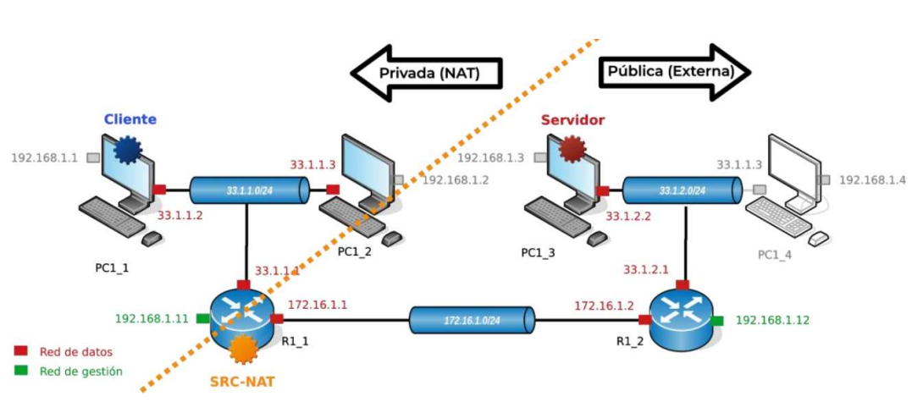
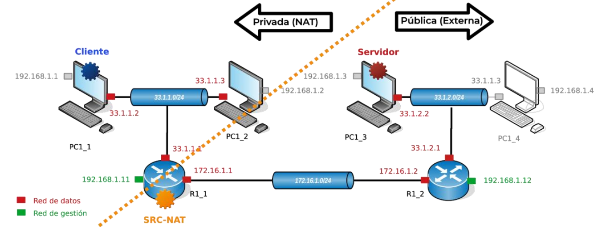

 

# Fundamentos de Redes. Práctica II (Sesiones 1 y 2)

**Autor:** Arturo Olivares Martos
***

- **Asignatura:** Fundamentos de Redes
- **Curso Académico:** Actualizado al curso 2024-25
- **Grado:** Preguntas comunes para el Grado en Ingeniería Informática y los Dobles Grados
<!--- **Grupo:** A.-->
<!--- **Profesor:** Ignacio Rojas Ruiz.-->
<!--- **Fecha:** 19-10-2023.-->
- **Descripción:** Examen de la Práctica 2 (sesiones 1 y 2).

El examen de la Práctica 2 (sesiones 1 y 2) consiste en un cuestionario de 10 preguntas tipo test, donde cada error resta 1/3 puntos.
La preguntas se sacaron de un banco de preguntas y salían aleatorias, por lo que los exámenes no coincidieron. En este documento hemos buscado juntar todos los exámenes en un mismo fichero.
______

1. Se quieren asignar direcciones IP de forma dinámica a equipos que pertenecen a la subred `10.10.0.0/24` ¿cómo lo haría?
    - ( ) Habilitando un servidor BOOTP y configurando el siguiente pool de direcciones IP: `10.10.2.1-10.10.2.254`.
    - (x) Habilitando un servidor DHCP y configurando el siguiente pool de direcciones IP: `10.10.0.1-10.10.0.254`.
    - ( ) Habilitando un servidor RIP y configurando el siguiente pool de direcciones IP: `10.10.0.1-10.10.0.254`.
    - ( ) Habilitando un servidor DHCP y configurando el siguiente pool de direcciones IP: `10.10.1.1-10.10.1.254`.

2. Suponga que tenemos configurado correctamente destination NAT en `R1_6` para gestionar remotamente `PC1_1` desde otras islas usando `SSH` (puerto 22). ¿Qué comando usaría para conectarse desde otras islas a `PC1_1` a través de la red de datos?
    - (x) `ssh operador@220.10.10.1`.
    - ( ) `ssh operador@192.168.1.1`.
    - ( ) `ssh operador@33.1.1.2`.
    - ( ) `ssh operador@172.17.1.4` o `ssh operador@172.17.1.5` dependiendo de la configuración de la tabla de rutas en `R1_6`.

3. ¿Cuál es el menú que debemos elegir en un router Mikrotik usando Winbox para configurar NAT?
    - ( ) NAT->Setup.
    - (x) IP->Firewall->NAT.
    - ( ) IP->Setup->NAT.
    - ( ) IP->NAT.

4. Dada la topología de la red de datos del laboratorio y la siguiente configuración para `DST-NAT` en `RX_3`, ¿cuál de las siguientes afirmaciones es correcta? <table border="1"><thead><tr><th>**Parameter**</th><th>**Value**</th></tr></thead><tbody><tr><td>*chain*</td><td>dstnat</td></tr><tr><td>*Dst-address*</td><td>`172.16.X.3`</td></tr><tr><td>*Action*</td><td>dst-nat</td></tr><tr><td>*To-address*</td><td>`33.X.3.3`</td></tr><tr><td>*Protocol*</td><td>tcp</td></tr><tr><td>*Dst-port*</td><td>`80` (HTTP)</td></tr><tr><td>*To-port*</td><td>`8080`</td></tr></tbody></table>
    - ( ) Se asume que el puerto TCP de escucha del servidor HTTP en `PCX_6` es el `8080`.
    - ( ) Los mensajes originados por `PCX_1` y destinados a `PCX_6` tendrán como dirección IP destino la `172.16.X.3` y como puerto TCP destino el `80` en la subred `172.16.X.0/24`.
    - ( ) Los mensajes originados por `PCX_1` y destinados a `PCX_6` tendrán como dirección IP destino la `33.X.3.3` y como puerto TCP destino el `8080` en la subred `33.X.3.0/24`.
    - (x) Todas las afirmaciones son correctas.

5. Considerando la topología de la red de datos del laboratorio, imagine que se quiere configurar `RX_4` como servidor DHCP para asignar direcciones IP a los equipos `PCX_3` y `PCX_4`, ¿qué subred(es) debemos añadir obligatoriamente a la lista de redes DHCP en `RX_4`?
    - ( ) `192.168.0.0/16`.	
    - (x) `33.X.2.0/24`.
    - ( ) `172.16.X.0/24`.
    - ( ) `33.X.2.0/24` y `172.16.X.0/24`.

6. Considerando la topología de la red de datos del laboratorio y la configuración recogida en la siguiente tabla, ¿cuál de las siguientes afirmaciones es correcta? <table border="1"><thead><tr><th>**Parameter**</th><th>**Value**</th></tr></thead><tbody><tr><td colspan="2"><strong>*DHCP Server Configuration*</strong></td></tr><tr><td>*Address-Pool*</td><td>`33.X.3.10 – 33.X.3.100`</td></tr><tr><td>*Relay*</td><td>`33.X.3.1`</td></tr><tr><td>*Lease-time*</td><td>0d01:00:00</td></tr><tr><td>*Interface*</td><td>Ether1</td></tr><tr><td colspan="2"><strong>*DHCP Relay Configuration*</strong></td></tr><tr><td>*Interface*</td><td>Ether1</td></tr><tr><td>*DHCP-Server*</td><td>`172.16.X.5`</td></tr><tr><td>*Local-Address*</td><td>`33.X.3.1`</td></tr></table>
    - ( ) Si `PCX_5` tiene configurado el uso de DHCP para su interfaz "datos", podrá usar la IP asignada por el servidor por un tiempo de 1 hora.
    - ( ) El servidor DHCP podrá asignar hasta 91 direcciones IP de forma simultánea.
    - (x) Todas las respuestas son correctas.
    - ( ) El router `RX_3` actúa como proxy DHCP entre `PCX_5` y `RX_5`.

7. Para asignar direcciones IP dinámicas con DHCP:
    - (x) Las otras respuestas son falsas.
    - ( ) Los clientes deben tener una conexión directa (sin intermediarios) con el servidor.
    - ( ) El servidor tiene que tener habilitado el puerto 76.
    - ( ) Los clientes tienen que tener el mismo prefijo de red que el servidor.

8. ¿Cómo interpretaría la siguiente regla NAT añadida al firewall de un equipo Mikrotik? `chain=dstnat action=dst-nat to-addresses=33.1.2.2 protocol=tcp dst-port=80` 
    - ( ) Toda petición SSH desde la red externa (pública) que llegue al router se redirige a la IP `172.16.1.2` de la red interna (privada).
    - ( ) Toda petición desde la red externa (pública) que llegue al router se redirige a la IP `33.1.2.2` de la red interna (privada).
    - ( ) Toda petición SSH desde la red interna (pública) que llegue al router se redirige a la IP `33.1.2.2` de la red externa (privada).
    - (x) Toda petición HTTP desde la red externa (pública) que llegue al router se redirige a la IP `33.1.2.2` de la red interna (privada).

9. Considerando la siguiente traza capturada con Wireshark, ¿cuál de las siguientes afirmaciones es correcta?  
    - ( ) El servidor DHCP ofrece la dirección `192.168.0.1` a un cliente DHCP.
    - ( ) El servidor DHCP genera un mensaje broadcast `DHCP Discover` destinado a todas las interfaces de la red para determinar cuáles necesitan asignación de IP.
    - (x) El protocolo encapsulador de DHCP es UDP y se usan los puertos `67` y `68` para el servidor y el cliente, respectivamente.
    - ( ) El cliente DHCP solicita la dirección `192.168.0.1` al servidor DHCP.

10. ¿Cuál sería el comando para que un cliente solicite una IP al servidor DHCP para su interfaz de Datos?
    - ( ) `sudo dhcp new ip datos`.
    - ( ) `sudo client dhcp new datos`.
    - ( ) `sudo dhcpclient new datos`.
    - (x) `sudo dhclient -v datos`.

11. Considerando la siguiente traza capturada con Wireshark, ¿cuál de las siguientes afirmaciones es correcta?  
    - ( ) Todas las respuestas son correctas.
    - ( ) DHCP genera un mensaje DHCP ACK comunicando que está conforme con la dirección IP que le ha ofrecido el servidor DHCP.
    - (x) El servidor DHCP tiene la dirección `192.168.0.1`.
    - ( ) El servidor DHCP está asignando direcciones en la subred `192.168.1.0/24`.

12. En un esquema de asignación de direcciones IP dinámicas con DHCP ¿qué papel juega el *tiempo de lease*?
    - ( ) El *tiempo de lease* es el tiempo que transcurre desde que se envía un `DCHPREQUEST` hasta que se recibe un `DHCPACK`.
    - (x) El *tiempo de lease* determina la duración de préstamo de una determinada dirección IP.
    - ( ) Es el tiempo que tarda un relay en reenviar los mensajes al servidor DHCP.
    - ( ) El *tiempo de lease* determina el proceso de arranque de la interfaz de red en modo DHCP.

13. ¿Cuál de las siguientes configuraciones aplicaría a `R1_6` si queremos que todos los equipos de la isla 1 puedan originar peticiones al resto de islas a través de la red de datos, pero no queremos que los equipos de otras islas puedan inferir el direccionamiento interno usado en la isla 1?
    - ( ) Destination NAT con la acción `dst-nat` en la interfaz `ether2` (cuya dirección IP es la `220.10.10.1`).
    - ( ) Una regla de firewall para la cadena `FORWARD` con la acción `DROP` para descartar el tráfico destinado a cualquier IP de la red de datos de la isla 1.
    - ( ) Ninguna de las configuraciones propuestas es válida.
    - (x) Source NAT con la acción `masquerade` en la interfaz `ether2` (cuya dirección IP es la `220.10.10.1`).

14. En un esquema de traducciones `SRC-NAT` ...
    - ( ) Se mantiene una tabla NAT en donde se establecen entradas que relacionan IP destino privada e IP destino pública, esta última normalmente la del router de acceso.
    - (x) Se mantiene una tabla NAT en donde se establecen entradas que relacionan IP origen privada e IP origen pública, esta última normalmente la del router de acceso.
    - ( ) Se mantiene una tabla NAT en donde se establecen entradas que relacionan IP destino privada e IP origen pública.
    - ( ) Todas las afirmaciones son correctas.

15. Para que a un PC de la subred `33.1.2.0/24` se le pueda asignar una dirección IP de forma dinámica, ¿qué pasos se han de seguir?
    - ( ) Ninguna de las afirmaciones es correcta.
    - ( ) Asignarle a la interfaz de datos una IP dentro del conjunto de direcciones `192.168.0.0/16` y configurar adecuadamente el servidor DHCP disponible en la misma subred de datos.
    - ( ) Configurar la interfaz de red de gestión en modo DHCP así como el servidor DHCP disponible en la misma subred de datos.
    - (x) Configurar la interfaz de red de datos en modo DHCP así como el servidor DHCP disponible en la misma subred de datos.

16. ¿Cómo interpretaría la siguiente regla NAT añadida al firewall de un dispositivo Mikrotik? `chain=src-nat action=masquerade out-interface=ether1`
    - ( ) A todo paquete que entre por la interfaz `ether1` se le cambia su IP destino por la que tiene asignada dicha interfaz.
    - (x) A todo paquete que salga por la interfaz `ether1` se le cambia su IP origen por la que tiene asignada dicha interfaz.
    - ( ) A todo paquete que entre por la interfaz `ether1` se le cambia su IP origen por la que tiene asignada dicha interfaz.
    - ( ) A todo paquete que salga por la interfaz `ether1` se le cambia su IP destino por la que tiene asignada dicha interfaz.

17. ¿Cómo saben tanto cliente y servidor, en un esquema de asignación dinámica de IP, que una dirección IP se puede seguir utilizando por el dispositivo al que se le asignó?
    - (x) Mediante el envío y recepción de mensajes `DHCPREQUEST` y `DCHPACK` periódicos entre cliente y servidor.
    - ( ) Mediante el envío y recepción de mensajes `DHCPREQUEST` y `DCHPACK` a toda la red.
    - ( ) Mediante el envío de mensajes `DHCPDISCOVER` a toda la red.
    - ( ) Ninguna de las afirmaciones es correcta.

18. Para permitir que usuarios externos a una empresa puedan acceder a servicios internos localizados en su red privada o corporativa, ¿qué tipo de traducción de direcciones utilizaría?
    - ( ) BOOTP y HTTPS.
    - ( ) SRC-NAT.
    - (x) DST-NAT.
    - ( ) RIP.

19. Si mi red fuese muy dinámica, es decir, con dispositivos añadiéndose y dejando mi red muy asiduamente, ¿qué *tiempo de lease* escogería?
    - ( ) Corto, para mantener direcciones IP el máximo tiempo posible.
    - ( ) Largo, para mantener direcciones IP el máximo tiempo posible.
    - (x) Corto, para liberar rápidamente direcciones IP que no se están utilizando.
    - ( ) Dividiría el tiempo que tarda en responder el servidor ante un `DHCPDISCOVER` y lo dividiría entre el número de dispositivos de mi red siendo este mi *tiempo de lease*.

20. ¿Qué fichero hay que configurar en los equipos del aula para usar el servicio DCHP?
    - ( ) El fichero `interfaces`, que está en `/network`.
    - (x) El fichero `01-network-manager-all.yaml`, que está en `/etc/netplan`.
    - ( ) El fichero `netplan`, que está en `/etc`.
    - ( ) El fichero `dchp-client`, que está en `/users`.

21. En la configuración de un servidor DHCP, el tiempo de asignación de IP (*lease time*) de las direcciones IP...
    - (x) ... puede ser distinto para cada red que se sirva.
    - ( ) ... no es configurable.
    - ( ) ... es igual para todas las redes que se sirvan.
    - ( ) ... es distinto para cada una de las IPs del *adress pool*.

22. Considerando la topología de la red de datos del laboratorio y la configuración recogida en la siguiente tabla, ¿cuál de las siguientes afirmaciones es correcta? <table border="1"><thead><tr><th>**Parameter**</th><th>**Value**</th></tr></thead><tbody><tr><td colspan="2"><strong>*DHCP Server Configuration*</strong></td></tr><tr><td>*Address-Pool*</td><td>`33.X.1.10 – 33.X.1.20`</td></tr><tr><td>*Relay*</td><td>`33.X.1.1`</td></tr><tr><td>*Lease-time*</td><td>0d01:00:00</td></tr><tr><td>*Interface*</td><td>Ether1</td></tr><tr><td colspan="2"><strong>*DHCP Relay Configuration*</strong></td></tr><tr><td>*Interface*</td><td>Ether1</td></tr><tr><td>*DHCP-Server*</td><td>`172.17.X.6`</td></tr><tr><td>*Local-Address*</td><td>`33.X.1.1`</td></tr></table>
    - ( ) El servidor DHCP podrá asignar hasta 11 direcciones IP de forma simultánea.
    - ( ) El router `RX_1` actúa como proxy de los mensajes DHCP entre `PCX_1` y `RX_6`.
    - (x) Todas las respuestas son correctas.
    - ( ) Se podrán asignar a `PCX_2` la dirección `33.X.1.3` de forma estática configurando el fichero `/etc/netplan/01-network-manager-all.yaml`.

23. Supongamos que queremos configurar en `RX_2` el acceso a un servidor HTTP ejecutándose en `PCX_3` y escuchando en el puerto TCP 8080. Se asume que los equipos externos a la subred `33.X.2.0/24` no conocen el direccionamiento IP interno de dicha subred y las peticiones dirigidas al servidor HTTP tendrán originalmente como puerto TCP origen el 80. ¿Cómo configuraría la entrada NAT correspondiente en `RX_2`? <table border="1"><thead><tr><th>**Parameter**</th><th>**Value**</th></tr></thead><tbody><tr><td>*Chain*</td><td>`A`</td></tr><tr><td>*Dst-adress*</td><td>`B`</td></tr><tr><td>*Action*</td><td>`C`</td></tr><tr><td>*To-adress*</td><td>`D`</td><tr><td>*Protocol*</td><td>tcp</td></tr><tr><td>*Dst-port*</td><td>`E`</td></tr><tr><td>*To-port*</td><td>`F`</td></tr></table>
    - (x) `A=dstnat`, `B=172.16.X.2`, `C=dst-nat`, `D=33.X.2.2`, `E=80`, `F=8080`.
    - ( ) `A=srcnat`, `B=172.16.X.2`, `C=masquerade`, `D=33.X.2.2`, `E=80`, `F=8080`.
    - ( ) `A=dstnat`, `B=172.16.X.2`, `C=dst-nat`, `D=33.X.2.2`, `E=8080`, `F=80`.
    - ( ) `A=srcnat`, `B=172.16.X.2`, `C=masquerade`, `D=33.X.2.2`, `E=8080`, `F=80`.

24. Considerando el siguiente escenario donde se ha configurado correctamente `SRC-NAT`, ¿cuál de las siguientes afirmaciones es correcta? 
    - ( ) Los mensajes originados por `PC1_1` y destinados a `PC1_3` tendrán como dirección IP origen la `172.16.1.1` y como IP destino `33.1.2.2` en la subred `33.1.2.0./24`.
    - ( ) `PC1_1` recibirá los mensajes de respuesta de `PC1_3` aunque `R1_2` no tenga una entrada para alcanzar la subred `33.1.1.0/24` en su tabla de rutas.
    - (x) Todas las respuestas son correctas.
    - ( ) Los mensajes originados por `PC1_1` y destinados a `PC1_3` tendrán como dirección IP origen la `33.1.1.2` y dirección IP destino la `33.1.2.2` en la subred `33.1.1.0/24`.

25. En la configuración de los DHCP server en un router MikroTik del laboratorio,
    - (x) El DNS server puede ser cualquiera.
    - ( ) El DNS server debe ser la IP de PC de la isla.
    - ( ) El DNS servder debe ser la IP de gestión del router.
    - ( ) El DNS server debe ser la IP de de datos del router.

26. Considerando el siguiente escenario donde se ha configurado correctamente `SRC-NAT`, ¿cuál de las siguientes afirmaciones es correcta? 
    - ( ) Todas las respuestas son correctas.
    - (x) Los mensajes originados por `PC1_1` y destinados a `PC1_3` tendrán como dirección IP origen la `172.16.1.1` y como IP destino `33.1.2.2` en la subred `172.16.1.0/24`.
    - ( ) `PC1_3` recibirá los mensajes de respuesta de `PC1_1` enviados a través de la red de datos, aunque `R1_1` no tenga una entrada para alcanzar la subred `33.1.2.0/24` en su tabla de rutas.
    - ( ) Los mensajes originados por `PC1_1` y destinados a `PC1_3` tendrán como dirección IP origen la `172.16.1.1` y dirección IP destino la `33.1.2.2` en la subred `33.1.1.0/24`.

27. ¿Cuál es el menú que debemos elegir en un router Mikrotik usando Winbox para configurar el Servidor de DHCP?
    - ( ) DHCP->Server.
    - ( ) DHCP->Setup.
    - ( ) IP->DHCP Relay.
    - (x) IP->DHCP Server.

28. ¿Cuál de estas afirmaciones es cierta?
    - (x) En la práctica 2, los clientes DHCP serán los equipos del aula.
    - ( ) Todas las respuestas son ciertas.
    - ( ) En la práctica 2, los servidores DHCP Relay serán los routers `RX_4` y `RX_5`.
    - ( ) En la práctica 2, los servidores DHCP serán los routers `RX_6`.

29. ¿Cuál de estas afirmaciones es cierta?
    - ( ) En Destination NAT se configurará la acción `drop-nat`.
    - ( ) En Destination NAT se configurará la acción `src-nat`.
    - ( ) En Destination NAT se configurará la acción `accept`.
    - (x) En Destination NAT se configurará la acción `dst-nat`.

30. ¿Cómo interpretaría la siguiente regla NAT añadida al firewall de un dispositivo Mikrotik? `chain=dstnat action=dst-nat to-addresses=33.1.2.2 protocol=tcp dst-port=22` 
    - (x) Toda petición SSH desde la red externa (pública) que llegue al router se redirige a la IP `33.1.2.2` de la red interna (privada).
    - ( ) Toda petición SSH desde la red interna (pública) que llegue al router se redirige a la IP `33.1.2.2` de la red externa (privada).
    - ( ) Toda petición desde la red externa (pública) que llegue al router se redirige a la IP `33.1.2.2` de la red interna (privada).
    - ( ) Toda petición HTTP desde la red externa (pública) que llegue al router se redirige a la IP `172.16.1.2` de la red interna (privada).