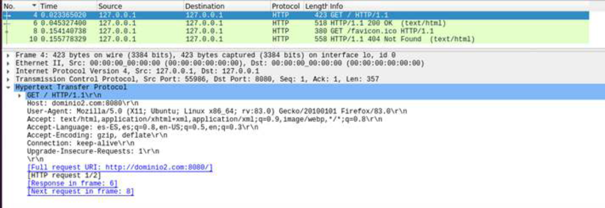
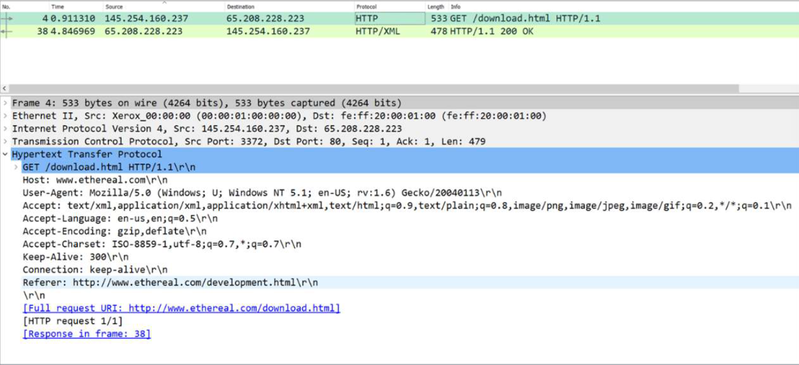
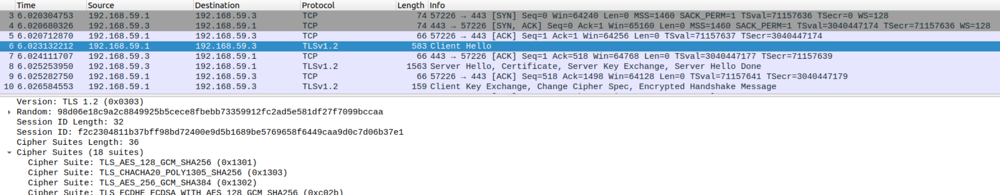
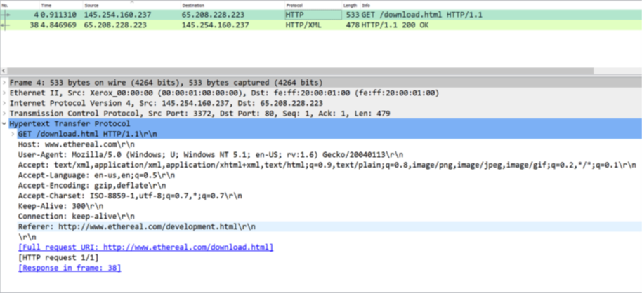
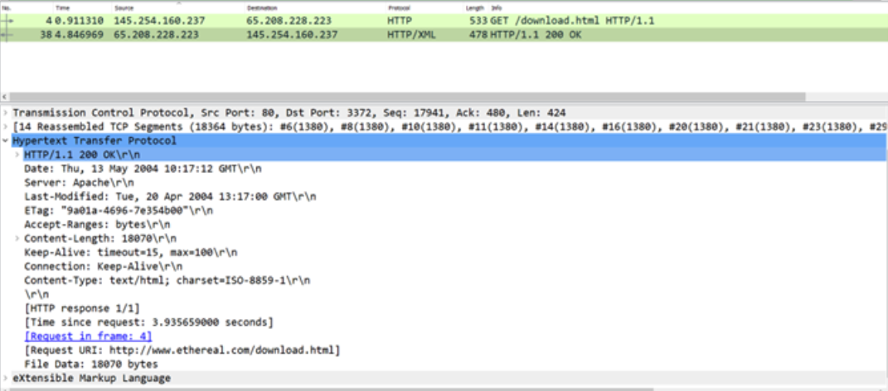
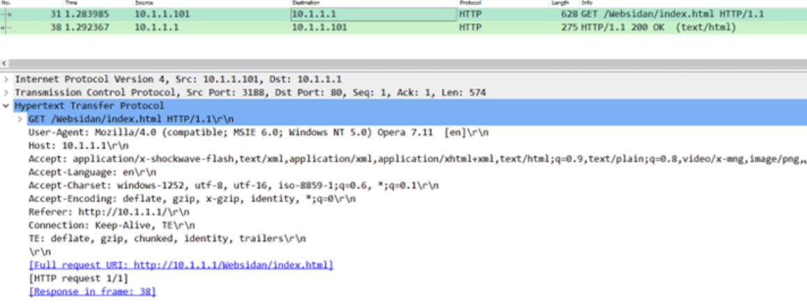

 

# Fundamentos de Redes. Práctica III

**Autor:** Arturo Olivares Martos
***

- **Asignatura:** Fundamentos de Redes
- **Curso Académico:** Actualizado al curso 2024-25
- **Grado:** Preguntas comunes para el Grado en Ingeniería Informática y los Dobles Grados
<!--- **Grupo:** A.-->
<!--- **Profesor:** Ignacio Rojas Ruiz.-->
<!--- **Fecha:** 19-10-2023.-->
- **Descripción:** Examen de la Práctica 3.

El examen de la Práctica 3 consiste en un cuestionario de 10 preguntas tipo test, donde cada error resta 1/3 puntos.
La preguntas se sacaron de un banco de preguntas y salían aleatorias, por lo que los exámenes no coincidieron. En este documento hemos buscado juntar todos los exámenes en un mismo fichero.
______

1. ¿Cómo es capaz el servidor HTTP Apache2 de discernir si una petición se dirige a un determinado sitio (virtual host) u otro, previamente configurados y con nombre de dominio diferentes?
    - ( ) A través de la cabecera HTTP *Accept* en la petición que hace el cliente HTTP.
    - ( ) A través de la cabecera HTTP *Connection* en la petición que hace el cliente HTTP.
    - (x) A través de la cabecera HTTP *Host* en la petición que hace el cliente HTTP.
    - ( ) A través de la cabecera HTTP *Host* en la respuesta desde el servidor HTTP.

2. ¿Cuál es la carpeta en la que se almacenan los hosts virtuales de un sitio web gestionado mediante Apache2?
    - ( ) `/apache2/etc/sites-enabled`
    - ( ) `/user/apache2/sites-enabled`
    - (x) `/etc/apache2/sites-enabled`
    - ( ) `/etc/www/sites-enabled`

3. Considerando la siguiente traza, ¿cuál de las siguientes afirmaciones referentes al archivo de configuración, localizado en el directorio `/etc/apache2/sites-available/`, del correspondiente virtual host es correcta?  
    - (x) `<Virtual *:8080>` y `</VirtualHost>` encerrarán el grupo de directivas que se aplicarán al correspondiente virtual host.
    - ( ) `<Virtual *:80>` y `</VirtualHost>` encerrarán el grupo de directivas que se aplicarán al correspondiente virtual host.
    - ( ) Debe contener una directiva `ServerName` o `ServerAlias` con argumento `www.dominio2.com`.
    - ( ) Debe contener una directiva `ServerName` o `ServerAlias` con argumento `http://dominio2.com:8080`.

4. Se ha implementado el acceso autorizado de un sitio web en Apache2 usando una metodología de autenticación básica con el siguiente fichero `.htaccess`, ¿qué comando usaría para crear el correspondiente fichero de contraseñas? <code>AuthType Basic AuthName "Directorio con control de acceso" AuthUserFile "/usr/local/apache/passwords" Require user mew</code> 
    - ( ) `sudo htuser -c /usr/local/apache/passwords mew`
    - (x) `sudo htpasswd -c /usr/local/apache/passwords mew`
    - ( ) `sudo htpasswd -c /usr/local/passwords.pd mew`
    - ( ) `sudo htuser -c /usr/local/passwords.pd mew`

5. Suponga que queremos crear la clave privada y el certificado electrónico autofirmado de un sitio web en el directorio `/home/administrador/Descargas` utilizando openssl. El certificado debe tener una validez de 30 días y la clave privada debe tener una longitud de 1024 bits. ¿Qué comando usaría?
    - (x) `sudo openssl req -x509 -nodes -days 30 -newkey rsa:1024 -keyout /home/administrador/Descargas/clave.key -out /home/administrador/Descargas/certificado.crt`
    - ( ) `sudo openssl req -x509 -nodes -days 30 -newkey rsa:1024 -out /home/administrador/Descargas/apache-selfsigned.key -key /home/administrador/Descargas/apache-selfsigned.crt`
    - ( ) `sudo openssl req -x509 -nodes -days 30 rsa:1024 -out /home/administrador/Descargas/clave.key -keyout /home/administrador/Descargas/certificado.crt`
    - ( ) `sudo openssl req -x509 -days 30 -newkey rsa:1024 -keyout /home/administrador/Descargas/apache-selfsigned.key -out /home/administrador/Descargas/apache-selfsigned.crt`

6. ¿Cuál de los siguientes comandos usaría para crear un enlace simbólico del archivo de configuración `fr.com.conf` en el directorio `/etc/apache2/sites-enabled/`?
    - ( ) `sudo a2enmod fr.com`
    - ( ) `sudo a2dissite fr.com`
    - ( ) `sudo a2dismod fr.com`
    - (x) `ln -s /etc/apache2/sites-available/fr.com.conf /etc/apache2/sites-enabled/fr.com.conf`

7. Considerando la siguiente traza capturada con Wireshark, ¿cuál de las siguientes afirmaciones es correcta?  
    - (x) El navegador puede aceptar contenido comprimido Gzip.
    - ( ) Se está usando un servidor web NGINX.
    - ( ) Se está usando el protocolo HTTP/2.
    - ( ) El dominio del sitio web accedido por el cliente es `/download.html`.

8. Dada la siguiente captura de tráfico, ¿qué puede decir de ella?  
    - ( ) No se pueden dar muchos detalles con solo la información aportada.
    - ( ) Se trata de una interacción HTTPS entre cliente y servidor y ya se ha establecido el canal seguro de comunicaciones con TLSv1.2.
    - ( ) Se trata de una interacción HTTP entre cliente y servidor.
    - (x) Se trata de una interacción HTTPS entre cliente y servidor. Ambos están en la fase *handshake* en dónde establecerán un canal seguro de comunicaciones con `TLSv1.2`.

9. Si quisiéramos restringir el acceso a una carpeta llamada `zonaprivada` dentro de un dominio llamado `nuevodominio` gestionado por Apache2, ¿qué deberíamos hacer de entre estas opciones?
    - (x) Ubicar un fichero `.htaccess` en la carpeta `/var/www/nuevodominio/zonaprivada`
    - ( ) Ubicar un fichero `.private` en la carpeta `/etc/apache2/nuevodominio/zonaprivada`
    - ( ) Ubicar un fichero `.private` en la carpeta `/var/www/nuevodominio/zonaprivada`
    - ( ) Ubicar un fichero `.htaccess` en la carpeta `/etc/apache2/nuevodominio/zonaprivada`

10. Suponga que se usa la utilidad `openssl` como sigue para generar el certificado electrónico de un sitio web, ¿cuál de las siguientes afirmaciones referentes al archivo de configuración, localizado en el directorio `/etc/apache2/sites-available/`, del correspondiente virtual host es correcta? <code>sudo openssl req -x509 -nodes -days 365 -newkey rsa:2048 -keyout /usr/fr.key -out /usr/fr.crt</code>
    - ( ) Debe contener una directiva `SSLCertificateKeyFile` con argumento `/usr/fr.key`
    - ( ) Debe contener una directiva `SSLEngine` con argumento `on`.
    - (x) Todas las afirmaciones son correctas.
    - ( ) Debe contener una directiva `SSLCertificateFile` con argumento `/usr/fr.crt`

11. Dada la siguiente directiva de un servidor Apache ubicada en su fichero de configuración `apache.conf`, <code><Directory /var/www/> Options Indexes FollowSymLinks AllowOverride None Require all granted </Directory></code> ¿cómo la modificaría para permitir interpretar ficheros de autorización `.htaccess` únicamente en el directorio `/var/www/ejemplo/`?
    - ( ) `AllowOverride All`
    - ( ) `AllowOverride All` y `Directory /var/www/misitio/`
    - (x) `AllowOverride All` y `Directory /var/www/ejemplo/`
    - ( ) `Directory /var/www/ejemplo/`

12. Un servidor HTTP Apache2 tiene configurado el siguiente sitio (virtual host) tal que, <code><VirtualHost *:80> ServerName ejemplo.com ServerAlias www.ejemplo.com ServerAdmin webmaster@ejemplo.com DocumentRoot /var/www/ejemplo.com/ <Directory /var/www/ejemplo.com/> Options -Indexes +FollowSymLinks AllowOverride All </Directory> ErrorLog ${APACHE_LOG_DIR}/ejemplo.com-error.log CustomLog ${APACHE_LOG_DIR}/ejemplo.com-access.log combined </VirtualHost></code> ¿Qué cabecera HTTP tendría que enviar el cliente al servidor y con qué valor para que ser pueda servir la página de inicio del sitio?
    - (x) `Host: ejemplo.com`
    - ( ) `Host: midominio1.com`
    - ( ) `Accept: www.ejemplo.com`
    - ( ) `Server: ejemplo.com`

13. Un servidor Apache2 escucha peticiones HTTP en la IP `192.168.1.5` perteneciente a la red de gestión del laboratorio 3.7 y tiene alojado y configurado el sitio web `www.ejemplo.com` ¿es necesaria una configuración adicional para servir la página web por defecto de dicho sitio web? Si es así, ¿qué es lo que hay que configurar?
    - ( ) Sí, hay que introdudir la siguiente línea en el fichero `/etc/hosts` del cliente: `33.1.1.3 www.ejemplo.com`
    - (x) Sí, hay que introdudir la siguiente línea en el fichero `/etc/hosts` del cliente: `192.168.1.5 www.ejemplo.com`
    - ( ) No hay que añadir configuración alguna.
    - ( ) Sí, hay que introdudir la siguiente línea en el fichero `/etc/hosts` del servidor: `192.168.1.5 www.ejemplo.com`

14. ¿Cómo se autentica el servidor HTTPS ante el cliente para formar un canal seguro de comunicaciones?
    - (x) Mediante su certificado digital.
    - ( ) No es necesario que el servidor de autentique ante el cliente.
    - ( ) Mediante su usuario y contraseña.
    - ( ) Mediante el certificado digital del cliente.

15. Suponga que se usa la utilidad `openssl` como sigue para generar el certificado electrónico de un sitio web, ¿cuál de las siguientes afirmaciones referentes al archivo de configuración, localizado en el directorio `/etc/apache2/sites-available/`, del correspondiente virtual host es correcta? <code>sudo openssl req -x509 -nodes -days 365 -newkey rsa:2048 -keyout /usr/fr.key -out /usr/fr.crt</code>
    - ( ) Debe contener una directiva `SSLCertificateKeyFile` con argumento `/usr/fr.crt`
    - ( ) Debe contener una directiva `SSLCertificate` con argumento `/usr/fr.crt`
    - ( ) Debe contener una directiva `SSLCertificateFile` con argumento `/usr/fr.key`
    - (x) Debe contener una directiva `SSLCertificateKeyFile` con argumento `/usr/fr.key`

16. Considerando la siguiente traza capturada con Wireshark, ¿cuál de las siguientes afirmaciones es correcta?  
    - (x) El recurso `http://www.ethereal.com/download.html` tiene un tamaño de 18070 bytes y es servido por un servidor HTTP Apache escuchando en el puerto 80.
    - ( ) El recurso `http://www.ethereal.com/download.html` tiene un tamaño de 18070 bytes y es servido por un cliente Mozilla-Firefox.
    - ( ) El recurso `https://www.ethereal.com/download.html` tiene un tamaño de 18070 bytes y es servido por un servidor HTTPS Apache escuchando en el puerto 443.
    - ( ) El recurso `http://www.ethereal.com/download.html` no ha podido ser servido por el servidor Apache.

17. Un sitio web alojado en un servidor HTTP tiene configurada una zona restringida. Para que se pueda acceder a la zona restringida, es necesario introducir las credenciales del usuario en concreto, previamente configurado. Si un atacante pudiera interceptar las comunicaciones entre el cliente y el servidor, ¿podría ser capaz de obtener dichas credenciales y utilizarlas para suplantar la identidad de dicho usuario?
    - ( ) Sí, porque están cifradas.
    - ( ) No
    - (x) Sí
    - ( ) No, porque están cifradas

18. ¿Qué comando usaría para habilitar el módulo `mod_ssl` de Apache2?
    - ( ) `sudo a2ensite ssl`
    - ( ) `sudo a2enmod mod_ssl`
    - ( ) `sudo a2ensite mod_ssl`
    - (x) `sudo a2enmod ssl`

19. ¿Qué protocolo se utiliza para resolver un nombre de dominio en concreto?
    - ( ) HTTP (Hyper Text Transfer Protocol)
    - ( ) SSH (Secure SHell)
    - (x) DNS (Domain Name System)
    - ( ) TLS (Transport Layer Security)

20. ¿Qué servicios de seguridad garantiza el protocolo TLS?
    - ( ) TLS no garantiza ningún servicio de seguridad a diferencia de HTTP que sí lo hace.
    - ( ) Confidencialidad, integridad y disponibilidad.
    - ( ) Confidencialidad e integridad, pero no es capaz de autenticar a las partes implicadas en la comunicación.
    - (x) Confidencialidad, integridad y autenticación.

21. Considerando la siguiente traza capturada con Wireshark, ¿cuál de las siguientes afirmaciones es correcta?  
    - ( ) El navegador puede aceptar contenido comprimido Brotli.
    - ( ) El recurso www.ethereal.com tiene un tamaño de 478 bytes.
    - (x) Se está usando el protocolo HTTP/1.1.
    - ( ) El servidor web Apache está escuchando en el puerto 3372.

22. Si quisiéramos configurar un host virtual llamado `nuevodominio.es`, ¿en qué fichero incluiríamos su configuración?
    - ( ) `/var/apache2/sites-enable/nuevodominio.es.conf`
    - ( ) `/etc/apache2/sites-available/virtualhost.conf`
    - ( ) `/etc/apache2/sites-available/nuevodominio.es`
    - (x) `/etc/apache2/sites-available/nuevodominio.es.conf`

23. Considerando la siguiente traza capturada con Wireshark, ¿cuál de las siguientes afirmaciones es correcta?  
    - ( ) Un cliente con IP pública `65.208.228.223` accede mediante el navegador Mozilla Firefox al recurso `www.ethereal.com`.
    - ( ) El dominio del sitio web accedido por el cliente es `www.ethereal.com/download.html`.
    - ( ) Un cliente con IP pública `145.254.160.237` accede al recurso `http://www.ethereal.com/download.html` servido por un servidor HTTP Apache escuchando en el puerto 3372.
    - (x) El recurso `http://www.ethereal.com/download.html` tiene un tamaño de 18070 bytes y es servido por un servidor HTTP Apache escuchando en el puerto 80.

24. ¿Cuál de las siguientes afirmaciones es cierta cuando creamos un certificado con `openssl` para un sitio web servido con Apache2?
    - (x) Todas las afirmaciones son correctas.
    - ( ) El certificado debe ubicarse en el mismo directorio que el indicado en la directiva `SSLCertificateFile` del fichero de configuración del sitio web.
    - ( ) El valor del parámetro `Common Name` debe coincidir con el dominio del host virtual.
    - ( ) A la hora de crear el certificado debemos usar la opción `-nodes` para que Apache2 pueda usarlo autónomamente (sin intervención humana).

25. ¿Cuál es la carpeta en la que se almacena por defecto el contenido de un sitio web gestionado mediante Apache2?
    - ( ) `/etc/www/html`
    - (x) `/var/www/html`
    - ( ) `/apache2/www/html`
    - ( ) `/user/www/html`

26. Considerando la siguiente traza capturada con Wireshark, ¿cuál de las siguientes afirmaciones es correcta?  
    - (x) El navegador web puede manejar conjuntos de caracteres ISO-8859-1 (también conocido como Latin-1).
    - ( ) El servidor puede aceptar contenido comprimido DEFLATE.
    - ( ) Se está usando el protocolo HTTP/2.0.
    - ( ) El dominio del sitio web accedido por el cliente es `/Websidan/index.html`.