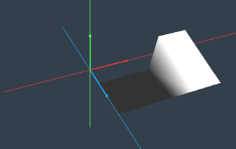
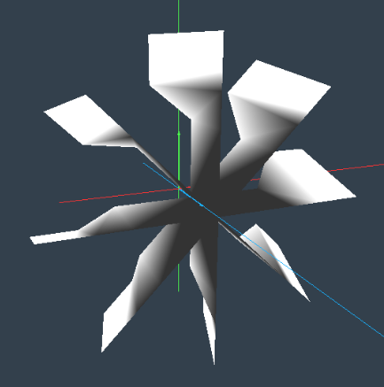
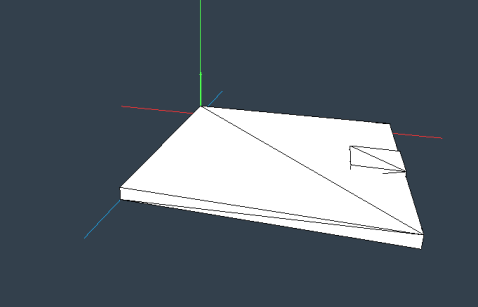
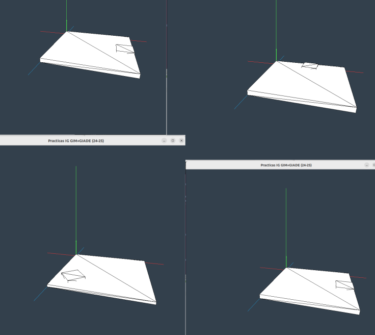

# Informática Gráfica. Examen I de Prácticas

***

- **Asignatura:** Informática Gráfica.
- **Curso Académico:** 2024-25.
- **Grado:** DGIIM + DGIIADE.
- **Grupo:** A1.
- **Profesor:** Carlos Ureña.
- **Descripción:** Parcial I de Prácticas del Grupo A1, Prácticas 1-3.

Para el presente examen, era necesario que el alumno llevase implementadas ya las prácticas 1 a 3 del la asignatura. Hay que tener en cuenta que el examen es de cuando se impartía OpenGL en la asignatura. Podrá encontrar tanto la resolución del examen en OpenGL así como en Godot.
***

1. Defina una clase `Ejercicio1` derivada de MallaInd. Crear las tablas de vértices y triángulos necesarias, además de la de colores de vértice, para obtener:

2. Defina una clase `Ejercicio2` derivada de MallaInd, con constructor `Ejercicio2(unsigned n)`, con $n\geq 1$. Dicho constructor hará uso de $n$ copias del `Ejercicio1()` de forma que obtengamos:

De nuevo, definir las tablas correspondientes (vértices triángulos y colores) para dicha figura.
- Dicho ejercicio se puede realizar realizando $n$ copias de los vértices que definen el "eje central". Si se realizan las copias, se opta como máximo al 80% de la puntuación del ejercicio.
- Si por el contrario, se consigue ahorrarse esos vértices, se opta al 100% de la puntuación.

3. Definir una clase `Ejercicio3` derivada de NodoGrafoEscena, con constructor `Ejercicio3(float w, float h)`, con $w>1$ y $h<0.3$. El constructor de la clase ha de generar un objeto jerárquico compuesto por un cubo que hace de tablero (de lado $w$) y cubo de lado $h$ colocados de la siguiente forma:

Añadir, además una animación de tal forma que el tablero escale periódicamente por una razón positiva no nula (se vaya haciendo más grande, luego más pequeño hasta volver al tamaño inicial, así continuamente) en la dirección del eje y. Por último, el cubo que se posiciona encima del tablero debe hacer un recorrido en forma circular por encima de la superficie del tablero (rotar continuamente de manera circular con respecto un eje paralelo al eje Y y situado en el centro del tablero).

***
La solución al examen puede encontrarla en:
- Solución en [OpenGL](https://github.com/LosDelDGIIM/LosDelDGIIM.github.io/blob/main/subjects/IG/Exámenes/Ex01/solucionOpenGL).
- Solución en [Godot](https://github.com/LosDelDGIIM/LosDelDGIIM.github.io/blob/main/subjects/IG/Exámenes/Ex01/solucionGodot).
