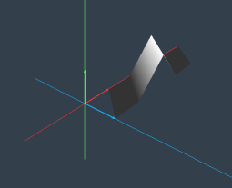
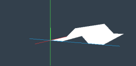
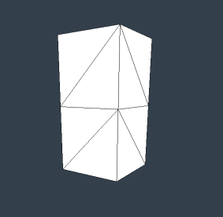
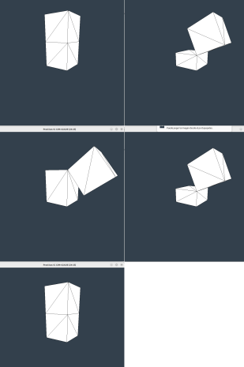

# Informática Gráfica. Examen I de Prácticas

***

- **Asignatura:** Informática Gráfica.
- **Curso Académico:** 2024-25.
- **Grado:** DGIIM + DGIIADE.
- **Grupo:** A2.
- **Profesor:** Carlos Ureña.
- **Descripción:** Parcial I de Prácticas del Grupo A2, Prácticas 1-3.

Para el presente examen, era necesario que el alumno llevase implementadas ya las prácticas 1 a 3 del la asignatura. Hay que tener en cuenta que el examen es de cuando se impartía OpenGL en la asignatura. Podrá encontrar tanto la resolución del examen en OpenGL así como en Godot.
***

1. Defina una clase `Ejercicio1` derivada de MallaInd. Crear las tablas de vértices y triángulos necesarias, además de la de colores de vértice, para obtener:

2. Defina una clase `Ejercicio2` derivada de MallaInd, con constructor `Ejercicio2(unsigned n)`, con $n\geq 1$. Dicho constructor hará uso de $n$ copias del `Ejercicio1()` de forma que obtengamos:

De nuevo, definir las tablas correspondientes (vértices triángulos y colores) para dicha figura.
- Dicho ejercicio se puede realizar duplicando los vértices compartidos entre la copia $i$ y la copia $i+1$. Si se realizan dichas copias, se opta como máximo al 80% de la puntuación del ejercicio.
- Si por el contrario, se consigue ahorrarse esos vértices, se opta al 100% de la puntuación.

3. Definir una clase `Ejercicio3` derivada de NodoGrafoEscena, con constructor `Ejercicio3(float w, float h)`. El constructor de la clase ha de generar un objeto jerárquico compuesto por 2 cubos, uno posicionado encima del otro. Debe verse de la siguiente forma:

Añadir, además una animación de tal forma que el cubo de abajo escale periódicamente por una razón positiva no nula (se vaya haciendo más grande, luego más pequeño hasta volver al tamaño inicial, así continuamente) en la dirección del eje Y. Por último, el cubo que se posiciona encima debe hacer la siguiente rotación con respecto a un eje paralelo al Z y situado en la esquina superior derecha del cubo de abajo.

***
La solución al examen puede encontrarla en:
- Solución en [OpenGL](https://github.com/LosDelDGIIM/LosDelDGIIM.github.io/blob/main/subjects/IG/Exámenes/Ex02/solucionOpenGL).
<!-- - Solución en [Godot](https://github.com/LosDelDGIIM/LosDelDGIIM.github.io/blob/main/subjects/IG/Exámenes/Ex02/solucionGodot). % // TODO: Añadir cuando se haga-->
