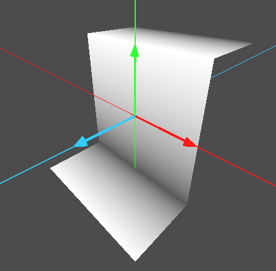
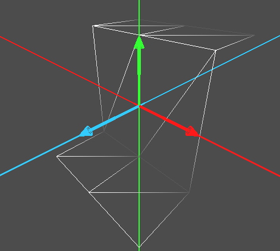
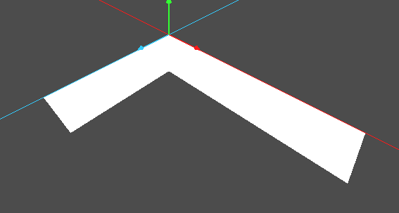
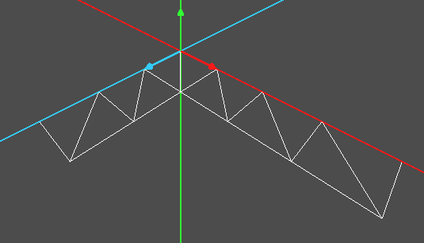
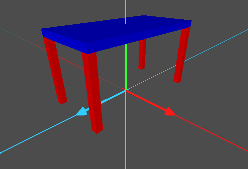

# Informática Gráfica. Examen I de Prácticas

***

- **Asignatura:** Informática Gráfica.
- **Curso Académico:** 2025-26.
- **Grado:** DGIIM + DGIIADE.
- **Grupo:** A3.
- **Profesor:** Carlos Ureña.
- **Descripción:** Parcial I de Prácticas del Grupo A3, Prácticas 1-3.

Para el presente examen, era necesario que el alumno llevase implementadas ya las prácticas 1 a 3 del la asignatura.
***

Copia tu proyecto de la práctica 3 en una nueva carpeta llamada `ex-ord-p123`. Elimina todos los nodos y scripts del proyecto y deja solo la cámara orbital, la fuente de luz, los ejes y el script que hace que al pulsar la `W` se visualice la malla.

1. Añade al árbol de escena un nodo con una instancia de tipo `MeshInstance3D`, renombralo como `EjerP1`. Añádele un script y en la función `_ready()` crea una malla indexada de triángulos con 12 vértices y 12 triángulos como el de la siguiente figura

Asígnale colores a los vértices de forma que aparezca como la figura (cada vértice tiene uno de entre dos colores posibles: o blanco o gris). Deshabilita la iluminación (no es necesario calcular las normales). Ten en cuenta que no debes hacer nada para que se vean las aristas como en la figura (solo es para que te hagas una idea de la forma de la malla), pero si deben verse las aristas pulsando `W`. Deja habilitado el cribado de caras.

2. Añade al árbol de escena del proyecto un nodo con una instancia de tipo `MeshInstance3D` renombralo como `EjerP2`. Añádele un script y en la función `_ready()` crea una malla indexada de triángulos. La malla tiene un par de triángulos formando un cuadrado, en el centro, y luego tiene $2n$ triángulos en una dirección y $2m$ triángulos en la otra dirección perpendicular. Declara dos constantes enteras $n$ y $m$, de forma que los valores se puedan cambiar en la declaración sin cambiar nada más en el código. En total habrá $2 + 2n + 2m$ triángulos y $4 + 2n + 2m$ vértices. En la figura se usa $n=3$ y $m=2$.

Asígnale a toda la malla el color blanco, sin usar una tabla de colores de vértices.

3. Añade al árbol de escena del proyecto un nodo con una instancia de tipo `Node3D`, renómbralo como `EjerP3`. Añade una luz direccional al árbol de escena.

Añádele un script y en la función `_ready()` declara una variable de nombre mcubo y de tipo `ArrayMesh`, que contenga los vértices, triángulos y normales del cubo de 24 vértices. Para ello usa el código que has escrito para la función `ArrayMeshCubo24` en el ejercicio adicional 2 de la práctica 3.

Añade al nodo los hijos necesarios para un árbol de escena como el de la figura.

Usa 5 instancias de la clase `MeshInstance3D` de godot, 4 para las patas y la otra para el tablero superior. Todas ellas comparten el objeto mcubo como malla. Las 4 patas tienen un material de color rojo y el tablero de color azul. Declara 4 constantes: ancho y alto de las patas, y ancho y alto del tablero.

