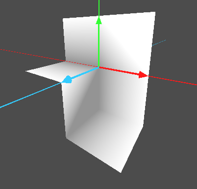
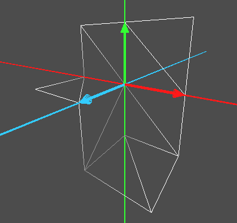
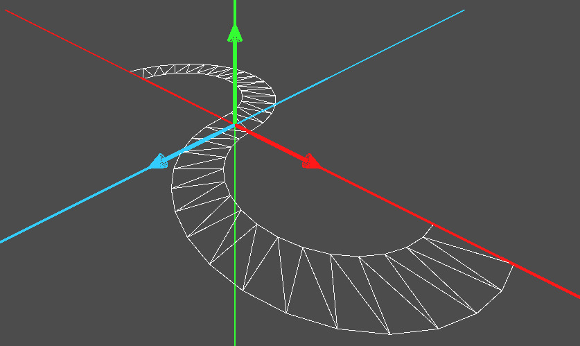
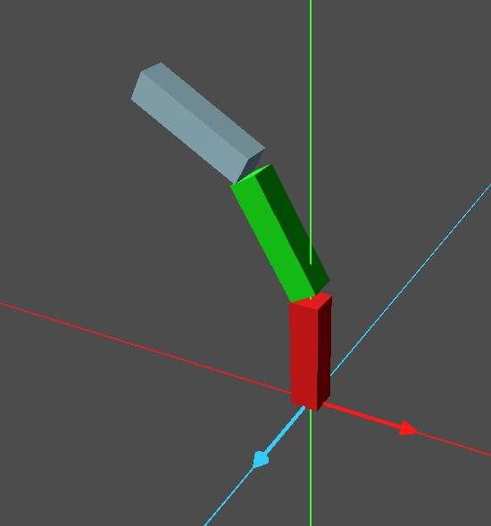

# Informática Gráfica. Examen I de Prácticas

***

- **Asignatura:** Informática Gráfica.
- **Curso Académico:** 2025-26.
- **Grado:** DGIIM + DGIIADE.
- **Grupo:** A2.
- **Profesor:** Carlos Ureña.
- **Descripción:** Parcial I de Prácticas del grupo A2, Prácticas 1-3.

Para el presente examen, era necesario que el alumno llevase implementadas ya las prácticas 1 a 3 del la asignatura.
***

Copia tu proyecto de la práctica 3 en una nueva carpeta llamada `ex-ord-p123`. Elimina todos los nodos y scripts del proyecto y deja solo la cámara orbital, la fuente de luz, los ejes y el script que hace que al pulsar la `W` se visualice la malla.

1. Añade al árbol de escena un nodo con una instancia de tipo `MeshInstance3D`, renombralo como `EjerP1`. Añádele un script y en la función `_ready()` crea una malla indexada de triángulos con 12 vértices y 12 triángulos como el de la siguiente figura

Asígnale colores a los vértices de forma que aparezca como la figura (cada vértice tiene uno de entre dos colores posibles: o blanco o gris). Deshabilita la iluminación (no es necesario calcular las normales). Ten en cuenta que no debes hacer nada para que se vean las aristas como en la figura (solo es para que te hagas una idea de la forma de la malla), pero si deben verse las aristas pulsando `W`. Deja habilitado el cribado de caras.

2. Añade al árbol de escena del proyecto un nodo con una instancia de tipo `MeshInstance3D` renombralo como `EjerP2`. Añádele un script y en la función `_ready()` crea una malla indexada de triángulos para obtener el modelo de la siguiente figura:

Asígnale a toda la malla el color blanco, sin usar una tabla de colores de vértices.

3. Añade al árbol de escena del proyecto un nodo con una instancia de tipo `Node3D`, renómbralo como `EjerP3`. Añade una luz direccional al árbol de escena.

Añádele un script y en la función `_ready()` declara una variable de nombre mcubo y de tipo `ArrayMesh`, que contenga los vértices, triángulos y normales del cubo de 24 vértices. Para ello usa el código que has escrito para la función `ArrayMeshCubo24` en el ejercicio adicional 2 de la práctica 3.

Añade al nodo los hijos necesarios para un árbol de escena como el de la figura.

Usa 3 instancias de la clase `MeshInstance3D` de godot, con las que construir la torre indicada. Todas ellas comparten el objeto mcubo como malla. El primer cubo tiene un color rojo, el segundo verde y el tercero azúl. Declara 3 constantes: ancho y alto de los cubos, así como el ángulo que guarda cada cubo con el de arriba

***
La solución al examen puede encontrarla en:
- Solución en [Godot](https://github.com/LosDelDGIIM/LosDelDGIIM.github.io/blob/main/subjects/IG/Exámenes/Ex04/solucionGodot).
