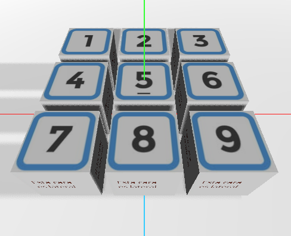
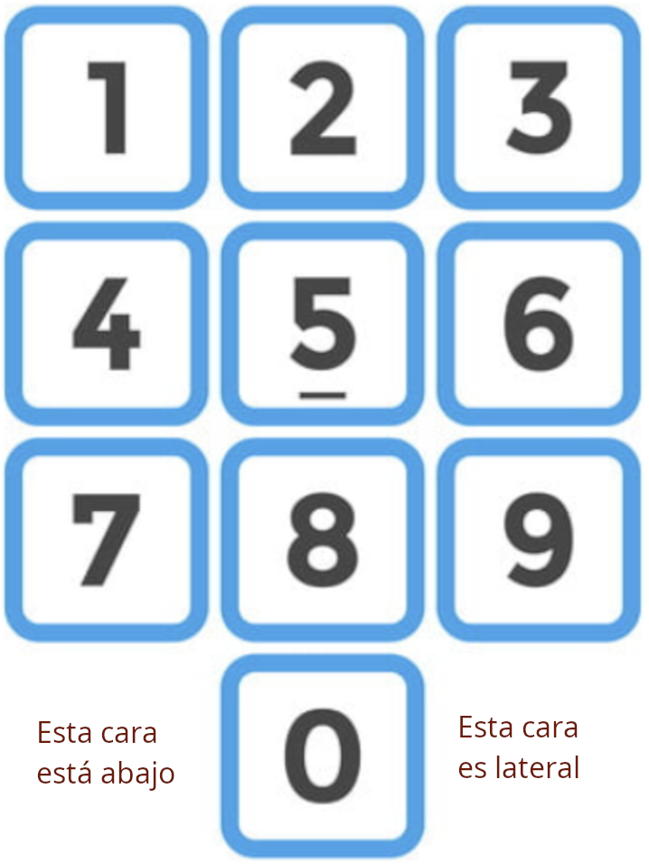
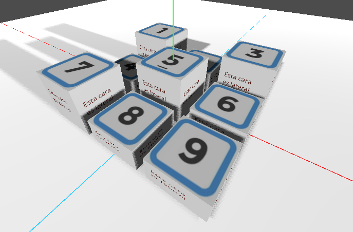

# Informática Gráfica. Examen II de Prácticas

***

- **Asignatura:** Informática Gráfica.
- **Curso Académico:** 2025-26.
- **Grado:** DGIIM + DGIIADE.
- **Grupo:** El examen es común para todos los grupos.
- **Profesor:** Carlos Ureña.
- **Descripción:** Parcial II de Prácticas común a todos los grupos, Prácticas 4-5.

Para el presente examen, era necesario que el alumno llevase implementadas ya las prácticas 4 a 5 de la asignatura.
***

Crea un nuevo proyecto en Godot en una carpeta llamada `ex-45.zip`. Añade los scripts de `Ejes3D`, `Utilidades`, el script de la raíz que permite visualizar la malla al pulsar `W` y el script correspondiente para la cámara orbital.

1. Para el primer ejercicio, se pretende diseñar un teclado numérico como el de la siguiente figura:

para ello, se pide:
- Crear una malla desde el editor que sirva como base o suelo para la escena, y añádale un material predeterminado con un color claro.
- Añadir dos fuentes de luz que permitan iluminar la escena desde dos posiciones distintas y que arrojen sombras.
- Añada un hijo del nodo raíz de tipo `Node3D` y que sea el primer hijo del nodo raíz en el árbol de la escena, llámelo `Teclado` y añada un script a este nodo.
- En dicho nodo implemente la función `CrearTecla`, que recibe dos argumentos enteros `i` (el número de fila) y `j` (el número de columna) y devuelve un objeto `MeshInstance3D` que contiene un cubo con sus tablas de vértices, índices, normales y coordenadas de textura rellenas. Las coordenadas de textura del cubo deben establecerse para visualizar en el cubo la siguiente textura:

que puede encontrarse en la ruta `/img/tecla3.png`. La cara superior del cubo debe mostrar un número entre el 1 y el 9, determinado por las coordenadas `(i,j)`. La cara inferior del cubo debe mostrar la parte de la textura correspondiente con la frase `Esta cara está abajo`, y las 4 caras laterales del cubo deben mostrar la porción de textura correspondiente con `Esta cara es lateral`. A partir de ahora llamaremos "tecla" a cualquier cubo generado por esta función.
- Cree 9 instancias de teclas usando para ello la función `CrearTecla`, todas ellas con un material con nivel $0.3$ de rugosidad y $0.4$ de color metálico. Realice las transformaciones oportunas para que las teclas se sitúen como las de la siguiente figura:

2. El segundo ejercicio es una modificación del ejercicio anterior. Se pretende implementar una interacción con ratón sobre el teclado generado en el ejercicio anterior, que permita "hundir" una tecla y luego volver a subirla. Para ello:
- Añada tanto a la malla de suelo como a las teclas los objetos necesarios para poder detectar colisiones.
- Añada metadatos a las teclas, un metadato booleano que permita conocer si la tecla correspondiente está subida o bajada, y otro metadato que permita conocer el número correspondiente a cada tecla.
- Cree un nuevo nodo `Node3D` hijo del nodo raíz que sea el segundo hijo suyo. Este nodo se encargará de gestionar la interacción con las teclas.
- En el nodo creado anteriormente, implemente una función que permita detectar cuando se hace click con el ratón encima de una tecla (supongamos la tecla `i`), de forma que se muestre el mensaje `Tecla i bajada` y que se escale la tecla por un factor de escala menor que 1 de forma vertical (las caras superior e inferior no deben alterarse, y las caras laterales deben estrujarse) si la tecla estaba subida; y que se muestre el mensaje `Tecla i subida` y que la tecla recupere su forma original si la tecla estaba bajada. En caso de no haber ninguna tecla donde el usuario ha clickado, hacer que se muestre el mensaje `No hay tecla en ese pixel`.

La funcionalidad implementada debería poder obtener estados del teclado como el de la siguiente figura:

***
La solución al examen puede encontrarla en:
- Solución en [Godot](https://github.com/LosDelDGIIM/LosDelDGIIM.github.io/blob/main/subjects/IG/Exámenes/Ex05/solucionGodot).
