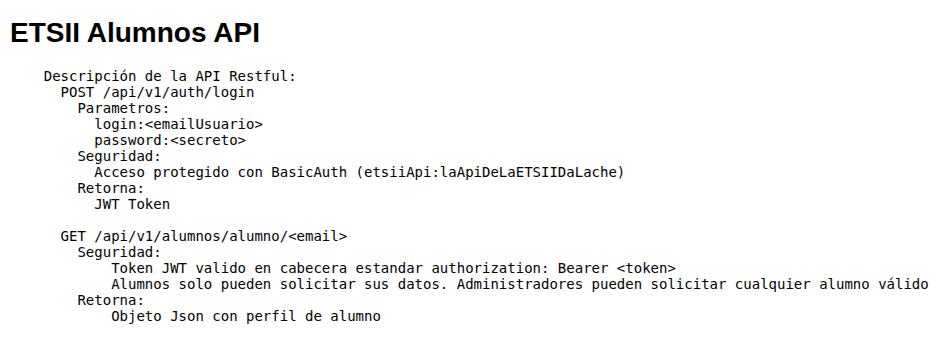

# Bloque 2: Simulación de Carga de Trabajo y Monitorización

- **Autor**: Arturo Olivares Martos
- **Autor**: Miguel Ángel de la Vera


## Introducción
En este documento abordamos herramientas y técnicas para la monitorización de sistemas y la simulación de carga de trabajo en servidores. Utilizaremos tecnologías modernas como contenedores Docker, herramientas de benchmark, generadores de carga como JMeter, y soluciones de monitorización como Grafana y Prometheus. Esta infraestructura permite evaluar el rendimiento de los sistemas y asegurar su correcto funcionamiento bajo diferentes condiciones de uso.

## Contenedores
Los contenedores proporcionan una capa de abstracción sobre el sistema operativo, similar a una máquina virtual pero más ligera y eficiente. A diferencia de los hipervisores, esta tecnología permite ejecutar múltiples aplicaciones encapsuladas, compartiendo el kernel del host.
Los contenedores han facilitado la adopción de arquitecturas de microservicios, donde cada servicio corre de forma independiente y se comunica con otros mediante APIs o colas de mensajes.

Sus principales ventajas son:
- **Prestaciones**: Puesto que no hay virtualización, no hay pérdida ninguna de rendimiento.
- **Portabilidad**: Debido al encapsulamiento de la aplicación y sus dependencias, los contenedores pueden ejecutarse en cualquier entorno compatible. Facilita por tanto la migración entre entornos de desarrollo, pruebas y producción. Es, sobretodo, una tecnología de distribución del software.
- **Seguridad**: Se crea un filesystem aislado para cada contenedor, lo que mejora la seguridad al evitar que una aplicación afecte a otras. De hecho, es un `sandbox` que permite ejecutar aplicaciones de forma aislada, evitando conflictos entre ellas.
- **Espacio de Procesos Propio**: Cada contenedor tiene su propio espacio de procesos, lo que evita conflictos entre aplicaciones. De hecho, si desde un mismo contenedor ejecutamos `ps -ax`, veremos que solo aparecen los procesos de ese contenedor, no los del host.


Como contrapartida, hemos de mencionar que se crea una "red virtual" entre las distintas aplicaciones de un contenedor para poder comunicarse entre ellas, por lo que en este aspecto sí hay una ligera pérdida de rendimiento. Por otro lado, las dependencias de cada contenedor son independientes, lo que puede llevar a un aumento del uso de espacio en disco si no se gestionan adecuadamente, puesto que pueden existir dependencias duplicadas en diferentes contenedores.

Hay varias tecnologías de contenedores, pero la más popular es **Docker**, y es la que estudiaremos en este bloque. No obstante, cabe mencionar alternativas a Docker como *Podman*, que destaca por tener una sintaxis muy similar pero no requiere un *daemon* para su ejecución, lo que lo hace más seguro y ligero.

Otra herramienta que usaremos más adelante es *Docker Compose*, que sirve para definir y ejecutar aplicaciones multi-contenedor. Con un solo comando, podemos crear y ejecutar todos los contenedores necesarios para una aplicación, facilitando la gestión de entornos complejos.

### Instalación de Docker
Para instalar **Docker**, podemos optar por la instalación en la MV o en el host, aunque la instalación en el host es suficiente para la práctica. Para instalarlo, podemos seguir [la guía oficial de Docker](https://docs.docker.com/engine/install/). Sin embargo, se muestran algunos comandos para distribuciones comunes.
#### Debian 
```shell
$ sudo apt-get update
$ sudo apt-get install ca-certificates curl
$ sudo install -m 0755 -d /etc/apt/keyrings
$ sudo curl -fsSL https://download.docker.com/linux/debian/gpg -o /etc/apt/keyrings/docker.asc
$ sudo chmod a+r /etc/apt/keyrings/docker.asc
```

```shell
$ echo \
  "deb [arch=$(dpkg --print-architecture) signed-by=/etc/apt/keyrings/docker.asc] https://download.docker.com/linux/debian \
  $(. /etc/os-release && echo "$VERSION_CODENAME") stable" | \
  sudo tee /etc/apt/sources.list.d/docker.list > /dev/null
sudo apt-get update
```

Y ahora ya podemos instalar docker junto con algunos plugins adicionales que usaremos:
```shell
$ sudo apt-get install docker-ce docker-ce-cli containerd.io docker-buildx-plugin docker-compose-plugin
$ wget https://desktop.docker.com/linux/main/amd64/docker-desktop-amd64.deb?utm_source=docker&utm_medium=webreferral&utm_campaign=docs-driven-download-linux-amd64
$ sudo apt-get update
$ sudo apt-get install ./docker-desktop-amd64.deb

```

#### Arch (By The Way)
```shell
$ sudo pacman -S docker docker-compose
```

### Trabajando con Docker

Comenzamos con algunos comandos básicos para trabajar con Docker. Cabe destacar que tan solo pueden ejecutar comandos de Docker los usuarios que pertenezcan al grupo `docker` o que tengan permisos de superusuario. Para añadir un usuario al grupo `docker`, podemos usar el siguiente comando:
```shell
$ sudo usermod -aG docker <usuario>
```
En caso contrario, deberemos usar `sudo` para ejecutar los comandos de Docker.


En primer lugar, hay que distinguir entre imágenes y contenedores.
- **Imágenes**: Son plantillas de solo lectura que contienen el código y las dependencias necesarias para ejecutar una aplicación. Se pueden considerar como un "snapshot" del sistema de archivos.
- **Contenedores**: Son instancias en ejecución de imágenes. Cada contenedor tiene su propio sistema de archivos, red y espacio de procesos, pero comparte el kernel del host.

Los comandos básicos para trabajar con las imágenes de Docker son:
```shell
$ docker pull <imagen>        # Descargar una imagen desde Docker Hub
$ docker image ls             # Listar imágenes descargadas
$ docker image rm <imagen>    # Eliminar una imagen del sistema
```

Para trabajar con contenedores, los comandos son:
```shell
$ docker container ls -la     # Listar todos los contenedores (en ejecución y detenidos)
$ docker run <imagen>         # Crear y ejecutar un nuevo contenedor
$ docker run -it  sh     # Ejecutar un contenedor con terminal interactivo
$ docker stop <nombre>        # Detener un contenedor en ejecución
$ docker container rm <nombre>  # Eliminar un contenedor detenido
```

Cabe destacar que el comando `docker run` crea y ejecuta un nuevo contenedor a partir de una imagen. Si la imagen no está disponible localmente, Docker la descargará automáticamente.

Notemos que, tras detener la ejecución de un contenedor, este sigue existiendo en el sistema, por lo que si queremos eliminarlo, deberemos usar el comando para eliminarlo visto. No obstante, si queremos eliminarlo al finalizar la ejecución, podemos usar el flag `--rm` al ejecutar el contenedor. Por ejemplo:
```shell
$ docker run --rm <imagen>      # Ejecutar y eliminar el contenedor al finalizar
```
Aun así, si queremos eliminar todos los contenedores detenidos, podemos usar el siguiente comando:
```shell
$ docker container prune
```

Para comprobar que Docker está instalado y funcionando correctamente, podemos comprar su estado como servicio:
```shell
$ systemctl status docker
```

Cuando hablamos de descargar imágenes, estas se descargan de [Docker Hub](https://hub.docker.com/), que es el repositorio oficial de imágenes de Docker. Muchas aplicaciones populares (como `ubuntu`, `nginx`, `mysql`) tienen imágenes oficiales mantenidas por Docker o sus creadores.

Para ilustrar su fácil uso, y especialmente comprobar que toda la instalación ha sido correcta, vamos a ejecutar el primer contener. Este será el contenedor [hello-world](https://hub.docker.com/_/hello-world), que es una imagen de prueba que simplemente imprime un mensaje en la consola. Para ello, ejecutamos el siguiente comando:
```shell
$ docker run hello-world
```
Como vemos, este se descarga automáticamente y se ejecuta, mostrando un mensaje de bienvenida.

Hacemos referencia ahora brevemente a distintos términos:
1. **Dockerfile**: Es un archivo de texto que contiene instrucciones para construir una imagen de Docker. Define cómo se debe configurar el contenedor, qué software instalar, etc. Se puede considerar como un script de construcción de la imagen. Aunque en la asignatura no se nos pide saber construirlos, veamos un ejemplo:
    ```
    FROM mongo:6
    COPY ./scripts/* /tmp/
    RUN chmod 755 /tmp/initializeMongoDB.sh
    WORKDIR /tmp
    CMD ./initializeMongoDB.sh
    ```
    - Se está especificando que se use la versión 6 de la imagen de `mongo`. Además, se ejecutan ciertos comandos para el correcto funcionamiento del contenedor. Se emplea además el sistema de archivos propio, como vemos en `/tmp/`.

    Otro ejemplo relevante es el siguiente:
    ```
    FROM node:16.13.0-stretch
    RUN mkdir -p /usr/src/app
    COPY . /usr/src/app
    EXPOSE 3000
    WORKDIR /usr/src/app
    RUN ["npm", "install"]
    ENV NODE_ENV=production
    CMD ["npm","start"]
    ```
    - Este ejemplo cabe destacarlo, puesto que se emplea la opción `EXPOSE`, que indica que este contenedor va a escuchar en el puerto 3000. Esto es importante, ya que si no se especifica, el contenedor no podrá recibir peticiones en ese puerto.

2. **Docker Compose**: Es una herramienta que permite definir y ejecutar aplicaciones multi-contenedor. Con un solo archivo de configuración (`docker-compose.yml`), podemos definir un único servicio que emplee varios contenedores. De nuevo, aunque no es necesario que sepamos construirlos, veamos un ejemplo:
    ```yaml
    version: '2.0'
    services:
      #MongoDB based in the original Mongo Image
      mongodb:
        image: mongo:6
        ports:
          - "27017:27017"

      # Initialize mongodb with data
      mongodbinit:
        build: ./mongodb
        links:
          - mongodb

      # Nodejs App
      nodejs:
        build: ./nodejs
        ports:
          - "3000:3000"
        links:
          - mongodb
    ```
    - En este caso, se definen tres servicios: `mongodb`, `mongodbinit` y `nodejs`. Cada uno de ellos tiene su propia configuración y se pueden ejecutar juntos.
    - En lo referido a los puertos, vemos que se especifican de la forma `<puerto_host>:<puerto_contenedor>`. Esto significa que el puerto 27017 del host se redirige al puerto 27017 del contenedor. De esta forma, podemos acceder al contenedor desde el host a través del puerto 27017.
    - El comando `links` se usa para conectar contenedores entre sí. Cada vez que `docker-compose` levanta un contenedor, se crea una red virtual entre ellos y les asigna una dirección IP a cada servicio. Para que los contenedores puedan comunicarse entre sí, añadirá una entrada en el archivo `/etc/hosts` de cada contenedor, permitiendo que se puedan resolver los nombres de los contenedores entre sí. De esta forma, para conectarse desde un contenedor a otro, se puede usar el nombre del servicio como si fuera un nombre de host.
      - Por ejemplo, el contenedor `nodejs` puede conectarse al contenedor `mongodb` usando la dirección `mongodb:27017`.

    Para levantar dicho servicio multi-contenedor, simplemente ejecutamos el siguiente comando:
    ```shell
    $ docker-compose up [-d]
    ```
    - El flag `-d` indica que se va a ejecutar en segundo plano, es decir, que no se va a mostrar la salida del contenedor en la consola.

    Para detenerlo, hay dos casos:
    - Si se ha ejecutado en segundo plano (o desde otra terminal pero en la misma carpeta), se puede usar el siguiente comando:
      ```shell
      $ docker-compose down
      ```
    - Si se ha ejecutado en primer plano, se puede usar `Ctrl + C` para detenerlo.


## Benchmarking
El benchmarking es una técnica fundamental para evaluar el rendimiento de sistemas y servicios. Permite comparar distintas configuraciones, detectar cuellos de botella y validar mejoras de rendimiento. En este bloque se explorarán tanto herramientas de propósito general como específicas para servidores web.

### OpenBenchmarking
*OpenBenchmarking* es el proyecto más significativo en el ámbito de benchmarking de código abierto. Se trata de un repositorio en el que se pueden encontrar una amplia variedad de benchmarks para evaluar el rendimiento de sistemas y aplicaciones.

*Phoronix Test Suite* es la plataforma de *OpenBenchmarking* que permite ejecutar benchmarks en una amplia variedad de sistemas y configuraciones. Notemos no obstante que no está muy mantenida. Aunque se puede instalar tanto en el host como en una MV, recomendamos instalarlo mediante contenedores Docker empleando la [imagen oficial de Phoronix](https://hub.docker.com/r/phoronix/test-suite). Notemos además que buscamos una interfaz interactiva:
```shell
docker run -it phoronix/pts
```

Una vez ejecutándose el contenedor, podemos ejecutar los dos siguientes comandos:
- `system-info`: Muestra información detallada sobre el sistema, incluyendo CPU, memoria, disco y red. Notemos que, aun estando en un contenedor, como no hay virtualización, podemos ver la información del host.
- `system-sensors`: Muestra información sobre los sensores del sistema, como temperatura, voltaje y velocidad de los ventiladores. Esto es útil para monitorear el estado del hardware.


Phoronix distingue entre:
- **Tests**: Son los benchmarks individuales que se pueden ejecutar. Cada test tiene su propio conjunto de parámetros y configuraciones.
- **Suites**: Son colecciones de tests que se pueden ejecutar juntos. Permiten evaluar el rendimiento de un sistema en diferentes áreas (CPU, memoria, disco, etc.). Por ejemplo, puede haber una `suite` de ofimática que emplee test de acceso a disco, RAM, etc.

Para ver todos los tests o suites disponibles, podemos usar el siguiente comando:
```shell
$ phoronix-test-suite list-available-tests      # Listar todos los tests disponibles
$ phoronix-test-suite list-available-suites     # Listar todas las suites disponibles
```

Para ver información de un test o suite en concreto (como son sus dependencias), podemos usar el siguiente comando:
```shell
$ phoronix-test-suite info <test/suite>
```

Para ejecutar un test o suite, podemos usar el siguiente comando:
```shell
$ phoronix-test-suite install <test/suite>
$ phoronix-test-suite run <test/suite>
$ phoronix-test-suite benchmark <test/suite>  # Equivalente al anterior
```
Notemos que si se usa sin instalar, se descargará automáticamente. Para que los datos se guarden y se puedan comparar con otros resultados, hay dos opciones:
- `--save-results`: Esta opción añadida al parámetro `run` permite guardar los resultados de la prueba en un archivo específico.
- En la ejecución, se pedirá el nombre del fichero en el que se van a guardar los resultados.

Para ver los resultados guardados, podemos usar los siguientes comandos:
```shell
$ phoronix-test-suite list-saved-results  # Listar el nombre de todos los resultados guardados
$ phoronix-test-suite show-result <fichero_resultados>                      # Ver resultados de un test específico
```

Comprobémoslo con un ejemplo (aunque evidentemente tardará). Para evitar tener que instalarlos dependencias, emplearemos la imagen de Docker de [gZip](https://openbenchmarking.org/test/pts/compress-gzip) que contiene la herramienta de compresión `gzip`. Para ello, ejecutamos el siguiente comando:
```shell
$ phoronix-test-suite run compress-gzip
```

### Apache Benchmark
Dentro de los benchmarks para servidores web, hay varias harramientas que destacan. En este caso nos centraremos en *Apache Benchmark*, benchmark de la empresa Apache pero que está destinado a estudiar cualquier sevidor web (Apache, Nginx, etc.). Se emplea como sigue:
```shell
$ ab -n <num_requests> -c <num_concurrent_requests> <url>
```
Donde:
- `num_requests`: Número total de peticiones a enviar al servidor.
- `num_concurrent_requests`: Número de peticiones concurrentes a enviar al servidor.

Evidentemente, no tiene sentido aplicar el benchmark desde el mismo servidor, puesto que el resultado se va a ver afectado por la carga que el propio servidor genera. Por tanto, es recomendable usar una máquina diferente para realizar el benchmark.

<!--
Las opciones mas comunes que usaremos son:
- *-n*: El número de peticiones a enviar
- *-t*: La duración (en segundos) del benchmark
- *-c*: El número de peticiones concurrentes a realizar. 
Si usamos -t y -n, deberemos poner primero -t ya que de lo contrario, ApacheBench lo va a ignorar, dejando por defecto 50000.
El comando *ab* se ejecuta en un solo hilo, el flag -c indica cuantos fd se van a reservar para la ejecución, no cuantas peticiones HTTP se van a mandar simultáneamente.
-->

#### Ejemplo Práctico

Veamos ahora un ejemplo práctico de benchmarking con Apache Benchmark, junto con la herramienta `curl`, que nos permite realizar peticiones HTTP y ver la respuesta del servidor.
```shell
$ curl -v <url>   # -v: verbose, también las cabeceras
```

Buscamos aplicar el benchmarl en la web de la [Universidad de Granada](https://www.ugr.es/). Para ello, ejecutamos el siguiente comando:
```shell
$ ab -n 5000 -c 10 http://www.ugr.es/
```

Como podemos ver, el servidor está implementadocon `nginx`. No obstante, nos extraña que la longitud de la respuesta es de tan solo 162 bytes. Para comprobar qué ocurre, empleamos `curl` para ver la respuesta del servidor:
```shell
$ curl -v http://www.ugr.es/
* Host www.ugr.es:80 was resolved.
* IPv6: (none)
* IPv4: 150.214.27.71
*   Trying 150.214.27.71:80...
* Connected to www.ugr.es (150.214.27.71) port 80
> GET / HTTP/1.1
> Host: www.ugr.es
> User-Agent: curl/8.5.0
> Accept: */*
> 
< HTTP/1.1 301 Moved Permanently
< Server: nginx
< Date: Thu, 22 May 2025 00:43:17 GMT
< Content-Type: text/html
< Content-Length: 162
< Connection: keep-alive
< Location: https://www.ugr.es/
< 
# ....
```

Como vemos, el servidor responde con un `301 Moved Permanently`, lo que indica que la página ha sido movida permanentemente a otra URL. En este caso, la nueva URL es `https://www.ugr.es/`. Como vemos, esto es una *limitación* de Apache Benchmark, que no sigue redirecciones. Para comprobar que, efectivamente, la página ha sido movida, podemos usar `curl` con el flag `-L`, que sigue las redirecciones:
```shell
$ curl -vL http://www.ugr.es/
```

En este caso, la respuesta es mucho más larga, por lo que procedemos a aplicar el benchmark de nuevo:
```shell
$ ab -n 5000 -c 10 https://www.ugr.es/
# ...
Server Software:        nginx
Server Hostname:        www.ugr.es
Server Port:            443
SSL/TLS Protocol:       TLSv1.2,ECDHE-RSA-AES128-GCM-SHA256,2048,128
Server Temp Key:        ECDH P-384 384 bits
TLS Server Name:        www.ugr.es

Document Path:          /
Document Length:        111344 bytes

Concurrency Level:      10
Time taken for tests:   201.923 seconds
Complete requests:      5000
Failed requests:        0
Total transferred:      560673874 bytes
HTML transferred:       556720000 bytes
Requests per second:    24.76 [#/sec] (mean)
Time per request:       403.845 [ms] (mean)
Time per request:       40.385 [ms] (mean, across all concurrent requests)
Transfer rate:          2711.60 [Kbytes/sec] received

Connection Times (ms)
              min  mean[+/-sd] median   max
Connect:      102  138  37.4    132    1174
Processing:   126  265  67.9    275    1145
Waiting:       60   84  34.0     74     944
Total:        238  403  75.2    408    1495

Percentage of the requests served within a certain time (ms)
  50%    408
  66%    425
  75%    437
  80%    442
  90%    457
  95%    477
  98%    514
  99%    639
 100%   1495 (longest request)
```

Además de las métricas de fácil interpretación, hemos de resaltar los Tiempos de Conexión:
- **Connect**: Tiempo que tarda en establecer la conexión con el servidor.
- **Processing**: Tiempo que tarda el servidor en procesar la petición y enviar la respuesta completa.
- **Waiting**: Tiempo que transcurre desde que se envía la petición hasta que se recibe la primera respuesta del servidor. Este tiempo es importante porque puede indicar si el servidor está saturado o si hay problemas de red.

Es normal que la suma de los tiempos no sea igual al tiempo total, ya que se consideran los valores mínimos, máximos. En los valores medios no obstante sí se mantiene la relación.

También es de notar por qué hay dos tipos de *Time per request*:
- El menor especifica *across all concurrent requests*, es decir, el tiempo medio de cada petición teniendo en cuenta todas las peticiones concurrentes. Es menor porque hay peticiones ejecutándose al mismo tiempo.
- El mayor especifica *mean* a secas, es decir, el tiempo medio de cada petición sin tener en cuenta la concurrencia. Este tiempo es mayor porque no se están ejecutando varias peticiones al mismo tiempo, por lo que el tiempo es mayor que el real.


Como vemos, esta es una herramienta útil por su sencillez, pero nos impide hacer estudios más en profundidad. Se usa para lo que se conoce como *smoketest* (prueba de humo), que es una prueba rápida para comprobar que el sistema funciona correctamente. Sin embargo, no es suficiente para hacer un análisis exhaustivo del rendimiento de un sistema. Ahí es donde entran en juego otras herramientas más avanzadas como JMeter, que nos permiten hacer pruebas más complejas y detalladas.

## Simulación de Carga: Jmeter
Aunque Apache Benchmark tiene muchas posibilidades y es una herramienta poderosa y correcta, existen otras herramientas que permiten hacer tests más complejos. Nosotros estudiaremos JMeter, que es una de las más populares y completas. Aunque es ciertamente antigua, sigue siendo una de las más utilizadas en la industria. Está está diseñado para cargar funcionalidades de benchmark y medir rendimiento, especialmente en servidores web.

Una de las características interesantes de Jmeter es su manejo de la distribución de la carga:
- Puede crear concurrencia real gracias a la posibilidad de crear varias hebras dentro de la misma CPU.
- También puede distribuir el esfuerzo de carga entre varios equipos en red local.
- Existen otros proveedores de servicios de carga en la nube, como *Flood*, que permiten distribuir el esfuerzo de carga entre varios equipos en la nube, de forma global.

Como veremos, una de las principales ventajas de JMeter, que le distingue de Apache Benchark, es que se puede configurar como proxy de un servidor a JMeter, registrando la navegación de los usuarios. De esta forma, podremos replicar situaciones exactas de carga en el servidor, lo que es muy útil para hacer pruebas de rendimiento.
- Por ejemplo, si el servidor ha estado especialmente recargado en cierto momento y se ha caído, podemos realizar pequeños ajustes y comprobar si, con la misma carga, el servidor aguantará.

Los test en JMeter se diseñan y se configuran mediante la interfaz gráfica, y esto también nos permite ejecutarlos con fines de depuración; pero no es recomendable usar la interfaz gráfica para ejecutar los tests en producción, ya que esta consume muchos recursos y los resultados se verían alterados.

Para ejecutar los tests en producción mediante la línea de comandos, se emplea:
```shell
$ jmeter -n -t <jmx file>.jmx -l <results file> -e -o <Path to web report folder>
```
donde:
- `-n`: Indica que se va a ejecutar en modo no gráfico.
- `-t`: Indica el archivo de configuración del test. Este es el que habremos creado previamente con la interfaz gráfica. Tendrá extensión `.jmx`.
- `-l`: Indica el archivo donde se van a guardar los resultados del test. Este archivo tendrá extensión `.jtl`, aunque también puede ser `.csv` o `.xml`.
- `-e`: Indica que se va a generar un informe HTML al finalizar el test. Esto es opcional.
- `-o`: Indica la ruta donde se va a guardar el informe HTML. Este informe se generará al finalizar el test y contendrá información detallada sobre los resultados del test. Esta carpeta ha de estar vacía, o bien no existir, para que el comando no falle.

Una vez ejecutado, los resultados se pueden ver desde la interfaz gráfica de JMeter, o bien desde el informe HTML generado. Este informe contiene gráficos y tablas con información detallada sobre los resultados del test, lo que facilita la interpretación de los resultados.


- *Observación*: Las traducciones de la versión en español de la interfaz gráfica no son del todo correctas, por lo que se recomienda emplear la versión en inglés.


### Ejemplo Práctico

JMeter tiene infinidad de opciones, y sería imposible explicarlas todas. Es por ello que veremos un ejemplo práctico, en el que explicaremos en detalle cada aspecto.

Para este ejemplo, emplearemos una web disponible gracias en el siguiente repositorio.
```shell
$ git clone https://github.com/davidPalomar-ugr/iseP4JMeter
```

En la documenación de [dicho repositorio](https://github.com/davidPalomar-ugr/iseP4JMeter) se explica en detalle qué hemos de hacer. Se trata de una aplicación multi-contenedor, por lo que en primer lugar hemos de levantar el contenedor.
```shell
$ docker-compose up
```

Este contenedor levantará un servidor web, y hemos de realizar una simulación de carga empleando JMeter. Como vemos en el correspondiente archivo de configuración `docker-compose.yml` y en la documentación, la API está disponible en el puerto 3000, por lo que accederemos desde un navegador a [http://localhost:3000](http://localhost:3000) (en el caso de que estemos ejecutándolo en el mismo ordenador. En caso contrario, especificar en vez de `localhost`, la IP del servidor), donde vemos:



Como vemos, se trata de una descripción básica de la API. Esta API es de tipo *RESTful* (*Resource State Transfer*); es decir, emplea operaciones básicas de HTML como `GET`o `POST` para hacer operaciones de tipo CRUD (*Create, Read, Update, Delete*) sobre entidades. En este caso, es una API orientada al manejo de expedientes de alumnos. La API contiene dos métodos:
- `POST /api/v1/auth/login`: Este método permite autenticar un usuario y obtener un token de acceso JWT, que le permitirá emplear el segundo método. La autenticación se realiza mediante el usuario y la contraseña, que se proporcionan como parámetros en la petición. El acceso a este servicio está protegido por HTTP Basic Auth, por lo que deberemos enviar las credenciales en la cabecera de la petición.
- `GET /api/v1/alumnos/alumno/<email>`: Un método GET que nos permite obtener el expediente de un alumno en particular. Este método requiere un token de acceso JWT que se obtiene al autenticar al usuario mediante el método anterior.

Notemos que hay dos tipos de usuarios: alumnos y administradores.
- Los usuarios autenticados como alumnos pueden acceder en el segundo método a su propio expediente, pero no pueden acceder a la información de otros alumnos.
- Los usuarios autenticados como administradores pueden acceder al expediente de cualquier alumno.


Explicamos ahora en detalle la seguridad de la API, antes ligeramente mencionada.
1. El primero de los métodos emplea el protocolo de autenticación `HTTP Basic Auth`, que es un método sencillo y ampliamente utilizado para autenticar usuarios en aplicaciones web. Aunque este está obsoleto y no es seguro sobre HTTP (puesto que no se cifran las credenciales), permite paliar el ruido del canal, puesto que solo se procesan las peticiones que contienen las credenciales correctas. Para autenticarse, se emplea un *Encabezado de Autenticación* que contiene el nombre de usuario y la contraseña codificados en Base64. En nuestro caso, podemos ver que la API está protegida por `HTTP Basic Auth`, y las credenciales son:
    - Usuario: `etsiiApi`
    - Contraseña: `laApiDeLaETSIIDaLache`

2. El segundo método emplea el protocolo de autenticación `JWT` (JSON Web Token) que se basa en Tokens, que son cadenas de texto codificadas en Base64 que contienen información sobre el usuario. Contiene tres partes separados por un `.`:
    - **Header**: Contiene información sobre el algoritmo de firma y el tipo de token.
    - **Payload**: Contiene la información del usuario, como su ID, nombre, etc. En nuestro caso, contiene el ID del usuario y su rol (alumno o administrador).
    - **Signature**: Es la firma del token, que se genera a partir del header y el payload. Esta firma se utiliza para verificar la integridad del token y asegurarse de que no ha sido modificado.

    Estas tres partes pueden obtenerse con el [JWT Debugger](https://jwt.io/), que nos permite decodificar el token y ver su contenido. Además, este nos permite conocer si efectivamente es un Token válido, pero para ello necesita saber con qué contraseña se firmó. Esta está disponible en [./nodejs/config/config.js](https://github.com/davidPalomar-ugr/iseP4JMeter/blob/master/nodejs/config/config.json)
    ```json
    {
      "mongodburl":"mongodb://mongodb:27017/etsii",
      "jwtTokenSecret":"meMolaMuchoEstudiarEnLaETSII",
      "jwtTokenTTLInSecons": 3600,
      "jwtTimeJitterInSeconds":60,
      "basicAuthLogin":"etsiiApi",
      "basicAuthPassword":"laApiDeLaETSIIDaLache"
    }
    ```
    Como vemos, la contraseña es `meMolaMuchoEstudiarEnLaETSII`. Esta contraseña se utiliza para firmar el token, y es la que se utiliza para verificar la firma del token. Si el token no está firmado con esta contraseña, no será válido.
    
    Es importante resaltar que:
    - **No están cifrados**, por lo que no se puede incluir información sensible.
    - **Sí están firmados**, por lo que se puede verificar la integridad del token y asegurarse de que no ha sido modificado.

    Como se explica, hemos de incluir en la cabecera de la petición `GET`, en el campo `Authorization`, el valor de `Bearer <token>`.


Una vez levantado el servidor y explicado su funcionamiento, para probar el entorno ejecutamos el siguiente script, que se encuentra en el fichero `pruebaEntorno.sh`.
```bash
#!/bin/bash
SERVER=localhost
TOKEN=$(curl -s \
-u etsiiApi:laApiDeLaETSIIDaLache \
-d "login=mariweiss@tropoli.com&password=anim" \
-H "Content-Type: application/x-www-form-urlencoded" \
-X POST http://$SERVER:3000/api/v1/auth/login)

resultado=$?
if test "$resultado" != "0"; then
   echo "ERROR: Curl fallo con resultado: $resultado"
fi

echo $TOKEN

curl \
-H "Authorization: Bearer $TOKEN" \
http://$SERVER:3000/api/v1/alumnos/alumno/mariweiss%40tropoli.com 
```

Como vemos, para obtener el Token se emplea el comando `curl` con los siguientes parámetros:
- `u`: Especifica el usuario y la contraseña a usar para autenticarse. En este caso, se especifica el usuario y la contraseña separados por `:`. Empleamos la opción `-u` para que `curl` use `HTTP Basic Auth`.
- `d`: Especifica los datos a enviar en la petición. En este caso, se especifica el login y la contraseña del usuario a autenticar. Estos datos se envían como parámetros en la petición.
- `H`: Especifica la cabecera a enviar en la petición. En este caso, se especifica el tipo de contenido a enviar. En este caso, se especifica que se van a enviar datos en formato `application/x-www-form-urlencoded`, que es el formato utilizado por los formularios HTML.
- `X`: Especifica el método HTTP a usar. En este caso, se especifica que se va a usar el método `POST`.
- `s`: Especifica que se va a usar el modo silencioso, es decir, que no se va a mostrar la salida del comando en la consola. Esto es útil para evitar que se muestre información innecesaria en la consola.

Por otro lado, una vez obtenido el token, se usa de nuevo `curl` para hacer la petición `GET` al servidor. El único parámetro que se añade es:
- `H`: Especifica la cabecera a enviar en la petición. En este caso, se especifica el token a usar para autenticar la petición. Este token se obtiene de la respuesta del servidor al autenticar al usuario.

Como vemos, la salida está en formato JSON. Se recomienda emplear un [formateador de JSON](https://jsonformatter.org/json-pretty-print) para ver el expediente de forma más legible:
```json
{
  "_id": "682f03b487779655f4d6ac8d",
  "nombre": "Mari",
  "apellidos": "Fletcher Weiss",
  "sexo": "female",
  "email": "mariweiss@tropoli.com",
  "fechaNacimiento": "1992-04-04T00:00:00.000Z",
  "comentarios": "Aliquip dolor laboris ullamco id ex labore. Ipsum [...] minim nostrud et.\r\n",
  "cursos": [
    {
      "_id": "682f13f1d1a1dab4e510a177",
      "curso": 1,
      "media": 5.2
    },
    {
      "_id": "682f13f1d1a1dab4e510a178",
      "curso": 2,
      "media": 9.1
    }
  ],
  "usuario": 10
}
```

Por simple curiosidad para el lector, los ejemplos de los alumnos se han obtenido empleando [JSON Generator](https://json-generator.com/) con las plantillas ubicadas en [./mongodb/scripts](https://github.com/davidPalomar-ugr/iseP4JMeter/tree/master/mongodb/scripts).

Una vez desarrollado y explicado el entorno, pocedemos en sí a explicación de la práctica.
- Se debe simular el acceso de cierto número de alumnos. Estos tan solo deben verificarse y obtener su expediente. Las credenciales de los alumnos se encuentran en [./jMeter/alumnos.csv](https://github.com/davidPalomar-ugr/iseP4JMeter/tree/master/jMeter/alumnos.csv).
- Se debe simular el acceso de cierto número de administradores. Estos deben verificar su acceso y ejecutar un acceso log. Las credenciales de los administradores se encuentran en [./jMeter/administradores.csv](https://github.com/davidPalomar-ugr/iseP4JMeter/tree/master/jMeter/administradores.csv), mientras que el log a simular se encuentra en [./jMeter/apiAlumno.log](https://github.com/davidPalomar-ugr/iseP4JMeter/tree/master/jMeter/apiAlumno.log).

Para la realización, hemos de crear el fichero de jMeter `jmx` correspondiente desde la interfaz gráfica. La situación final del test, de cara a facilitar el trabajo al lector, debe quedar como sigue:


 A continuación, describiremos paso por paso:
1. **ETSII Alumnos API**

    `Test Plan` es la base del proyecto, y desde él colgarán todos los elementos del test. En él, aparte del nombre y de los comentarios, hemos de conocer el campo de `User Defined Variables`, que nos permite definir variables que se pueden usar en todo el test.
   - Para acceder a ellas, deberemos usar el símbolo `$` seguido del nombre de la variable. Por ejemplo, si definimos una variable llamada `PORT`, la usaremos como `${PORT}`. Esto es útil para definir variables que se usan en varias partes del test. En nuestro caso, hemos de usar (como mínimo):
     - `HOST`: `localhost` (o la IP del servidor)
     - `PORT`: 3000 (es el puerto en el que está levantado el servidor).
     - `PROTOCOL`: `http` (es el protocolo que se va a usar para acceder al servidor).

2. **Access to ETSII API**
   
   Es buena costumbre unificar todos los valores por defecto de las peticiones HTML en un elemento de configuración llamado `HTTP Request Defaults` (`Add > Config Element > HTTP Request Defaults`). Esto nos permite definir valores por defecto para todas las peticiones que se hagan en el test. De esta forma, si queremos cambiar algún valor, lo haremos una sola vez y se aplicará a todas las peticiones. En nuestro caso, hemos de definir:
     - Server Name: `${HOST}`
     - Port Number: `${PORT}`
     - Protocol: `${PROTOCOL}`

    También se podrían añadir los siguientes elementos:
    - Path por defecto.
    - Parámetros a enviar en cada petición.
    - En la opción de `Advanced`, hay una opción llamada `Retrieve All Embeded Resources`, que permite descargar todos los recursos embebidos en la página (imágenes, CSS, etc.). Esto es útil para hacer pruebas de rendimiento más completas y fiables (puesto que en una situación real las visitas descargarán dichos elementos). No obstante, debido a la sencillez de la aplicación, no hay recursos embebidos, por lo que no es necesario.

3. **Basic Auth API** 
   
   A continuación, debemos controlar el acceso a la API mediante `HTTP Basic Auth`. Para ello, hemos de añadir un elemento de configuración llamado `HTTP Authorization Manager` (`Add > Config Element > HTTP Authorization Manager`). Este elemento permite gestionar la autenticación HTTP en las peticiones que se realicen. Este debe contener:
     - Base URL: `"${PROTOCOL}"://${HOST}:${PORT}/api/v1/auth/login`
     - Username: `etsiiApi`
     - Password: `laApiDeLaETSIIDaLache`
     - Mechanism: `BASIC`

4. **Alumnos**

    Ahora, añadimos el *Thread Group* de los alumnos. Este es un elemento que permite simular la carga de usuarios en el servidor. En este caso, vamos a simular el acceso de varios alumnos a la API. Para ello, añadimos un elemento llamado `Thread Group` (`Add > Threads (Users) > Thread Group`). Este elemento permite configurar cómo va a ser esa carga:
    - **Number of Threads (users)**: 30. 

      Representa el número de usuarios que van a acceder al servidor. En este caso, vamos a simular el acceso de 30 alumnos.
    - **Ramp-up period (seconds)**: 10.
  
      Representa el tiempo que va a tardar JMeter en lanzar todos los usuarios, puesto que no es realista el acceso tan simultáneo de tantos clientes. En este caso, vamos a lanzar 30 usuarios en 10 segundos, lo que significa que JMeter lanzará 3 usuarios por segundo. Este concepto está relacionado con los dos siguientes:
      - **Warmup**: El tiempo que tarda el servidor en estabilizarse. La arquitectura solicita los recursos de forma progresiva.
      - **Cooldown**: Concepto análogo al *warmup* pero a la hora de aparcar el servidor.
    - **Loop Count**: 5. 

      Representa el número de veces que cada usuario va a acceder al servidor. En este caso, cada usuario va a acceder 5 veces al servidor. Esto significa que se van a realizar un total de $30 \cdot 5 = 150$ peticiones al servidor.

    Aunque esos sean los valores que dejemos fijos en producción, en el desarrollo del test es recomendable usar valores más bajos, para evitar saturar el servidor y que las pruebas vayan más rápidas.


5. **Credenciales Alumnos** 
   
   A continuación, y dentro ya del *Thread Group* de alumnos, hemos de recoger sus credenciales, que como especificamos se encuentran en [./jMeter/alumnos.csv](https://github.com/davidPalomar-ugr/iseP4JMeter/tree/master/jMeter/alumnos.csv). Para ello, hemos crear un elemento llamado `CSV Data Set Config` (`Add > Config Element > CSV Data Set Config`). Este elemento permite leer datos de un archivo CSV y usarlos en las peticiones que se realicen. Este elemento debe contener:
    - Filename: `./jMeter/alumnos.csv`

      Path al archivo CSV que buscamos procesar. A efectos prácticos en el desarrollo de la práctica, **es indispensable emplear paths relativos**.
    - File encoding: `UTF-8`
    - Variable Names: `login,password`

      Variables que se van a usar en el test, ordenadas tal y como aparecen en el CSV. En este caso, las variables son `login` y `password`, que corresponden al login y la contraseña de los alumnos.
    - Ignore first line: `True`

      Esta opción es útil en el caso de que el archivo CSV contenga una cabecera con los nombres de las columnas, como es nuestro caso.
    - Delimiter: `,`

      Delimitador que se va a usar en el archivo CSV. Otros delimitadores son `;` o `\t` (tabulador), dependiendo del formato del archivo CSV.
    - Allow quoted data?: `False`
    - Recycle on EOF: `True`
  
      Cuando se acaben los datos del archivo CSV (se lea el EOF, *End Of File*), al estar a `True` se volverá a leer el archivo desde el principio. Esto es útil si queremos que los usuarios se repitan.
    - Stop Thread on EOF: `False`

      Solo tiene sentido si `Recycle on EOF` está a `False`. Determina si el hilo se ha de detener cuando se acabe el archivo CSV.
    - Sharing Mode: `Current thread group`

      Determina si los datos leídos del archivo CSV son también accesibles por otros grupos de hilos o no. En nuestro caso, no es necesario.

6. **Login Alumno**

    Llegados a este punto, ya tenemos las credenciales de los alumnos y el acceso a la API, por lo que podemos realizar la primera petición para obtener el Token. Para ello, hemos de añadir un elemento llamado `HTTP Request` (`Add > Sampler > HTTP Request`). Este elemento permite realizar peticiones HTTP al servidor, y empleará las opciones ya configuradas por defecto en el `HTTP Request Defaults`. Este elemento debe contener:
    - Method: `POST`
    - Path: `/api/v1/auth/login`

    En los parámetros de la petición, hemos de añadir los siguientes:
    - Name: `login`, Value: `${login}`
    - Name: `password`, Value: `${password}`
    Esos dos parámetros los tomará del fichero CSV que hemos leído anteriormente. Además, en este elemento está la opción de `Follow Redirects`, que permite seguir las redirecciones que se produzcan en la petición (como ocurrió con el caso de la Universidad de Granada visto anteriormente).

7. **Listeners**

    Llegados a este punto, puesto que ya hemos realizado una petición, nos interesa saber si se ha realizado todo correctamente. Para ello, añadiremos elemenos llamados `Listeners` (`Add > Listener`) que cuelguen de todo el *Test Plan*. Estos elementos permiten ver los resultados de las peticiones que se realicen. En este caso, añadiremos los siguientes:
    - `View Results Tree`: Permite ver el resultado de cada petición realizada. Este elemento es útil para depurar el test y ver si las peticiones se están realizando correctamente. En el caso de que no sea así, permite ver las cabeceras de la petición y la respuesta del servidor, pudiendo así comprobar si se ha realizado la petición tal y como se buscaba.

    - `View Results in Table`: Permite ver los resultados de las peticiones en forma de tabla. Este elemento es útil para ver los resultados de forma más clara y ordenada.
    
    - `Summary Report`: Permite ver un resumen de los resultados de las peticiones realizadas. Este elemento es útil para ver un resumen de los resultados sin tener que ver cada petición por separado.
    
    - `Aggregate Report`: Permite ver un informe agregado de los resultados de las peticiones realizadas.

    Los últimos dos *listeners* son parecidos, aunque el último incluye también percentiles. Estos nos permitarán depurar, y son los que nos ayudarán a obtener conclusiones sobre el rendimiento del servidor una vez el test esté en producción. 
    - Para ejecutar el test desde la interfaz gráfica, se emplean los botones de `Start` disponibles en la barra de herramientas de arriba, y para limpiar el contenido de los *listeners* se emplea el botón de `Clear All` (el que tiene una escoba).
    - Mientras que el test se encuentra en producción y se está ejecutando por línea de comandos, se recomienda deshabilitar los *listeners* para evitar esta sobrecarga. Para ello, se puede hacer clic derecho sobre el *listener* y seleccionar `Disable`. Esto hará que el *listener* no se ejecute, pero seguirá estando disponible para su uso posterior. Para habilitarlo de nuevo, se hace clic derecho sobre el *listener* y se selecciona `Enable`.
    - Los listeners también son los que nos permiten ver los resultados de los test ejecutados por línea de comandos. Para ello, hemos de emplear el campo `Filename` del *listener* y especificarle el nombre del archivo donde se han guardado los resultados.

8. **Extract JWT Token**

    Una vez estamos autenticados, hemos de realizar la segunda petición. No obstante, para ello hemos de obtener el Token (resultado de la petición ya realiza) para poder usarlo en la siguiente petición. Para ello, hemos de añadir un elemento llamado `Regular Expression Extractor` (`Add > Post Processors > Regular Expression Extractor`) dentro del `HTTP Request` que acabamos de crear. Este elemento permite extraer información de la respuesta del servidor y guardarla en una variable que se puede usar en las siguientes peticiones. Este elemento debe contener:
    - *Name of created variable*: `token`
    - *Regular Expression*: `.+`
    - *Template*: `$0$`

      Este último campo se usaría en expresiones regulares más complejas, pero en este caso no es necesario.
      <!-- en la expresion regular le puedes meter por ejemplo:
      User: (regex1) Pass: (regex2)
      Si en template pones $1$, te guarda solo regex1, si pones $1$-$2$ te pilla regex1-regex2, y si pones $0$ te pilla todo
      -->

    Como se puede intuir, se almacenará la parte de la respuesta que coincide con la expresión regular en una variable llamada `token` (en este caso).


9. **Espera un poco**

    Añadimos un temporizador mediante `Add > Timer > Uniform Random Timer`, que nos permite simular el tiempo que tarda un usuario en realizar la petición.
    - *Random Delay Maximum*: 3000

      Este campo permite especificar el tiempo máximo que se va a esperar entre peticiones. En este caso, se especifica que se va a esperar un máximo de 3 segundos entre peticiones.

    - *Constant Delay Offset*: 0

      Este campo permite especificar un tiempo constante que se va a esperar entre peticiones.

10. **Recuperar Datos Alumno**

    Petición `GET` para recuperar los datos del alumno. Para ello, hemos de añadir un `HTTP Request` (ya explicado) con:
    - Method: `GET`
    - Path: `/api/v1/alumnos/alumno/${login}`

    Para que funcione, hemos de especificar el JWT Token en la cabecera de la petición.

11. **JWT Token**

    Para ello, hemos de añadir un elemento llamado `HTTP Header Manager` (`Add > Config Element > HTTP Header Manager`) que cuelgue del anterior. Este elemento permite añadir cabeceras a las peticiones que se realicen. Este elemento debe contener:
    - Name: `Authorization`
    - Value: `Bearer ${token}`

    Llegados a este punto, ya tenemos la configuración del test para los alumnos. Recomendamos evientemente ejecutar el test desde la interfaz gráfica para comprobar que todo funciona correctamente.

12. **Administradores**

    Se crea el `Thread Group` de los administradores, análogo al de los alumnos.

13. **Credenciales Administradores**

    A continuación, y dentro del *Thread Group* de administradores, hemos de configurar el `CSV Data Set Config` para leer las credenciales de los administradores, de forma análoga a la de los alumnos.

14. **Login Administrador**

    Hemos de crear un `HTTP Request` para autenticar al administrador. Este elemento es análogo al de los alumnos.

15. **Extract JWT Token Administrador**

    Hemos de crear un `Regular Expression Extractor` para extraer el token del administrador. Este elemento es análogo al de los alumnos.

16. **Espera un poco Administrador**

    Hemos de crear un `Uniform Random Timer` para simular el tiempo que tarda un administrador en realizar la petición. Este elemento es análogo al de los alumnos.


17. **Accesos Administradores**

    Este acceso recordamos que es distinto, puesto que se emplea el log de accesos disponible en [./jMeter/apiAlumno.log](https://github.com/davidPalomar-ugr/iseP4JMeter/tree/master/jMeter/apiAlumno.log).


    Para ello, hemos de añadir un elemento llamado `Access Log Sampler` (`Add > Sampler > Access Log Sampler`). Este elemento permite simular el acceso a un servidor web mediante un log de accesos. Este elemento debe contener:
    - Protocol: `${PROTOCOL}`
    - Server: `${HOST}`
    - Port: `${PORT}`
    - Log file: `./jMeter/apiAlumno.log`
    - Parser: `org.apache.jmeter.protocol.http.util.accesslog.SharedTCLogParser`. Dependiendo de cómo se ha generado el log, se puede usar un parser u otro.

18. **JWT Token Administrador**

    Hemos de crear un `HTTP Header Manager` para añadir el token a la petición. Este elemento es análogo al de los alumnos.


Estos son todos los pasos que hemos de seguir para crear el test. Algunos detalles relevantes que merece la pena recalcar son:
- Importancia de los Path Relativos.
- Simulación de la carga en producción sin interfaz gráfica.
- Uso de los *listeners* deshabilitados en producción.

## Monitorización
La monitorización es una parte esencial en la administración de sistemas.

### `top`

`Top` es una herramienta de monitorización de procesos en tiempo real, muy ampliamente extendida y disponible en casi todos los sistemas operativos basados en Unix. Permite ver información sobre el uso de CPU, memoria, procesos en ejecución y carga del sistema.
- `htop` es una versión mejorada de `top`, que incluye una interfaz más amigable y visual. No obstante, `top` está más extendido y es más comúnmente utilizado en sistemas de producción.

Esta herramienta tan solo muestra y presenta los datos ofrecidos por el SO de forma visual. Estos datos son en su gran mayoría obtenidos del sistema de archivos `/proc`, que es un sistema de archivos virtual que contiene información sobre los procesos en ejecución y el estado del sistema.

Además, en `top` podemos ordenar los procesos por diferentes criterios, como el uso de CPU, memoria, tiempo de ejecución, etc. Algunos de los atajos más comunes son:
- `M`: Ordenar por uso de memoria.
- `P`: Ordenar por uso de CPU.
- `T`: Ordenar por tiempo de ejecución.
- `R`: Revertir el orden de la lista.

También se permite pulsar `-k` para seleccionar el PID de un proceso y matarlo.


Una salida de `top` podría ser la siguiente, aunque recomendamos que se ejecute el comando para ver la salida real:
```shell
$ top
top - 18:00:37 up 1 day, 36 min,  1 user,  load average: 1,00, 1,10, 0,91
Tasks: 306 total,   1 running, 305 sleeping,   0 stopped,   0 zombie
%Cpu(s): 12,5 us,  4,7 sy,  0,2 ni, 81,7 id,  0,8 wa,  0,0 hi,  0,2 si,  0,0 st 
MiB Mem :   7843,8 total,    214,5 free,   5861,7 used,   2524,4 buff/cache     
MiB Swap:   4096,0 total,   2565,5 free,   1530,5 used.   1982,1 avail Mem 

    PID USER      PR  NI    VIRT    RES    SHR S  %CPU  %MEM     TIME+ COMMAND                                                          
   3813 arturoo+  20   0 4773100 215596  55688 S  19,9   2,7  49:44.94 gnome-shell                                                      
 477508 arturoo+  20   0 1164,8g 397248 119068 S  10,3   4,9   7:49.83 code                                                             
 376184 arturoo+  20   0   32,4g  79480  76084 S   8,3   1,0   1:47.64 code          
```

1. La primera línea en realidad es el comando `uptime` (compruébese).
   - Hora actual del sistema, empleando el comando `date`.
   - Tiempo que lleva activo el sistema. En este caso, 1 día y 36 minutos. Se obtiene del archivo `/proc/uptime`.
   - Número de usuarios conectados al sistema.
   - Carga media del sistema en los últimos 1, 5 y 15 minutos. Esta información se obtiene del archivo `/proc/loadavg`.
      ```shell
      $ cat /proc/loadavg 
      1.79 1.41 1.13 3/1408 521226
      ```
      Como vemos, muestra en primer lugar la carga media del sistema en los últimos 1, 5 y 15 minutos. En segundo lugar, el número de procesos ejecutables (en ejecución o en cola) sobre el número total de procesos; y por último muestra el PID del último proceso creado.

      En lo referente a la carga media, es importante aclarar que su interpretación depende del número de procesadores del sistema. Por ejemplo:
      - Un único procesador con carga media de `1.0` significa que el procesador está al 100% de su capacidad.
      - Un único procesador con carga media de `0.5` significa que el procesador está al 50% de su capacidad.
      - Cuatro procesadores con carga media de `2.0` significa que el sistema está al 50% de su capacidad.
      

2. La segunda línea muestra información sobre los procesos en ejecución:
   - Total de procesos activos en el sistema. Es la suma del resto de tipos de procesos.
   - Número de procesos en ejecución, en espera, detenidos y zombi (un proceso zombie es un proceso que ha terminado su ejecución pero aún tiene un PID asignado, y no ha sido eliminado por su padre. De hecho, no ha liberado memoria).

3. La tercera línea muestra información sobre el uso de CPU:
   - `us`: Porcentaje de CPU usado por procesos en modo usuario.
   - `sy`: Porcentaje de CPU usado por procesos en modo sistema (kernel).
   - `ni`: Porcentaje de CPU usado por procesos con prioridad modificada (`nice value`).
   - `id`: Porcentaje de CPU inactivo.
   - `wa`: Porcentaje de CPU usado por procesos en espera de I/O.
   - `hi`: Porcentaje de CPU usado por interrupciones de hardware.
   - `si`: Porcentaje de CPU usado por interrupciones de software.
   - `st`: Porcentaje de CPU "robado" por máquinas virtuales. Este porcentaje es el tiempo que la CPU ha estado ejecutando procesos del hipervisor en lugar de procesos del sistema operativo invitado.

4. Las siguientes dos líneas muestran información sobre el uso de memoria. Algunos aspectos a destacar son:
   - `free`: Memoria total libre.
   - `buff/cache`: Memoria usada por buffers y caché.
   - `avail Mem`: Memoria disponible para procesos. En la mayoría de veces considera que la memoria usada por buffers y caché está disponible para procesos, ya que el sistema puede liberar esa memoria si es necesario. Es por tanto mayor que la memoria libre.

    Toda esta información se obtiene del archivo `/proc/meminfo`, archivo que también emplean comandos como `free` o `vmstat` para mostrar información sobre el uso de memoria.
    > El comando `memfree` no existe. Es en muchos casos un error tipográfico del comando `free`.


5. A continuación, para cada uno de los procesos en ejecución, se muestra información suya. Para cada uno de los procesos, hay una carpeta `/proc/<PID>/` que contiene información sobre el proceso, como su estado, uso de CPU y memoria, etc. Esta información es actualizada en tiempo real por el kernel del sistema operativo.
    
    Veamos esto gráficamente, aunque recomendamos al lector probar un poco porque hay gran cantidad de información:
    ```shell
    $ sudo cat /proc/703/status | head -n 5
    Name:	node_exporter
    Umask:	0022
    State:	S (sleeping)
    Tgid:	703
    Ngid:	0
    # ...
    ```

Como hemos mencionado, la gran mayoría de la información que muestra `top` se obtiene del sistema de archivos `/proc`. Esto se puede probar monitorizando un archivo del sistema de archivos `/proc` y viendo cómo cambia su contenido en tiempo real de la misma forma que lo hace `top`. Esto se consigue con el comando `watch`:
```shell
$ watch -n 1 cat /proc/loadavg
```
   - `-n 1`: Actualiza cada segundo.
   - `cat /proc/loadavg`: comando a ejecutar cada segundo.

La ventaja de esto es que, mientras que `top` es una herramienta de foreground, los archivos de `/proc` y los comandos base vistos son herramientas de background, y esto permite obtener información de ellos de forma más sencilla y rápida.

Además de las herramientas ya mencionadas, tenemos comandos como `uptime`, `free` o `vmstat` que acceden a las mismas fuentes de información pero son más adecuados para extraer información específica o para scripts.

#### Ejercicio Práctico

Para comprobar que efectivamente `top` es empleado para monitorizar el sistema, vamos a realizar una sobrecarga y veremos cómo reacciona. Para ello, emplearemos la herramienta `stress-ng


Stress es una herramienta de carga que permite estresar el sistema, generando carga en CPU, memoria, disco y red. Permite simular condiciones extremas para evaluar la estabilidad y rendimiento del sistema. Se empleará `stress-ng` en vez de `stress`, puesto que es una versión más moderna y mejorada de `stress`.

Algunas de las opciones son:
- `--cpu N`: Estresa `N` núcleos de CPU.
- `--io N`: Estresa `N` dispositivos de I/O.
- `--timeout Ns`: Ejecuta el estrés durante `N` segundos.

No obstante, en el manual se puede apreciar que hay opciones mucho más específicas para estresar componentes concretos del sistema, como la memoria, el disco o la red. Ejecutamos por tanto el siguiente comando:
```shell
$ stress-ng --cpu 4 --io 2 --timeout 60s
```

Esto vemos que provoca que el porcentaje de CPU usado por procesos en modo usuario (`us`) se eleve, que el número de procesos en estado de espera (`wa`) aumente por las esperas de I/O, y que el número de ciclos de reloj dedicados a resolver interrupciones software (`si`) aumente.

## Logs
Una forma sencilla de monitorización es analizar los logs del sistema, que son archivos que registran eventos y actividades del sistema. Estos logs pueden ser útiles para detectar problemas, analizar el rendimiento, etc.

En los sistemas Linux, `systemd` es el encargado de la recepción y posible almacenamiento de logs. Este emplea el servicio `systemd-journald`, que se encarga de recibir y almacenar los logs del sistema y de los servicios. Estos se almacenan de forma volátil en la RAM y en `/run/`, de forma que se pierden al reiniciar el sistema.
- Para evitar esto, hay un servicio denominado `rsyslog` encargado de leer los logs de `systemd-journald` y almacenarlos en disco, en la carpeta `/var/log/`. Este servicio se encarga de almacenar los logs principales de forma persistente, de forma que no se pierden al reiniciar el sistema.
- Para que el servicio `systemd-journald` almacene los logs en disco de forma persistente, se puede configurar el archivo `/etc/systemd/journald.conf` y establecer la opción `Storage=persistent`. Esto hará que los logs se almacenen en disco de forma persistente, en la carpeta `/var/log/journal/`.
    - Por defecto, esta opción en *Rocky 9* está en `auto`, por lo que creando la carpeta `/var/log/journal/` y reiniciando el servicio `systemd-journald`, se almacenarán los logs en disco de forma persistente de forma automática.

La gran mayoría de logs de `/var/log` se encuentran en texto plano y se pueden consultar sin problema, pero hay algunos que son binarios y requieren comandos específicos para su consulta.
- `btmp` ha de consultarse empleando el comando `last`.
- `wtmp` ha de consultarse empleando el comando `who`.

El log más importante es el llamado `messages`, que contiene información sobre el sistema y los servicios. A veces, se encuentra dividido en tres log distintos:
- `syslog`: Contiene información sobre el sistema y los servicios.
- `kern.log`: Contiene información sobre el kernel del sistema.
- `auth.log`: Contiene información sobre la autenticación de usuarios.


### Envío de logs: `logger`

Para enviar logs al sistema, se puede usar el comando `logger`, que permite enviar mensajes al sistema de logs.
```shell
$ logger -t <tag> -p <facility>.<level> <message>
```

Veamos el concepto de *tag* y las prioridades.
- `tag`: Es una etiqueta que se añade al mensaje para identificarlo. Por defecto, se usa el nombre del usuario que envía el mensaje.
- Respecto a las prioridades, estas están especificadas por dos campos:
  - `facility`: Indica la fuente del mensaje. Algunas comunes son:
      - `kern`: Mensajes del kernel.
      - `user`: Mensajes de aplicaciones de usuario. Es la establecida por defecto.
      - `auth`: Mensajes de autenticación.

  - `level`: Indica la severidad del mensaje. De mayor a menor severidad, las prioridades son:
      - `emerg`: Emergencia. El sistema no puede funcionar.
      - `alert`: Alerta. Se requiere atención inmediata.
      - `crit`: Crítico. Error crítico.
      - `err`: Error. Error normal.
      - `warning`: Advertencia. Advertencia normal.
      - `notice`: Aviso. Aviso normal. Es el nivel establecido por defecto.
      - `info`: Información.
      - `debug`: Depuración. Información de depuración.

  Todos estos niveles y facilidades se pueden consultar en el manual de `logger` (`man logger`).

### Consulta de los logs: `Journalctl`

Como hemos especificado, algunos logs se pueden consultar de forma directa accediendo a los archivos de texto plano. No obstante, esta no es la forma más común de hacerlo, sino que se emplea el comando `journalctl`, que permite consultar los logs de `systemd-journald`. Este comando permite filtrar y buscar información en los logs de forma sencilla y rápida. Además, permite ver los logs en tiempo real, lo que es útil para monitorizar el sistema y los servicios.

Algunas de las opciones más comunes son:
- `--list-boots`: Muestra la lista de arranques del sistema. Esto es útil para ver los logs de un arranque específico. Por ejemplo:
    ```shell
    $ journalctl --list-boots
    0 708b1f5019b04a79b823a91a892a13d3 Fri 2025-05-23 11:48:37 CEST—Fri 2025-05-23 12:34:40 CEST
    ```
    Como vemos, muestra el número de arranque, el identificador del arranque y la fecha y hora de inicio y fin del arranque.
- `-b`: muestra los logs de ciertos arranques.
    - Si se especifica el identificador del arranque, se muestran los logs de ese arranque.
    - Si se especifica `all`, se muestran los logs de todos los arranques.
    - Si se especifica un número positivo `n`, se muestran los logs de los primeros `n` arranques. El `1` es el arranque más antiguo.
    - Si se especifica un número negativo `-n`, se muestran los logs de los últimos `n` arranques. El `-0` es el arranque actual.
- `-p`: filtra por nivel de prioridad, tal y como se ha explicado anteriormente. Se emplea de la forma `-p <nivel1>..<nivel2>`, y muestra los logs entre los niveles especificados. De solo especificar uno, se muestran los logs de ese nivel y más graves.
- `--facility`: filtra por facilidad. Se emplea de la forma `--facility=<facilidad1>,<facilidad2>,...`, y muestra los logs de las facilidades especificadas.
- `-u`: filtra por unidad de servicio. Se emplea de la forma `-u <unidad>`, y muestra los logs de la unidad especificada. Una unidad es, por ejemplo, un servicio o un socket. Se puede ver la lista de unidades con el comando `systemctl list-units`.

### Rotación de logs

Los archivos de logs pueden crecer mucho y ocupar mucho espacio en disco, llegando incluso a ser tan grandes que no quepan en la RAM y, por tanto, no puedan ser leídos. Para evitar esto, se emplea la rotación de logs, que emplea diversas técnicas para reducir el tamaño de los logs y evitar que ocupen demasiado espacio en disco. Algunas de estas técnicas son:
- Se crea una copia del log actual y se renombra. Por ejemplo, `syslog.1`, `syslog.2`, etc. De esta forma, los nuevos logs se escriben en el archivo original y los antiguos se almacenan en archivos separados. Esto permite mantener un historial de los logs evitando que un único archivo crezca demasiado. Estas copias pueden estar numeradas, o empleando la fecha de creación.
- Se comprimen los archivos de logs antiguos para reducir su tamaño.

En sistemas con cierto uso, como posiblemente sea su ordenador personal, podrá ver que emplea ambas técnicas. En la mayoría de los equipos, el programa empleado para la rotación de logs es `logrotate`, que se encarga de gestionar la rotación de logs de forma automática. Este programa se ejecuta periódicamente con la herramienta `cron` (a continuación se verá), aunque también se puede ejecutar con timers de `systemd`.

La configuración por defecto se encuentra en `/etc/logrotate.conf`, donde se especifica cada cuánto ha de rotarse, si se han de comprimir los ficheros, si se emplea la fecha como sufijo... No obstante, la información concreta de cómo rotar cada log en función de quién lo ha producido se encuentra en el directorio `/etc/logrotate.d/`, donde cada archivo de configuración corresponde a un log específico. Por ejemplo, el archivo `/etc/logrotate.d/firealld` contiene la configuración para rotar el log del firewall `firewalld`.
  
Lo importante de cara a esta práctica no es comprender cómo configurar el `logrotate`, sino cómo se realiza la rotación. Cuando se va a rotar un log, y para evitar que el programa que lo está escribiendo falle, se le ha de notificar para que cierre el log. Una vez que esté cerrado, se puede rotar; y una vez que esté rotado, se le notifica al programa que lo vuelva a abrir. Esto en muchos casos se realiza relanzando el servicio original.
- Esto evidentemente no es lo más idóneo, puesto que sería mejor que el servicio no se enterase de que el archivo de log se ha rotado. Para ello, se puede emplear otra herramienta más moderna denominada *Apache Httpd* `rotatelogs`, y aunque fue diseñada para el servidor web Apache, se puede usar con cualquier programa que escriba logs. Los logs en este caso no se envían a archivos, sino a la salida estándar (`stdout`), y el programa `rotatelogs` se encarga de redirigir la salida a un archivo mediante un *pipe*. Este programa se encarga de gestionar la rotación de logs de forma automática, sin necesidad de notificar al servicio que está escribiendo los logs. Esto permite evitar problemas de rendimiento y asegurar que los logs se rotan de forma correcta.


## Programacion tareas.
En el ambito de la adminitración de servidores es muy común la ejecución de tareas periódicas de mantenimiento. Para automatizar este fin, existen varias herramientas muy útiles, nos centraremos en cron, que es la clásica y más extendida solución, sin embargo, se recomienda leer sobre systemd timers, que para sistemas basados en systemd proporcionan una manera más adecuada, sencilla y eficiente de ejecutar estas tareas.

### ¿Cómo funciona `cron`?

`cron` ejecuta tareas en segundo plano definidas por el usuario mediante un archivo especial llamado *crontab* (tabla de cron). Cada usuario puede tener su propia tabla de tareas.

Para editarla:

```shell
crontab -e
```

Este comando abre el archivo de configuración asociado al usuario actual. Las tareas se escriben en líneas con el siguiente formato:

* * * * * comando
│ │ │ │ │
│ │ │ │ └── Día de la semana (0-7) (domingo es 0 o 7)
│ │ │ └──── Mes (1-12)
│ │ └────── Día del mes (1-31)
│ └──────── Hora (0-23)
└────────── Minuto (0-59)

### Comandos útiles

- Ver tareas programadas: crontab -l
- Borrar tareas: crontab -r
- Editar tareas: crontab -e
- Ver logs del sistema: journalctl, dmesg, o /var/log/syslog (depende del sistema)

### Ejercicio opcional

Queremos que ejecute un comando para el log del sistema con las características dadas, para ello, podemos usar el siguiente comando, que deberemos insertar en el crontab con la frecuencia deseada:
```shell
echo "[INICIALES] $(date '+%d-%m-%Y %H:%M:%S') – CPU: $(top -bn1 | grep 'Cpu(s)' | awk '{print 100 - $8}')%" | logger -t ISE
```
En este caso se imprime el % de CPU en uso, podríamos haber definido cualquier otra forma para representar la carga y sería valido. Por ejemplo en top tambien hay un parámetro de carga media.
Para poner la frecuencia editamos con crontab -e y añadimos la linea anterior junto con la frecuencia deseada, por ejemplo:
```shell
0 4 8-14 * * echo "[INICIALES] $(date '+%d-%m-%Y %H:%M:%S') – CPU: $(top -bn1 | grep 'Cpu(s)' | awk '{print 100 - $8}')%" | logger -t ISE
```
Que ejecutaría a las 4:00 cada dia del mes comprendido entre 8 y 14. Para obtener los tiempos de forma más sencilla, se recomienda la pagina crontab.guru.