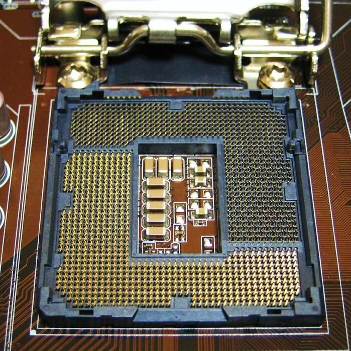
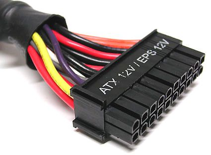
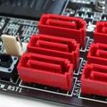
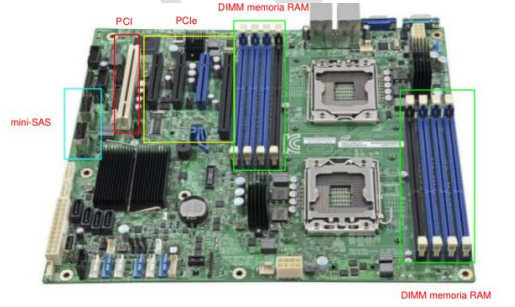

 

# Ingeniería de Servidores - Preguntas Tipo Test

- **Autor:** Arturo Olivares Martos
- **Autor:** Jesús Muñoz Velasco
- **Autor:** Laura Mandow Fuentes
- **Autor:** Joaquín Avilés de la Fuente
- **Autor:** Irina Kuzyshyn Basarab
- **Descripción:** Recopilación de preguntas Tipo Test de la asignatura de Ingeniería de Servidores. Como mínimo, se incluyen las preguntas de los exámenes de **Enero y Febrero de cada año desde 2022 hasta 2024**.
Se han obtenido de fuentes diversas, por lo que si faltasen, sobrasen o estuviesen mal formuladas, por favor, se ruega nos lo hagan saber para corregirlo.

---

1. Decimos que un servidor es fiable si se encuentra en estado operativo.
    - ( ) Verdadero
    - (x) Falso
  
2. Podemos aumentar la escalabilidad de un servidor añadiendo fuentes de alimentación redundantes.
    - ( ) Verdadero
    - (x) Falso

3. Los procesadores para servidores suelen tener más canales de memoria que los de PC en la misma generación.
    - (x) Verdadero
    - ( ) Falso

4. Las unidades de estado sólido (SSD) son capaces de alcanzar anchos de banda superiores a los que el
protocolo SATA-3 puede proporcionar.
    - (x) Verdadero
    - ( ) Falso

1. El primer procesador con un conjunto de instrucciones de 64 bits lo diseñó AMD a principios de los 2000.
    - ( ) Verdadero
    - (x) Falso

2. La "S" del acrónimo SRAM es por Synchronous.
    - ( ) Verdadero
    - (x) Falso

3. Puedo conectar una tarjeta PCle 2.0 en un conector PCIe 4.0 de la placa base, pero no al revés.
    - ( ) Verdadero
    - (x) Falso

4. PCle 2.0 x4 tiene un ancho de banda de 2GB/s en cada sentido.
    - (x) Verdadero
    - ( ) Falso

5. Puedo conectar un disco SATA usando el controlador SAS de la placa, pero no un disco SAS usando el controlador SATA de la placa.
    - (x) Verdadero
    - ( ) Falso

6. SO-DIMM es un tipo de memoria pensada para servidores.
    - ( ) Verdadero
    - (x) Falso

7. En la jerarquía de memoria de un computador, la memoria LLC tiene menor latencia que la DRAM.
    - (x) Verdadero
    - ( ) Falso

8. El conjunto de instrucciones que ejecutan el auto-test de arranque (Power On self-test) se encuentran almacenadas en la ROM/Flash BIOS de la placa.
    - (x) Verdadero
    - ( ) Falso

17. Para diagnosticar que una memoria RAM funciona correctamente debemos utilizar un benchmark específico para memorias RAM.
    - ( ) Verdadero
    - (x) Falso

18. Si `NT >> NT*` el servidor dejará de estar en equilibrio de flujo (para el caso de redes de colas cerradas).
    - ( ) Verdadero
    - (x) Falso

19. La sección de garantías de un pliego de prescripciones se refiere esencialmente a la garantía en la realización del pago del contrato.
    - ( ) Verdadero
    - (x) Falso

20. En un anuncio de licitación pública se debe aportar tanto los códigos CPV como la dirección de internet en la que estará disponible el pliego de condiciones.
    - (x) Verdadero
    - ( ) Falso

21. Un módulo de DRAM DDR4 con ECC 2Rx4 tiene 36 chips.
    - (x) Verdadero
    - ( ) Falso

22. Las tarjetas que usaban las ranuras ISA tenían que ser pre-configuradas para asignarles la interrupción que correspondía a cada una.
    - (x) Verdadero
    - ( ) Falso

23. Podemos mejorar la escalabilidad de un servidor utilizando RAID 1.
    - ( ) Verdadero
    - (x) Falso

24. Si una interfaz es Plug and Play podemos cambiar el componente en caliente (sin reiniciar).
    - ( ) Verdadero
    - (x) Falso

25. Un SSD con MLC es menos fiable que uno SLC.
    - (x) Verdadero
    - ( ) Falso

26. Un disco SAS usa un único conector que unifica tanto los cables de alimentación procedentes de la fuente de alimentación como los de datos, procedentes de la placa base.
    - (x) Verdadero
    - ( ) Falso

27. Los chips de la serie AMD Opteron X son SoC.
    - (x) Verdadero
    - ( ) Falso

28. AGP tiene más ancho de banda que PCI.
    - (x) Verdadero
    - ( ) Falso

29. Con la Ley de Amdahl podemos estimar la ganancia en velocidad de la ejecución un único trabajo (un hilo) en un computador después de mejorar k veces un componente.
    - (x) Verdadero
    - ( ) Falso

30. Las prestaciones de un servidor no se ven afectadas por la configuración de la memoria virtual.
    - ( ) Verdadero
    - (x) Falso

31. La ganancia en velocidad siempre es un número comprendido entre 0 y 2, ambos inclusive.
    - ( ) Verdadero
    - (x) Falso

32. El protocolo USB 2.0 es half-duplex.
    - (x) Verdadero
    - ( ) Falso

33. El puente sur del chipset es el encargado de las transferencias entre el puente norte y el resto de periféricos con menores exigencias de velocidad de la placa.
    - (x) Verdadero
    - ( ) Falso

34. En un test t, el valor-p equivale esencialmente a la probabilidad de que la hipótesis nula sea falsa.
    - ( ) Verdadero
    - (x) Falso

35. La hipótesis de partida de un test `ANOVA` es que el factor que se está estudiando influye en el rendimiento.
    - ( ) Verdadero
    - (x) Falso

36. Con "sar -u", sin más argumentos, iremos obteniendo la información de la utilización global del procesador desde el momento actual en adelante.
    - ( ) Verdadero
    - (x) Falso

37. Un microbenchmark también suele denominarse benchmark de sistema completo.
    - ( ) Verdadero
    - (x) Falso

38. Una ganancia (speedup) negativa quiere decir que la mejora aplicada ha empeorado el tiempo original.
    - ( ) Verdadero
    - (x) Falso

39. EPYC es una familia de procesadores de AMD para servidores.
    - (x) Verdadero
    - ( ) Falso

40. eDonkeyes un ejemplo de Arquitectura Cliente/Servidor de varios niveles.
    - ( ) Verdadero
    - (x) Falso

41. El zócalo para CPU de la figura es de tipo LGA.  
    - (x) Verdadero
    - ( ) Falso

42. AHCI es una interfaz diseñada para facilitar la conexión de SSD a través de PCIe.
    - ( ) Verdadero
    - (x) Falso

43. En una placa base de un PC es habitual encontrar tanto conectores SATA como SAS.
    - ( ) Verdadero
    - (x) Falso

44. La transmisión de información entre un módulo de memoria de tipo DDR4 y la CPU es half-duplex.
    - (x) Verdadero
    - ( ) Falso

45. El módulo regulador de voltaje, entre otras cosas, convierte la corriente alterna en corriente continua.
    - ( ) Verdadero
    - (x) Falso

46. SATA-3 usa codificación 128b/130b.
    - ( ) Verdadero
    - (x) Falso

47. La precisión de un sensor se refiere esencialmente a cómo se aproximan las medidas que toma al valor verdadero.
    - ( ) Verdadero
    - (x) Falso

48. Todos los protocolos de comunicación serie son full-duplex.
    - ( ) Verdadero
    - (x) Falso

49. La utilidad principal de las unidades de cinta en servidores es para almacenamiento de respaldo (backup) y archivado.
    - (x) Verdadero
    - ( ) Falso

50. PCIe permite la conexión serie punto a punto, una comunicación de tipo full-duplex y la conexión de dispositivos en caliente.
    - (x) Verdadero
    - ( ) Falso

51. En un pliego de prescripciones técnicas no se debe hacer referencia a una fabricación o una procedencia determinada con la finalidad de favorecer o descartar ciertas empresas o ciertos productos. Si no es posible, se acompañará la mención «o equivalente».
    - (x) Verdadero
    - ( ) Falso

52. En un test `ANOVA`, si `Fexp` es mayor que el grado de significatividad concluiremos que no podemos decir que el factor a considerar influya en la variable respuesta.
    - ( ) Verdadero
    - (x) Falso

53. `gprof` basa su información en lo que obtiene leyendo de `/proc`.
    - ( ) Verdadero
    - (x) Falso

54. El contratante es el licitador que resulta adjudicatario de la licitación y quien finalmente se encargará de llevar a cabo los trabajos contratados.
    - ( ) Verdadero
    - (x) Falso

55. Los procesadores Intel Core i7 están especialmente diseñados para placas con dos o más zócalos de CPU.
    - ( ) Verdadero
    - (x) Falso

56. Una memoria DRAM necesita refresco porque es volátil.
    - ( ) Verdadero
    - (x) Falso

57. Si  \\(\sum\limits_{i=1}^{K} U_i > 1\\) el servidor está saturado.
    - ( ) Verdadero
    - (x) Falso

58. El conector de la figura de la derecha proviene de una fuente de alimentación.  
    - (x) Verdadero
    - ( ) Falso

59. El índice SPEC premia mejoras sustanciales con respecto a algún programa del benchmark y no castiga al mismo nivel los empeoramientos.
    - (x) Verdadero
    - ( ) Falso

60. La razón media de visita de un dispositivo no tiene por qué ser necesariamente un número entero no negativo. 
Nota: números enteros no negativos son: \\(0, 1, 2, 3, \dots\\)
    - (x) Verdadero
    - ( ) Falso

1. La expresión \\(Wi=Ni \cdot Si\\) es una ley operacional.
    - ( ) Verdadero
    - (x) Falso

2. En la monitorización de un servidor durante un tiempo T, CO no puede ser mayor que A0.
    - ( ) Verdadero
    - (x) Falso

3. \\(R_i=W_i+Q_i\\), para todo \\(i=1..K\\)
    - ( ) Verdadero
    - (x) Falso

4. La versión serie del interfaz SCSI se llama SAS, cuyas siglas provienen de "Serial Attached SCSI".
    - (x) Verdadero
    - ( ) Falso

5. Una red de colas abierta se puede considerar un caso particular de red de colas cerrada si hacemos que \\(Z = 0s\\).
    - ( ) Verdadero
    - (x) Falso

6. El pliego de condiciones se divide en "pliego de cláusulas administrativas particulares" y "pliego de prescripciones técnicas".
    - (x) Verdadero
    - ( ) Falso

7. AMD ofrece los procesadores EPYC para el mercado de sobremesa y los OPTERON para el de servidores.
    - ( ) Verdadero
    - (x) Falso

8. La cola/pasta térmica es un aislante que evita que el calor salga de la CPU.
    - ( ) Verdadero
    - (x) Falso

9. Las SSD tienen menor latencia que los discos duros debido a que, entre otras cosas, no tienen que esperar a que el cabezal se posicione sobre la pista a leer/escribir.
    - (x) Verdadero
    - ( ) Falso

10. Las LR-DIMM se utilizan para caché de altas prestaciones en servidores.
    - ( ) Verdadero
    - (x) Falso

11. Es el propio microprocesador en muchos computadores actuales el que realiza la función de puente norte del chipset.
    - (x) Verdadero
    - ( ) Falso

12. El fenómeno llamado "timing skew" motivó la aparición de protocolos de comunicación paralelos como P-ATA (también llamado IDE) o PCI.
    - ( ) Verdadero
    - (x) Falso

13. Existen servidores con fuentes de alimentación reemplazables en caliente (hot swappable).
    - (x) Verdadero
    - ( ) Falso

14. Las primeras instrucciones que ejecuta un procesador en el arranque proceden de las primeras direcciones de la DRAM.
    - ( ) Verdadero
    - (x) Falso

15. Las pistas en una placa base están hechas de una resina no conductora y no inflamable.
    - ( ) Verdadero
    - (x) Falso

16. Los conectores de la placa base de la figura de la derecha podrían ser de tipo SATA.  
    - (x) Verdadero
    - ( ) Falso

17. Un servidor que siempre me da respuesta, pero que a veces me da respuestas incorrectas, tiene una disponibilidad del 100%.
    - (x) Verdadero
    - ( ) Falso

18. Con “sar -P 1” puedo conocer el estado del proceso con id=1.
    - ( ) Verdadero
    - (x) Falso

19. Cuando nos referimos al método USE para la monitorización del rendimiento de un servidor, la “S” de USE viene de “Saturation”.
    - (x) Verdadero
    - ( ) Falso

20. Un zócalo PGA tiene agujeritos para que entren las palillas del procesador.
    - (x) Verdadero
    - ( ) Falso

21. Una celda SRAM tiene más componentes electrónicos (condensadores, transistores...) que una DRAM.
    - (x) Verdadero
    - ( ) Falso

22. Un microprocesador puede acceder a la vez a dos módulos de memoria del banco de un mismo canal.
    - ( ) Verdadero
    - (x) Falso

23. PCle 5.0 usa codificación 8b/10b.
    - ( ) Verdadero
    - (x) Falso

24. No solo se puede conectar una tarjeta PCIe 2.0 en una ranura PCIe 5.0 de la placa base, sino que también se puede conectar una tarjeta PCIe 5.0 en una ranura PCle 2.0 de la placa base.
    - (x) Verdadero
    - ( ) Falso

25. A través del System Panel (o Front Panel) se puede conectar un dispositivo USB del chasis a la placa base.
    - ( ) Verdadero
    - (x) Falso

26. Las placas de servidores suelen tener un conector VGA en el panel trasero.
    - (x) Verdadero
    - ( ) Falso

27. \\(N_0 = \sum\limits_{i=1}^K V_i \times N_i \\)
    - ( ) Verdadero
    - (x) Falso

28. Los pliegos de prescripciones técnicas en ningún caso contendrán declaraciones o cláusulas que deban figurar en el pliego de cláusulas administrativas particulares.
    - (x) Verdadero
    - ( ) Falso

29. A la hora de escoger un servidor ateniéndonos únicamente al valor de la relación prestaciones/coste, es mejor escoger la versión con un valor numérico mayor.
    - (x) Verdadero
    - ( ) Falso

30. Decimos que un módulo de DRAM tiene dos rangos si tiene chips por las dos caras (dualranked).
    - ( ) Verdadero
    - (x) Falso

31. NCQ (Native Command Queuing) es una extensión de SATA concebida especialmente para optimizar el acceso a unidades de estado sólido.
    - ( ) Verdadero
    - (x) Falso

32. Una de las líneas del protocolo PCIe se usa en exclusiva para transmitir la señal de reloj.
    - ( ) Verdadero
    - (x) Falso

33. El puente sur del chipset se encarga de las líneas de PCIe x16.
    - ( ) Verdadero
    - (x) Falso

34. Un determinado monitor software por muestreo se activa cada 5s. Cada activación del monitor (para medir lo que tenga que medir) requiere un total de 6 ms de uso de la única CPU de nuestro servidor. Entonces, la sobrecarga de CPU del monitor será 0,0012%.
    - ( ) Verdadero
    - (x) Falso

35. La precisión de un sensor está relacionada con la dispersión de las medidas que realiza.
    - (x) Verdadero
    - ( ) Falso

36. El indice SPEC no tiene unidades.
    - (x) Verdadero
    - ( ) Falso

37. El pliego de prescripciones técnicas debe contener, con carácter general, la información sobre el plazo de ejecución o duración del contrato.
    - ( ) Verdadero
    - (x) Falso

1. Puedo colocar una PCIe x16 en una x4 pero no al revés.
    - ( ) Verdadero
    - (x) Falso

2. MTTF significa Mean Time To Failure.
    - (x) Verdadero
    - ( ) Falso

3. PCI soporta *Hot Plugging*.
    - ( ) Verdadero
    - (x) Falso

4. Ultra-SCSI no soporta Full-Duplex.
    - (x) Verdadero
    - ( ) Falso

5. La ROM tiene el código para instalar los drivers que se usarán por el SO para usar normalmente.
    - ( ) Verdadero
    - (x) Falso

6. Un servidor blade es más complejo que un rack.
    - (x) Verdadero
    - ( ) Falso

7. Los procesadores Opteron son los procesadores de Intel para servidores.
    - ( ) Verdadero
    - (x) Falso

9. El puente norte del chipset es el que se encarga de las transferencias de alta velocidad.
    - (x) Verdadero
    - ( ) Falso

10. Llamamos "rango" a cada una de las caras de un módulo de memoria RAM.
    - ( ) Verdadero
    - (x) Falso

11. La anchura de entrada de un monitor es la frecuencia máx de la ocurrencia de los eventos.
    - ( ) Verdadero
    - (x) Falso

12. En `gprof` la columna `self` de cada función incluye el tiempo de código propio (incluyendo el tiempo que tardan sus hijos en ejecutarse).
    - ( ) Verdadero
    - (x) Falso

13. `gprof` da información exacta (no estimada) del tiempo de ejecución de cada función de un programa instrumentado por esta herramienta.
    - ( ) Verdadero
    - (x) Falso

14. Un monitor por eventos siempre da info exacta.
    - (x) Verdadero
    - ( ) Falso

15. Medir los `MIPS` es un buen índice de rendimiento.
    - ( ) Verdadero
    - (x) Falso

16. En un *call graph*, las flechas indican el número de veces que una función llama a otra. Este número siempre es entero.
    - ( ) Verdadero
    - (x) Falso

17. SPECrate, a diferencia de SPECspeed, mide cuántos programas se ejecutan por unidad de tiempo.
    - (x) Verdadero
    - ( ) Falso

18. Si lanzo dos dados (sin truncar) muchas veces, la media de la diferencia entre los valores de sus lanzamientos debería tender a 0.
    - ( ) Verdadero
    - (x) Falso

19. El tiempo de respuesta medio de un servidor es la suma de los tiempos de respuesta de las estaciones de servicio.
    - ( ) Verdadero
    - (x) Falso

20. Si añado una nueva CPU a nuestro servidor, el tiempo mínimo medido de respuesta del servidor seguro que disminuye.
    - ( ) Verdadero
    - (x) Falso

1. Las principales medidas de prestaciones de un servidor se basan en tiempos de respuesta (o latencias) y en productividades (o anchos de banda). 
    - (x) Verdadero
    - ( ) Falso

2. Todos los sistemas escalables son extensibles, pero no a la inversa.
    - (x) Verdadero
    - ( ) Falso

3. Xeon es una familia de microprocesadores de IBM especialmente dirigida a los servidores.
    - ( ) Verdadero
    - (x) Falso

4. La familia "AMD Opteron X Series" usa microprocesadores de ARM.
    - ( ) Verdadero
    - (x) Falso

6. El voltaje que usa un módulo DDR4 es menor que el de un módulo DDR3.
    - (x) Verdadero
    - ( ) Falso

7. Las latencias de las unidades de cinta suelen ser muy bajas ya que hay que rebobinar la cinta hasta que el cabezal se encuentre en la posición deseada. 
    - ( ) Verdadero
    - (x) Falso

9. SAS es full-duplex. 
    - (x) Verdadero
    - ( ) Falso

10. En el panel trasero de la placa base de un servidor es habitual encontrar varios conectores para Ethernet. 
    - (x) Verdadero
    - ( ) Falso

11. A través del "System Panel" se puede conectar el altavoz del chasis a la placa base. 
    - (x) Verdadero
    - ( ) Falso

12. La pila que hay en la placa base sirve, entre otras cosas, para tener el reloj en tiempo real de dicha placa actualizado. 
    - (x) Verdadero
    - ( ) Falso

1. SSD procede de las siglas "Solid State Disk":
    - ( ) Verdadero.
    - (x) Falso.

1. La placa base de la figura tiene una ranura PCI y 4 PCIe: 
    - (x) Verdadero.
    - ( ) Falso.

1. La placa base de la figura tiene al menos dos conectores mini-SAS: 
    - (x) Verdadero.
    - ( ) Falso.

1. La placa base de la figura admite hasta dos microprocesadores y un máximo de cuatro DIMM de memoria RAM dinámica en total.: 
    - ( ) Verdadero.
    - (x) Falso.

2. El puente sur del chipset se encarga de la comunicación con la DRAM
    - ( ) Verdadero.
    - (x) Falso.
3. En saturación, el cuello de botella está al máximo de su productividad.
    - (x) Verdadero.
    - ( ) Falso.
4. La demanda media de servicio de un dispositivo en el seno de un servidor nunca puede ser menor que su tiempo medio de servicio.
    - ( ) Verdadero.
    - (x) Falso.
5. \\(\sum\limits_{i=1}^k R_i = R_0\\)
    - ( ) Verdadero.
    - (x) Falso.
6. Si ejecutamos la línea `sar -d` en un servidor con `sar` instalado, iremos obteniendo información sobre las transferencias de cada disco del servidor de forma interactiva.
    - ( ) Verdadero.
    - (x) Falso.
7. \\(C_0\\) es un valor medio calculado durante el periodo de monitorización \\(T\\)
    - ( ) Verdadero.
    - (x) Falso.
8. Un módulo de DRAM con chips en ambas caras no tiene por qué ser de doble rango (dual ranked).
    - (x) Verdadero.
    - ( ) Falso.
9.  Tanto las SRAM como las DRAM son volátiles, pero solo las DRAM necesitan refresco. 
    - ( ) Verdadero.
    - (x) Falso.
10. Los protocolos de comunicación serie pueden ser half-duplex.
    - (x) Verdadero.
    - ( ) Falso.
11. Con "almacenamiento permanente" queremos indicar que el dispositivo es de solo lectura y que el dato se va a quedar escrito en el dispositivo de forma permanente. 
    - ( ) Verdadero.
    - (x) Falso.
12. Con un conector SATA de la placa base puedo conectar 4 discos mini SAS.
    - ( ) Verdadero.
    - (x) Falso.
13. Jugando con las distintas configuraciones de un RAID se puede conseguir más fiabilidad o más disponibilidad, pero no mayores prestaciones.
    - ( ) Verdadero.
    - (x) Falso.
14. `sar` es un monitor software por eventos. 
    - ( ) Verdadero.
    - (x) Falso.
15. Con "carga del sistema", el S.O. Linux se refiere al número de procesos en modo running, runnable o 1/0 blocked. 
    - (x) Verdadero.
    - ( ) Falso.
16. La hipótesis inicial de un test tes que los rendimientos de ambas alternativas a analizar son estadísticamente diferentes.
    - ( ) Verdadero.
    - (x) Falso.
17. Cuando nos referimos al índice de prestaciones que se calcula según el benchmark SPEC CPU2017, el SPEC pico (peak) nunca puede ser menor que el SPEC base. 
    - (x) Verdadero.
    - ( ) Falso.
18.  En los benchmarks TPC-C y TPC-H, el índice de prestaciones se calcula a partir de la media geométrica de las ganancias en velocidad con respecto a una máquina de referencia. 
    - ( ) Verdadero.
    - (x) Falso.
19. Actuando sobre el elemento con mayor razón de visita nos garantizamos mejorar la productividad máxima de un servidor.
    - ( ) Verdadero.
    - (x) Falso.
20. La razón media de visita de un dispositivo no tiene por qué ser un número entero.
    - (x) Verdadero.
    - ( ) Falso.
21. En un servidor, si la demanda de servicio de un dispositivo es menor que la de otro, su utilización nunca podrá ser mayor que la de ese otro dispositivo.
    - (x) Verdadero.
    - ( ) Falso.
22. En un servidor modelado mediante una red de colas se cumple que \\(B_i = (N_i-Q_i) \cdot T\\).
    - (x) Verdadero.
    - ( ) Falso.
23.  Si el número total de usuarios en un servidor modelado mediante una red de colas cerrada interactiva es superior a `NT*`, entonces el servidor está saturado. 
    - ( ) Verdadero.
    - (x) Falso.
24. La memoria técnica que presenta cada licitador no podrá hacer referencia a una fabricación o una procedencia determinada con la finalidad de favorecer o descartar ciertas empresas o ciertos productos. Si no es posible, se acompañará la mención «o equivalente». 
    - ( ) Verdadero.
    - (x) Falso.
25. Un mismo servidor, según su tipo de carga puede tener distintos cuellos de botella.
    - (x) Verdadero.
    - ( ) Falso.
26. \\(R_0 = V_1 \cdot R_1 \cdot V_2 \cdot R_2\\)
    - ( ) Verdadero.
    - (x) Falso.
27. La versión serie de SCSI se llama M2, también conocida como NGFF.
    - ( ) Verdadero.
    - (x) Falso.
28. Si reemplazamos un dispositivo por otro el doble de rápido, su razón de visita será menor.
    - ( ) Verdadero.
    - (x) Falso.
29. Si aplicamos la ley de Little a cada cola de una estación de servicio obtenemos que: \\(V_i = X_i \cdot S_i\\)
    - ( ) Verdadero.
    - (x) Falso.
30. Una maquina con un SPEC menor de 1 significa que es más rápida que la máquina de referencia.
    - ( ) Verdadero.
    - (x) Falso.
31. Uno de los inconvenientes de utilizar la media aritmética de los tiempos de ejecución de los benchmark es que su valor dependerá de la máquina de referencia que se escoja.
    - ( ) Verdadero.
    - (x) Falso.
32. En el servidor modelado mediante una red abierta la tasa de llegada no puede superar \\(\frac{1}{D_b}\\)
    - ( ) Verdadero.
    - (x) Falso.
33. Si `NT >> NT*` el servidor está saturado (para colas cerradas).
    - ( ) Verdadero.
    - (x) Falso.
34. En un test t, el valor-p obtenido depende del nivel de confianza seleccionado.
    - ( ) Verdadero.
    - (x) Falso.
35. En un test t, a mayor nivel de confianza es más fácil rechazar la hipótesis de que ambas alternativas son iguales.
    - ( ) Verdadero.
    - (x) Falso.
36. Al bajar el grado de significatividad, es más difícil conseguir que el valor-p < alfa.
    - (x) Verdadero.
    - ( ) Falso.
37.  En Linux, la información a la que se accede a través de /proc está almacenada realmente en la RAM.
    - (x) Verdadero.
    - ( ) Falso.
38. Si un servidor siempre responde a nuestras peticiones podemos decir que es un servidor de alta fiabilidad.
    - ( ) Verdadero.
    - (x) Falso.
39. \\(N_0 = \sum\limits_{i=1}^n N_i\\)
    - (x) Verdadero.
    - ( ) Falso.
40. La expresión \\(Q_i = \lambda_i\cdot W_i \\) es válida, aunque el servidor esté saturado.
    - (x) Verdadero.
    - ( ) Falso.
41. Las unidades SSD tienen mayor latencia que los discos duros debido a que no tienen que esperar a que el cabezal se posicione sobre la pista a leer/escribir.
    - ( ) Verdadero.
    - (x) Falso.
42. Bajo ningún concepto se puede hacer referencia a una fabricación o una procedencia determinada cuando se especifican los componentes a instalar o suministrar en un pliego de prescripciones técnicas. 
    - ( ) Verdadero.
    - (x) Falso.
43.  Las pistas en una placa base están normalmente hechas de cobre rodeadas de láminas de un substrato no conductor.
    - (x) Verdadero.
    - ( ) Falso.
44.  El número medio de trabajos en un servidor es la suma de los números medios de trabajos en cada uno de sus componentes. 
    - (x) Verdadero.
    - ( ) Falso.
45. Las unidades SSD son capaces de alcanzar anchos de banda superiores a los que el protocolo SATA-3 puede proporcionar.
    - (x) Verdadero.
    - ( ) Falso.
46. Los códigos CPV deben figurar obligatoriamente en todos los pliegos de prescripciones técnicas.
    - ( ) Verdadero.
    - (x) Falso.
47. En los paneles traseros de las placas de servidores los conectores de red son de bajas prestaciones.
    - ( ) Verdadero.
    - (x) Falso.
48. En un test ANOVA, si Fexp es menor que el grado de significatividad rechazamos la hipótesis nula y concluiremos que el factor a considerar sí que influye en la variable respuesta.
    - ( ) Verdadero.
    - (x) Falso.
49. El puente sur del chipset se encarga de la comunicación con la RAM. 
    - ( ) Verdadero.
    - (x) Falso.
50. La productividad de un servidor nunca podrá ser superior a \\(\frac{1}{D}\\).
    - ( ) Verdadero.
    - (x) Falso.
51. Intel Xeon es la familia de microprocesadores de Intel especializada en servidores.
    - (x) Verdadero.
    - ( ) Falso.
52. Los procesadores AMD Opteron Serie A están basados en microprocesadores de ARM.
    - (x) Verdadero.
    - ( ) Falso.
53. \\(\lambda_i = \frac{Q_i}{w_i}\\)
    - (x) Verdadero.
    - ( ) Falso.
54. \\(S_i = \frac{C_i}{B_i}\\)
    - ( ) Verdadero.
    - (x) Falso.
55. Es la media aritmética y no el índice SPEC el que nos ayuda a saber qué computadora ejecuta el conjunto total de programas de un benchmark en menos tiempo.
    - (x) Verdadero.
    - ( ) Falso.
56. `sar` al igual que `top` es un monitor software por eventos.
    - ( ) Verdadero.
    - (x) Falso.
57. Las pistas de una placa base están hechas de una resina no conductora y no inflamable.
    - ( ) Verdadero.
    - (x) Falso.
58. Frotándose las manos se elimina la electricidad estática.
    - ( ) Verdadero.
    - (x) Falso.
59. La memoria caché L3 se comparte por todos los cores de un microprocesador. 
    - (x) Verdadero.
    - ( ) Falso.
60. Conforme aumenta la generación de memorias DDR aumenta el ancho de banda y disminuye el voltaje.
    - (x) Verdadero.
    - ( ) Falso.
61. La transmisión DDR4 \\(\rightarrow\\)CPU es full-duplex.
    - ( ) Verdadero.
    - (x) Falso.
62. Los VGA de un servidor son de altas prestaciones.
    - ( ) Verdadero.
    - (x) Falso.
63. El puente sur se encarga del PCIe x16.
    - ( ) Verdadero.
    - (x) Falso.
64. El conjunto de instrucciones POST se encuentra en la RAM.
    - ( ) Verdadero.
    - (x) Falso.
65. Una fuente de alimentación convierte corriente continua en corriente alterna para usarla en la placa base.
    - ( ) Verdadero.
    - (x) Falso.
66. \\(Z=N_z\cdot R_0\\)
    - ( ) Verdadero.
    - (x) Falso.
67. La carga del sistema es el conjunto de tareas que ha de realizar.
    - (x) Verdadero.
    - ( ) Falso.
68. La carga de un sistema se puede definir como el conjunto de tareas que ha de realizar.
    - (x) Verdadero.
    - ( ) Falso.
69. El tiempo medio de respuesta de un servidor es la suma de los tiempos medios de respuesta de todos sus componentes.
    - ( ) Verdadero.
    - (x) Falso.
70. La interfaz Serial ATA es compatible con SAS. Dicho de otra manera, si tengo una placa con conectores Serial ATA voy a poder pinchar en ella unidades SAS.
    - ( ) Verdadero.
    - (x) Falso.
71. La expresión \\(N_i=X_i\cdot R_i\\) solo es válida si el servidor está saturado. 
    - ( ) Verdadero.
    - (x) Falso.
72. La placa base de la figura que hay al final del examen admite un único microprocesador y 4 módulos de memoria DRAM.
    - (x) Verdadero.
    - ( ) Falso.
73. La placa base de la figura que hay al final del examen tiene 4 ranuras PCIe y 6 conectores SATA.
    - (x) Verdadero.
    - ( ) Falso.
74. Los paneles traseros de placas de servidores suelen tener conectores de audio y video de altas prestaciones.
    - ( ) Verdadero.
    - (x) Falso.
75. Un microprocesador puede acceder simultáneamente a 2 módulos de memoria DRAM solo si están en canales diferentes.
    - (x) Verdadero.
    - ( ) Falso.
76. Tanto PCI como PCIe definen un protocolo de comunicación serie punto a punto.
    - ( ) Verdadero.
    - (x) Falso.
77. La expresión \\(N_0 = X_0 \cdot R_0\\) solo es válida si el servidor no está saturado. 
    - (x) Verdadero.
    - ( ) Falso.
78. La expresión \\(U_i = X_i \cdot S_i\\) solo es válida si el servidor no está saturado.
    - ( ) Verdadero.
    - (x) Falso.
79. El resultado de un benchmark siempre se expresa como el tiempo necesario para ejecutar una cantidad pre-establecida de tareas.
    - ( ) Verdadero.
    - (x) Falso.
80. El contratante es el proponente que resulta adjudicatario de una licitación y quien finalmente se encargara de llevar a cabo los trabajos contratados.
    - ( ) Verdadero.
    - (x) Falso.
81.  Es el propio microprocesador de muchas placas base actuales el que realiza la función de puente norte en el chipset.
    - (x) Verdadero.
    - ( ) Falso.